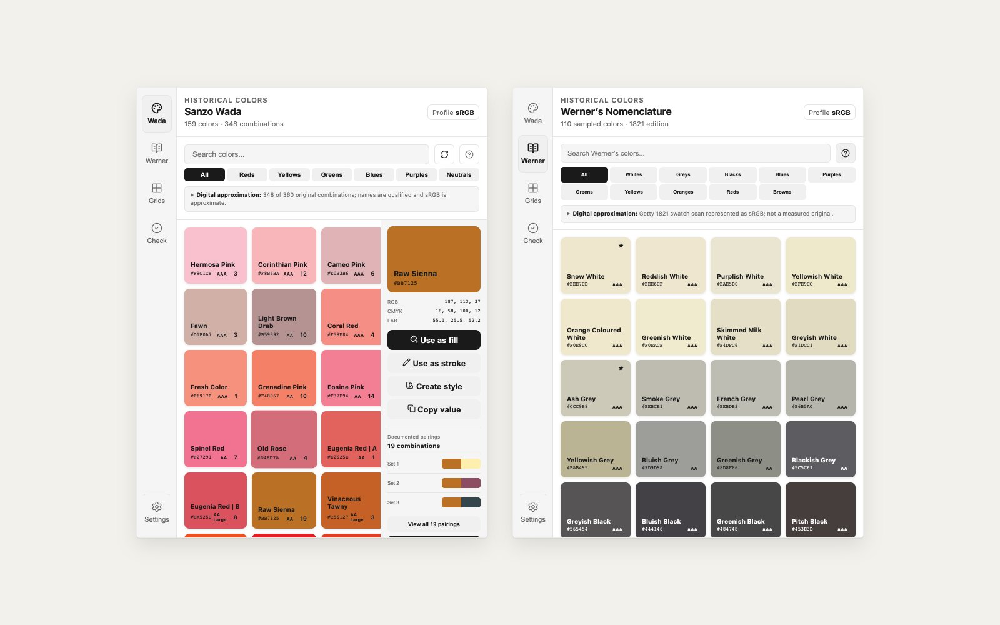
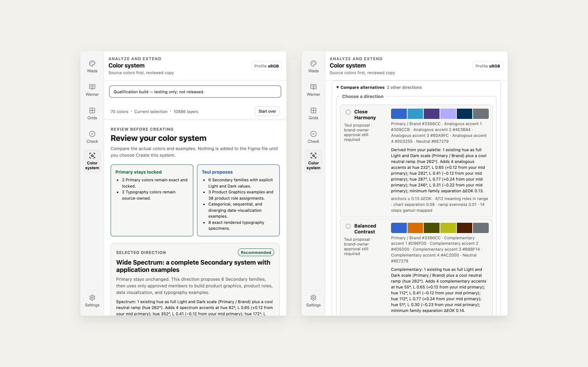
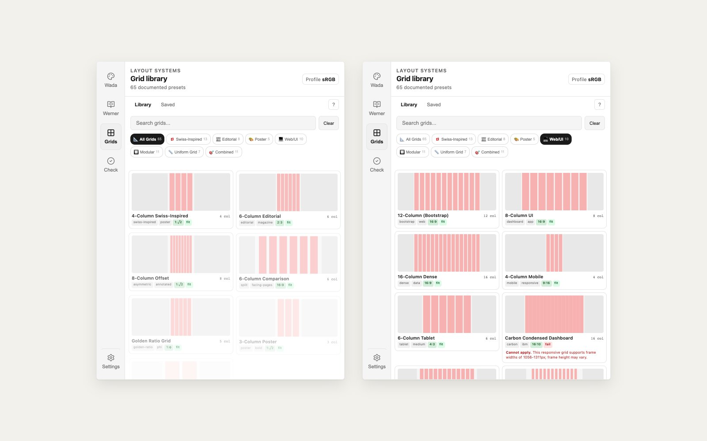

# Teul

**Color gives work a voice. A grid gives it structure.**



_Screenshots captured on 2026-09-08 from commit `6555f2f`._

Teul (틀) is Korean for _frame_, _mold_, or _pattern_. It is a Figma plugin for
designers who want stronger starting points for color and layout.

Use Teul to:

- explore documented color relationships from Sanzo Wada and Werner's
  Nomenclature of Colours;
- turn a color or Wada pairing into a tested system, Figma variables, and
  styles;
- check proven opaque sRGB pairs and preview modeled color-confusion risks; and
- choose, fit, save, and apply one of 65 documented layout grids.

Historical screen colors are digital approximations, not exact matches to
printed swatches or pigments. Teul keeps the source, the approximation, and
anything it generates clearly labeled.

History is the source. Teul is the tool.

## What Teul Does

### Explore Historical Color Relationships

- **Sanzo Wada** — 159 normalized colors used across 348 combinations from a
  modern selection of the original 360-combination series.
- **Werner's Nomenclature of Colours** — Patrick Syme's 110-color 1821 second
  edition, adapted from Werner's nomenclature and independently sampled from
  the Getty Research Institute's public-domain scan.

The bundled RGB and hex values are documented digital approximations. Teul
does not present a screen color as an exact match for a printed recipe, painted
swatch, or historical pigment.

### Build Color Systems

- **Exact Radix sRGB Solid** uses the unmodified sRGB solid subset from pinned
  `@radix-ui/colors` 3.0.0. Teul's Delta E OK matcher reports which published
  mode and step selected the family; that matching method is not Radix source data.
- **Teul Generated** uses the versioned `Teul OKLCH v3` Local MINDE mapper to
  build a 12-step light and dark sRGB system while preserving the selected
  source color and reporting what was tested.
- **WCAG-Constrained Tokens** creates semantic tokens only when every declared
  WCAG 2.2 sRGB color pairing passes.
- All three on-canvas methods require the backend to confirm and retain a live
  sRGB Figma document before frames, variables, or styles are mutated. A P3,
  legacy, unknown, or mid-operation profile change blocks and rolls back
  mutation because raw sRGB hex channels would otherwise be reinterpreted.
  Non-mutating export remains available.
- Export CSS variables, Tailwind configuration, JSON, optional Figma styles,
  native Figma color variables with light and dark modes, and visual reference
  frames.

Passing color-pair tests does not make an entire product accessible. Teul names
the guarantee it can prove and stops there.



The accessibility checker can read one opaque text/background pair from a
confirmed sRGB Figma document, including a bound color variable. It rejects
Display-P3 or unknown profiles, mixed or layered paints, transparency,
unsupported ancestor rendering, gradients, images, videos, masks, effects,
non-overlap, and unprovable stacking instead of estimating a rendered color.
Manual hex input is explicitly interpreted as sRGB. APCA remains supplemental;
color-vision previews are advisory approximations rather than diagnosis or
proof of accessibility.

### Apply Grids That Fit

Browse 65 documented presets spanning Swiss-inspired constructions,
historically informed editorial systems, modern product grids, and named
systems such as Material, Carbon, Bootstrap, and USWDS.

Teul resolves each grid against the selected frame. A preset fits, warns you,
or explains why it cannot be applied. Source-faithful reconstructions keep
their canonical dimensions instead of quietly stretching history to fit a
different canvas.

Build symmetric column, row, and uniform grids, or capture supported native
stretch grids from one selected frame. Teul refuses capture when Figma geometry
cannot round-trip through the saved model. Captured grid styles and bound
variables are retained: users can preserve available links or explicitly apply
the captured numeric values when moving between files. Saved grids move between
files through a versioned JSON format and live in Figma's plugin storage; v1
records migrate without changing their supported geometry.



## Why Teul Exists

Most tools flatten the source. Historical palettes become loose hex codes.
Grid theory becomes a dropdown of magic numbers. Teul keeps source,
approximation, and generated output separate—then gives you practical ways to
use all three.

Know where the reference came from. Know what the tool changed. Make the work
your own.

## Install

1. Open Figma Desktop.
2. Go to **Plugins → Browse plugins in Community**.
3. Search for **Teul**.
4. Select **Install**.

## Quick Start

To build a color system:

1. Open **Wada** or **Werner** in the rail.
2. Choose a color. Wada colors also show every documented pairing.
3. Use the color directly as a fill, stroke, or style—or select **Create
   system**. A chosen Wada pairing starts with both source colors included.
4. Assign palette roles, choose a system method, and review the result.
5. Create Figma variables and styles, or export the system.

To apply a grid:

1. Select a supported frame, component, or instance.
2. Open **Grids** in the rail.
3. Choose a preset or one of your saved grids.
4. Review its fit and application mode, then apply it.

## Development

Teul requires Node.js 22.13 or newer on the Node 22 line, or Node.js 24, with npm 10.9.9.
`.nvmrc` pins the Node 22 line (`nvm use` or `fnm use` selects it) and `.npmrc`
sets `engine-strict=true`, so npm refuses to install on an unsupported Node or
npm.

The shipping line is `main` on the owner’s private repository (moved there on 2026-09-08). The
public `github.com/pauljunbear/Teul` is the Community-facing mirror; it is fast-forwarded from the
shipping line when the owner publishes a release.

```bash
git clone https://github.com/pauljunbear/Teul.git
cd Teul
npm ci
npm run dev
```

Import `manifest.json` through **Plugins → Development → Import plugin from
manifest**.

Before committing:

```bash
npm run lint
npm run typecheck
npm run test:run
npm run test:scripts
npm run build
npm run assert:artifacts
npm run check:ui-bundle
npm run test:production-ui
npm run verify:color-foundations
```

Before release, run the full local gate once on Node 22 and once on Node 24,
then commit both receipts from `docs/evidence/gates/`:

```bash
npm run release-gate
```

There is no hosted CI on this repository; verification is local and the
committed receipts are the record. `npm run release-gate -- --dry-run` lists
the steps, and `npm run status` regenerates `STATUS.md` from the newest receipt
and the built channel files.

## Sources And Credits

**Sanzo Wada** — Modern Seigensha CMYK recipes converted to sRGB by
[dictionary-of-colour-combinations](https://github.com/mattdesl/dictionary-of-colour-combinations),
which credits [Dain M. Blodorn Kim's](https://sanzo-wada.dmbk.io/) original
digital compilation.

**Werner's Nomenclature of Colours** — Patrick Syme's 1821 second edition,
independently transcribed and sampled from the
[Getty Research Institute public-domain scan](https://archive.org/details/gri_c00033125012743312).

**Radix Colors** — Exact sRGB solid subset pinned to
[`@radix-ui/colors` 3.0.0](https://www.radix-ui.com/colors); Display-P3 and
alpha variants are not bundled as Teul product modes.

The complete source record, uncertainty notes, derivation methods, and grid
references live in the
[source and provenance ledger](docs/SOURCE_PROVENANCE.md).

## Author

Created by [Paul Jun](https://github.com/pauljunbear).

## License And Data Rights

Teul's plugin code is MIT-licensed under [LICENSE](LICENSE). Bundled libraries,
source data, and third-party material retain their own terms. See
[THIRD_PARTY_NOTICES.md](THIRD_PARTY_NOTICES.md),
[APCA_LICENSE.md](APCA_LICENSE.md), and
[the Werner derivation](docs/WERNER_DERIVATION.md).
