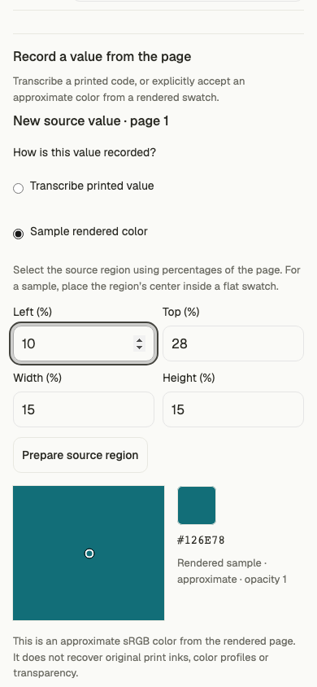
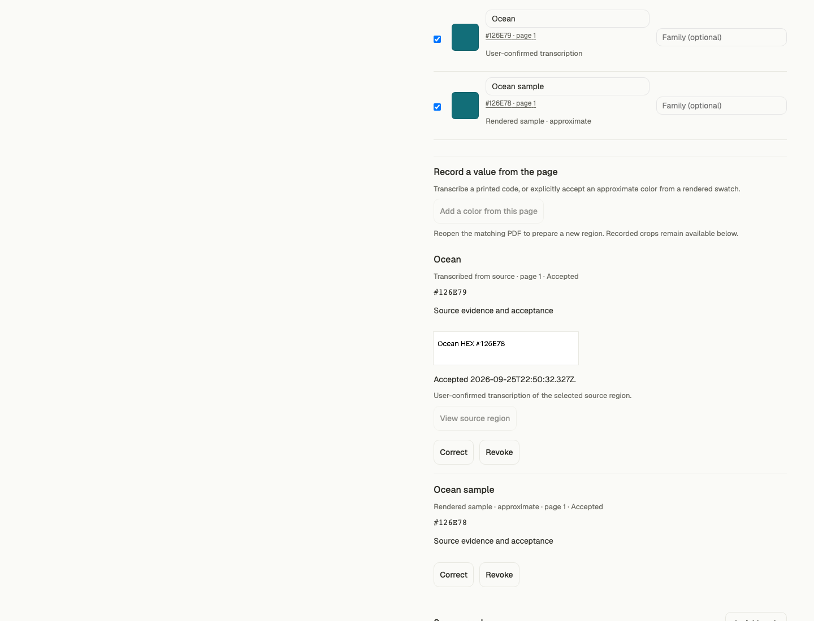

# Confirmed colors from scanned pages

This slice extends standalone Studio with two explicit ways to use a color from a selected PDF page: confirm printed digital notation, or accept an approximate rendered sample. It implements part of TASK-002/TASK-004 and the portable provenance boundary in TASK-009. Full source-adapter, design-quality and release acceptance remain open.

## Behavior and boundaries

- Original Capture V1/V2 records remain unchanged, including missing-text and incomplete-coverage gaps. Confirmed values live in Review/Project V4 with their source hash, capture hash, page, region, bounded raster and user decision.
- A transcription retains its exact supported HEX/RGB/sRGB literal and native channels, including alpha. It is described as user-confirmed interpretation rather than parser extraction.
- A sample comes from the center pixel of the retained, opaque sRGB raster. PDF.js renders onto white; the sample cannot establish original CMYK, Pantone, ICC profile, alpha or authored digital values. Acceptance never changes that classification.
- Source regions require the matching PDF and a requested, inspected page. Retained crops support offline inspection and transcription correction. Page selection does not silently expand.
- Corrections create a replacement record. Revocation and ordinary review edits clear the applied review and selected gradient. Existing source relationships and restrictions still pass through the same compiler and engine.
- CSS comments, token descriptions/metadata, application SVG descriptions and gradient exports disclose manually interpreted or approximate inputs. Generated shades inherit the notice from their declared source anchors.
- Projects explicitly contain their selected source crops; they exclude the full PDF. Design exports contain method notices without embedding those crops. No source is uploaded by this local flow.

The panel uses the existing Studio controls, with a retained crop beside the value, clear confirmation actions, keyboard-accessible region coordinates and mobile layouts. Automated assistance currently applies before manual values are added; reopening, naming, grouping, scale editing and explicit rules remain local afterward.

## Contracts and compatibility

The compiler receives one validated source inventory assembled from immutable extraction evidence and separately confirmed values. It does not manufacture parser observations or use a second color engine. Strict replay rejects changed crops, sampled values, source identity, stale confirmation and stale selected output. A saved record documents a declared source and reviewer; it does not authenticate either one.

Raw RGBA crops are at most 256 × 256 pixels, opaque, canonical base64, hash-bound and limited to 16 witnesses / 6 MiB per reviewed-value layer. Region rendering is bounded and cancellable. These are local proof limits, not a measured capacity promise for arbitrary documents.

Actual prior V1/V2 projects and the V3 browser download from commit `949f540` are pinned fixtures. They must replay byte-for-byte with their original review, model, project and selected-design hashes.

## Verification

Verified locally on Node 22.13.1 and Node 24.19.0:

| Check                                                         | Result                                                                                                                            |
| ------------------------------------------------------------- | --------------------------------------------------------------------------------------------------------------------------------- |
| Studio unit/contract suite                                    | 24 files, 332 tests pass on each runtime                                                                                          |
| Core proposal, construction and authored delivery regressions | 78 tests pass on each runtime                                                                                                     |
| Scanned/manual browser harness                                | 10 scenario groups pass on each runtime; zero external requests or browser errors                                                 |
| Assisted HTTP/service browser harness                         | 12 scenario groups pass on each runtime, including failed-cancellation recovery across a V4 project open; synthetic provider only |
| Earlier guideline browser flow                                | 24 scenario groups pass on Node 22; zero remote requests                                                                          |
| Numeric PDF browser regression                                | 8 scenario groups pass on Node 22; zero external requests or browser diagnostics                                                  |
| Studio lint, TypeScript and production build                  | Pass; builds on both runtimes                                                                                                     |
| PRD/plan validation                                           | Full + AI + refactor, ready stage, strict: pass                                                                                   |

The existing bundle-size advisory remains: the lazy guideline chunk is 690.29 kB / 206.83 kB gzip. The full release gate was not run for this local slice.

Reuse, quality and efficiency reviews covered the exact slice. Fixed findings: repeated crop validation during field edits and project replay; provenance omission from mismatched gradient exports; and lost assisted-request recovery controls when a manual project opens. Bounded performance measurements and their limits are in `manual-efficiency.json`; ordinary structure edits decode no crop data. Cold project import still performs synchronous bounded validation and hashing.

Final commands, source hashes and browser artifacts are recorded in `confirmed-page-values-checks.json` alongside this document. The suite covers source scope, altered evidence, correction/revocation, legacy replay, native numeric precision, generated input notices, product application exports, browser cancellation, offline recovery and mobile controls. Technical fixtures are synthetic; no result here establishes aesthetic quality or approval of a real brand palette.

## Remaining work

Figma/website intake, source-conflict review, broader direction generation, durable asset storage/source refresh and full gradient editing remain in the parent plan. Live-provider configuration/qualification, hosted authentication and deployment, independent human design acceptance and assistive-technology observation require their own evidence. This slice is local implementation and verification; it is not integrated, pushed, deployed or live-observed.
