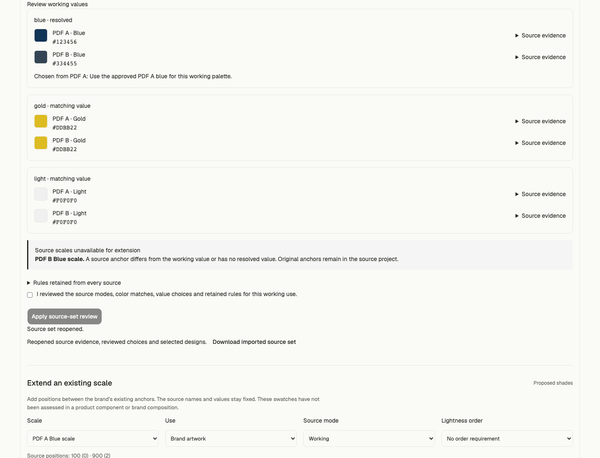
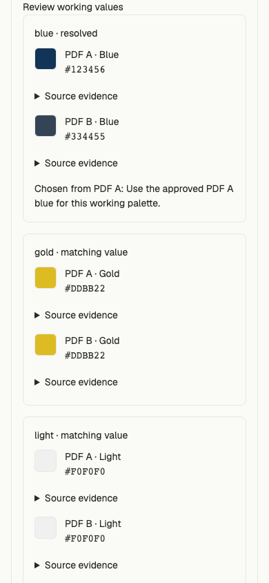

# Reviewed source sets in standalone Studio

Status: locally implemented and verified on Node 22.13.1 and Node 24.19.0. Not integrated into shipping main, pushed, deployed, live-connected or accepted for brand quality. This advances TASK-002/004/009 and REQ-004/005/006/011. Full PRD acceptance remains open.

Studio is the primary tool. No Figma plugin is required to reconcile sources, generate a design, or export SVG/CSS/JSON. An optional native Figma Variables/Styles importer remains separate work; browser proof does not establish successful paste behavior in Figma.

## What works

The Guidelines view now offers **Combine guidelines**. Add reviewed PDF/Figma/website projects directly from their review panels or from saved files. Two to eight preserved sources can define one explicitly selected brand/product use and one Working mode. Each original source mode is selected separately. Color-purpose matches are editable suggestions; different exact channels or alpha require an explicit value choice and reason. Original project strings, source hashes, locators, methods, claims and coverage remain available. Review creates fresh merged rule adoptions.

The combined model uses the existing extension, supporting-color, application and gradient tools. Source-set V1 downloads preserve the original projects, working decisions and selected designs. Reopening rebuilds the source projection and replays saved outputs through existing strict readers. Original single-source schemas and shared core behavior are unchanged.

## Safeguards and limits

- Choosing A's paint preserves B's restrictions on the same reviewed purpose. Rules keep their original scope, force, ordering and evidence. Unsupported meaning and missing values remain visible and block affected generation.
- Original scale values and positions remain exact. A scale with a different selected anchor is unavailable; no anchor is silently replaced.
- Available scale selectors stay dynamic, so adding shades changes their rule dependencies. Another source's rule-governed overlapping family/scale blocks extension until its group correspondence is reviewed. Matching individual color purposes alone cannot authorize adding group members. Existing-paint assessment still uses the preserved restrictions.
- Full source projects pass strict validation before a bounded exact-byte cache retains their immutable source review. Changed bytes revalidate. Combined model limits fail explicitly rather than trimming evidence. The project file limit is 16 MiB.
- Unknown versions retain the original file read-only. Failed imports preserve valid current export. Source replacement invalidates completed proof; saving and transient operations only cancel pending work. Cancelled late file reads cannot overwrite a newer workspace.
- Source sets must currently be downloaded before leaving the view. Device-library admission and selective refresh across the set are the next implementation work. Source family correspondence is not yet an authoring feature. Source-set nested territory fragments/conflicts remain explicitly unsupported.

## Verification

The [file-bound receipt](source-set-checks.json) records:

| Check                                                  | Node 22                     | Node 24                     |
| ------------------------------------------------------ | --------------------------- | --------------------------- |
| Studio unit suite                                      | 589 tests / 48 files passed | 589 tests / 48 files passed |
| Studio lint                                            | passed                      | passed                      |
| Typecheck and enabled production build                 | passed                      | passed                      |
| Production source-set browser flow                     | passed                      | passed                      |
| Existing selected-output/IndexedDB recovery regression | passed                      | passed                      |

The 18 new source-set tests cover all three source kinds together, preserved conflicting observations, color/family/scale rule bypass, dynamic retained scale membership, cross-source permission/requirement/prohibition guards, gradient-only restrictions, exact fractional conflicts at identical display hex, stale choices, source reorder, malformed/duplicate mappings, combined capacity, strict selected-output recovery and future/corrupt files.

The production browser scenario adds sources through actual review panels, saves/reopens unresolved work, resolves a conflict, produces a scale extension and gradient, and compares exact recovered shade values and SVG. It covers failed/future import recovery, a held file read cancelled before opening newer work, changed-use invalidation, offline replay, direct native Figma addition and a 390 px viewport. No browser page errors or external source/provider requests occurred. The website adapter is covered in the combined contract test and shares the directly verified Figma review action; this slice does not claim a new live website capture test.

Independent reuse, quality and efficiency reviews were completed. Their fixes preserve dynamic scale rules, block unreviewed cross-source group expansion, separate transient import errors from invalid drafts, retain completed gradient proof across save, and avoid repeating original workspace output replay on every edit. The full plugin/shared-core release gate was not rerun for this Studio-only change. Vite still reports the existing large lazy Guidelines chunk warning; this is not a performance qualification claim.

PRD/plan Full + AI + Refactor ready-stage structural validation passes. Broader real-brand evaluation, live capture/provider qualification, source-set storage/refresh, human visual acceptance and release remain open.

## Render evidence

The desktop and mobile images show the reviewed conflict and exact original values. Visual inspection found readable source evidence controls and no horizontal mobile overflow. These synthetic palette examples are engineering fixtures, not a recommended brand palette.

