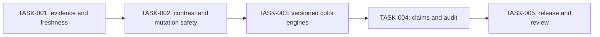

# Color Foundations Alignment 2026 — Plan of Action

## Plan Control

| Field                    | Value                                                    |
| ------------------------ | -------------------------------------------------------- |
| Canonical PRD            | docs/prds/2026-08-02-color-foundations-alignment.md      |
| Plan status              | Complete                                                 |
| Last updated             | 2026-08-02                                               |
| Current release state    | Locally verified                                         |
| Integration receipt      | Not applicable until integrated.                         |
| Commit receipt           | Not applicable until pushed.                             |
| Deploy receipt           | Not applicable until deployed.                           |
| Live observation receipt | Not applicable until live-observed.                      |
| Critical path            | TASK-001 to TASK-002 to TASK-003 to TASK-004 to TASK-005 |
| Highest uncertainty      | RISK-002: Local MINDE corpus impact                      |

## Strategy

**Outcome:** Deliver OUT-001 through OUT-005 without changing historical source datasets or weakening existing semantic pair gates.

**Guiding policy:** Prove profile, rendering context, pair semantics, and source provenance before issuing a pass or mutating Figma. Adopt newer mechanisms only where a fixture demonstrates a measurable correctness or fidelity gain.

**Delivery shape:** Lock the evidence contract first; fix false-pass boundaries; modernize mapping and matching behind versioned types; align claims; then run complete local release and independent-review gates.

**Stop or reshape conditions:** Stop a slice if historical source bytes change, any required semantic pairing regresses, exact Radix payload differs, the production UI/backend contract becomes mixed, or Local MINDE regresses any of the 536 eligible outputs or stops returning explicit failures for the two impossible Wada White exact anchors.

## Dependency Graph

## Milestones and Tasks

### Milestone 1 — Evidence becomes executable

**Entry criteria:** Baseline lint, typecheck, and focused tests pass; primary-source research is recorded.

**Exit criteria:** AC-008 passes and the ready-stage PRD validator exits zero.

#### TASK-001 — Encode source freshness and falsification fixtures

- **Purpose:** Turn the research snapshot into an expiring, deterministic release input before behavior changes.
- **Maps to:** REQ-008, NFR-004, AC-008, AC-009
- **Scope:** Add `docs/color-foundations-manifest.json`, `scripts/verify-color-foundations.mjs`, its tests, and the package/CI command; record source URLs, status, reviewed date, review-by date, Radix/APCA versions, CSS gamut algorithm, and unsupported frontier claims.
- **Dependencies:** EVID-001 through EVID-009 and baseline command receipts.
- **Implementation result:** Offline verification passes through 2027-02-02 and a controlled post-expiry fixture fails with actionable source names.
- **Verification:** `npm run verify:color-foundations` plus its clock-bound test.
- **Expected evidence:** Passing current-date receipt, failing post-expiry fixture, and ready-stage PRD validator output.
- **Recovery path:** Remove the new release script without changing runtime behavior; do not claim currentness without another dated gate.
- **Authority:** Autonomous local repository change; no release or external publication authorized.
- **Status:** complete

### Milestone 2 — False contrast and mutation claims are blocked

**Entry criteria:** TASK-001 complete.

**Exit criteria:** AC-001, AC-002, AC-003, and AC-006 pass with negative fixtures.

#### TASK-002 — Enforce authoritative profile context and protocol boundaries

- **Purpose:** Ensure Teul reports or mutates only when an opaque rendered sRGB context is proven.
- **Maps to:** REQ-001, REQ-002, REQ-003, REQ-006, NFR-001, NFR-003, AC-001, AC-002, AC-003, AC-006
- **Scope:** Update `src/backend/accessibilitySelection.ts`, accessibility result types/validation, `src/components/AccessibilityTab.tsx`, semantic report profile metadata, and `src/backend/colorSystemTransaction.ts`; add ancestor, overlap, stacking, profile, malformed-message, stale-response, mutation-spy, and export fixtures.
- **Dependencies:** TASK-001.
- **Implementation result:** Non-sRGB or ambiguous selection returns one explanatory failure; malformed/stale results cannot enter UI state; live profile/geometry is rechecked after dynamic-page awaits; every sRGB-described on-canvas generation mode blocks non-sRGB profiles and locks sRGB across frame, variable, and style mutations; export remains available.
- **Verification:** Focused Vitest suites for accessibility selection/UI/validation, semantic policy/export, and color-system transaction.
- **Expected evidence:** Threshold-reversal negative test, 50%-ancestor negative test, malformed-message table, and zero-mutation spy.
- **Recovery path:** Revert the slice atomically; keep manual sRGB analysis and non-mutating exports available.
- **Authority:** Autonomous local repository change; runtime Figma observation remains external.
- **Status:** complete

### Milestone 3 — Generated and exact systems have measured modern contracts

**Entry criteria:** TASK-002 complete and all affected tests green.

**Exit criteria:** AC-004 and AC-005 pass; no BASE-001 through BASE-004 regression.

#### TASK-003 — Version gamut mapping and Radix interpretation

- **Purpose:** Improve measurable output fidelity while keeping exact source values and accessibility gates unchanged.
- **Maps to:** REQ-004, REQ-005, NFR-002, NFR-003, AC-004, AC-005
- **Scope:** Implement Binary Search with Local MINDE in `src/lib/colorScale.ts`; atomically update method contracts to `Teul OKLCH v3`; add edge, golden, property, corpus, and checksum tests; pin exact Radix package as a development source, compare all 744 values, replace CIE76/light-step-9 recommendation with documented Delta E OK matching, and bind or remove context-free WCAG badges in every layout.
- **Dependencies:** TASK-002.
- **Implementation result:** Versioned deterministic v3 output preserves anchor/finite/sRGB guarantees for all 538 historical candidates, passes every invariant for 536 eligible candidates, retains explicit impossible-anchor failures for the two Wada White modes, improves reviewed adversarial chroma retention, rejects forged v3 claims through backend regeneration, and keeps exact Radix/package interpretation truthful.
- **Verification:** Focused color-scale corpus, message/export/backend, Radix source/matcher, and three layout suites.
- **Expected evidence:** Ten independent Color.js Local MINDE vectors, property grid, deterministic corpus checksum with 536 valid plus two named failures, 744-value upstream parity, pink/yellow/blue matcher goldens, and label assertions.
- **Recovery path:** Restore the complete v2 producer/consumer contract and keep the release blocked; never ship a mixed method version.
- **Authority:** Autonomous local repository change; generated-output release remains unapproved.
- **Status:** complete

### Milestone 4 — Claims match evidence

**Entry criteria:** TASK-003 complete.

**Exit criteria:** AC-007 passes and source-of-truth documentation reflects observed behavior.

#### TASK-004 — Publish the scoped audit and align claim surfaces

- **Purpose:** Make normative, supplemental, advisory, exact, generated, and unsupported claims distinguishable to users and maintainers.
- **Maps to:** REQ-007, REQ-008, AC-007, AC-008
- **Scope:** Update CVD tritan labels/descriptions, APCA/profile wording, Radix exact-mode name, README and `docs/SOURCE_PROVENANCE.md`; add `docs/COLOR_FOUNDATIONS_AUDIT_2026-08-02.md` with fix-now, no-change, and deferred findings and source links.
- **Dependencies:** TASK-003.
- **Implementation result:** Release surfaces contain zero audited overclaims and explicitly state that monitors, P3 WCAG, HDR, and simulated perception have external or experimental boundaries.
- **Verification:** Static claim search, focused UI/backend snapshots, provenance review, and `npm run verify:color-foundations`.
- **Expected evidence:** Claim matrix and zero-finding static review receipt.
- **Recovery path:** Block release and correct wording; do not weaken calculation gates to preserve copy.
- **Authority:** Autonomous local documentation/UI change; public publication remains unapproved.
- **Status:** complete

### Milestone 5 — Local candidate closes under independent review

**Entry criteria:** TASK-001 through TASK-004 complete.

**Exit criteria:** AC-009 passes; independent findings are resolved; PRD complete-stage validator exits zero; release state is Locally verified only.

#### TASK-005 — Run full gates and reconcile independent review

- **Purpose:** Prove the complete candidate and report the next external gate without inflating release state.
- **Maps to:** REQ-001, REQ-002, REQ-003, REQ-004, REQ-005, REQ-006, REQ-007, REQ-008, NFR-001, NFR-002, NFR-003, NFR-004, AC-001, AC-002, AC-003, AC-004, AC-005, AC-006, AC-007, AC-008, AC-009
- **Scope:** Run Node 22 lint, typecheck, full tests/coverage, build, artifact assertions, production UI checks, dead-code report, Wada verification, standards verification, and dependency audit; commission a no-intended-answer reviewer against the PRD/diff/evidence; update PRD, plan, and audit receipts.
- **Dependencies:** TASK-004.
- **Implementation result:** The scoped implementation, independent review, and every automated release gate pass against the isolated Git-index candidate. The source is locally verified; the production Figma reload remains a separate runtime-only acceptance step.
- **Verification:** Full release command chain and `validate_prd.py --stage complete --strict --extension refactor --plan ...`.
- **Expected evidence:** Command exit receipts, reviewer verdict, exact diff/status, complete validator output, and explicit runtime boundary.
- **Recovery path:** Leave the branch unreleased, isolate the failing slice, repair and rerun all affected gates; no destructive rollback.
- **Authority:** Autonomous local verification; staging, commit, push, deployment, publication, and Figma runtime sign-off require separate authorization or action.
- **Status:** complete
- **Runtime boundary:** The automated source contract is complete. A production Figma development reload is still required before any live-observed claim.

## Verification Ledger

| Acceptance ID | Task     | Proof method                                      | Expected result                                    | Actual receipt | Status  |
| ------------- | -------- | ------------------------------------------------- | -------------------------------------------------- | -------------- | ------- |
| AC-001        | TASK-002 | Focused backend/UI tests                          | Only proven sRGB selection succeeds.               | Node 22 foundation suite: 16 files, 284 tests passed. | Passed |
| AC-002        | TASK-002 | Scene-graph negative fixtures                     | Ambiguous context returns failure.                 | Ancestor, geometry, stacking, overflow, and render-bound negatives passed. | Passed |
| AC-003        | TASK-002 | Validator/component tests                         | Invalid/stale messages do not mutate UI state.     | Malformed, stale, unmount, success, and failure fixtures passed. | Passed |
| AC-004        | TASK-003 | Independent Local MINDE and 538-output corpus tests | v3 matches the oracle; all 538 retain anchor/finite/sRGB; 536 eligible outputs pass every invariant; two Wada White modes fail explicitly. | Ten pinned Color.js vectors and checksum `68485d2c…9050` passed; corpus reports 536 valid plus two named impossible-anchor failures. | Passed |
| AC-005        | TASK-003 | Direct package, matcher, and layout tests         | Exact payload and pair-bound interpretations pass. | 744-value parity, matcher goldens, layouts, and labels passed. | Passed |
| AC-006        | TASK-002 | Transaction/UI/export tests                       | Every non-sRGB profile produces zero retained on-canvas mutation; async profile drift rolls back; reports identify sRGB. | All-mode P3/legacy/unknown, font/style race, rollback, and report/export fixtures passed. | Passed |
| AC-007        | TASK-004 | Claim audit and snapshots                         | Zero scoped claim violations.                      | Automated search/tests and independent color-foundations review pass with no unresolved P1/P2 finding. | Passed |
| AC-008        | TASK-001 | Standards verifier and expiry fixture             | Current passes; post-expiry fails.                 | 9/9 verifier tests; current ledger pass and source-naming expiry failure. | Passed |
| AC-009        | TASK-005 | Full Node 22 release chain and complete validator | Every local gate exits zero.                       | Isolated Git index: lint/typecheck; 55 files and 752 tests; 83.64% statements, 75.40% branches, 75.57% functions, 85.10% lines; build, artifacts, production UI smoke, 370,439/409,600-byte bundle, Wada parity, 9/9 standards, 5/5 dependency-policy fixtures, and live audit of the exact lockfile pass. | Passed |

## Decision and Scope Changes

| Date       | PRD/decision ID | Learning                                                                                                                                                  | Plan change                                                                     | Reverification needed    |
| ---------- | --------------- | --------------------------------------------------------------------------------------------------------------------------------------------------------- | ------------------------------------------------------------------------------- | ------------------------ |
| 2026-08-02 | DEC-001         | Primary standards and repository audits found two false-claim paths and two measurable fidelity/interpretation gaps; Radix source data itself is current. | Implement bounded correctness/fidelity slices; defer native P3/HDR/alpha modes. | All acceptance criteria. |
| 2026-08-02 | DEC-001         | Independent adversarial review found async profile/context races, irregular/overflow/skew geometry false positives, and forged provenance paths. | Recheck authority after awaits, fail closed on unprovable geometry, lock mutation profile, and regenerate claimed v3 outputs in the backend. | AC-001 through AC-006. |
| 2026-08-02 | DEC-001         | The remaining `brace-expansion` advisory is indirect development tooling with no compatible patched 1.x/2.x release; production audit is clean. | Add a fail-closed exact advisory allowlist expiring 2026-09-02; unknown, changed, runtime, or expired findings fail `npm run audit`. | AC-009 security gate. |
| 2026-08-02 | DEC-001         | Verification of the exact Git index excludes unrelated working-tree changes and restores the scoped UI bundle to 370,439 bytes. | Treat the isolated index, not the mixed working tree, as the candidate for AC-009 and commit review. | AC-009 release gate. |

## Release Checklist

- [x] All Must requirements map to passing acceptance evidence.
- [x] Negative and recovery cases pass.
- [x] Security, privacy, accessibility, and reliability checks pass as applicable.
- [x] Migration and rollback are rehearsed as applicable.
- [x] Standards expiry and failure output are ready.
- [x] Documentation and support implications are complete.
- [x] Independent review findings are resolved or explicitly accepted.
- [x] Rollout authority is confirmed for local verification only.
- [x] Release state is reported precisely.
- [x] Post-launch review method and date are recorded.
