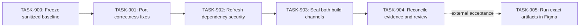

# Reconcile Teul's current shipping line — Plan of Action

## Plan Control

| Field                    | Value                                                                                 |
| ------------------------ | ------------------------------------------------------------------------------------- |
| Canonical PRD            | `docs/prds/2026-09-02-teul-current-reconciliation.md`                                 |
| Plan status              | Executing                                                                             |
| Last updated             | 2026-09-02                                                                            |
| Current release state    | Source-ready locally; not published or current-live-observed                          |
| Integration receipt      | This document's containing commit derives from `origin/main@aadccee`                  |
| Commit receipt           | Exact containing SHA is reported in the Git handoff                                   |
| Deploy receipt           | None; Figma publication is blocked by AC-909 and Q-900                                |
| Live observation receipt | Historical August receipt only; not current-artifact proof                            |
| Critical path            | TASK-900 → TASK-901 → TASK-902 → TASK-903 → TASK-904                                  |
| Highest uncertainty      | RISK-901: dependency/compiler drift could disturb build isolation or artifact budgets |

## Strategy

**Outcome:** OUT-900 through OUT-903: one current, sanitized, source-ready Teul shipping line with applicable correctness and dependency fixes while V2 remains candidate-only.

**Guiding policy:** Prefer public source authority and exact evidence over merging by recency. Every carried change must preserve INV-900 through INV-904.

**Delivery shape:** Establish ancestry and privacy first; port the two narrow correctness fixes; refresh compatible dependencies and both audit graphs; rebuild and re-seal both channels; independently compare the final diff to the PRD.

**Stop or reshape conditions:** Stop if rejected private evidence appears, production contains candidate runtime, historical data changes, unsupported profiles mutate, either supported Node line diverges, or no compatible dependency resolution clears the prototype audit.

## Dependency Graph

## Milestones and Tasks

### Milestone 1 — Authoritative baseline and correctness

**Entry criteria:** Public and private refs fetched; ignored files hashed.

**Exit criteria:** AC-900 through AC-902 pass.

#### TASK-900 — Freeze the sanitized public baseline

- **Purpose:** Prevent private/donor history from becoming shipping authority.
- **Maps to:** REQ-900, NFR-900, AC-900.
- **Scope:** Git ancestry and merge parents, the complete changed-file set, `docs/DONOR_RECONCILIATION_2026-08-23.md`, operational sanitization surface, and ignored `release/` files.
- **Dependencies:** EVID-900, EVID-901, EVID-907.
- **Implementation result:** `codex/teul-current-reconciliation` derives from exact `origin/main@aadccee`; it has no merge commits or donor/private ancestor, rejected paths are not imported, the complete diff is reviewed, the two baseline-hashed user-owned release files remain unchanged, and all ignored release artifacts stay outside staging/current-release claims.
- **Verification:** Positive public ancestry, negative donor ancestry, no-merges audit, complete `origin/main...HEAD` changed-file review, `npm run verify:generic-sanitization`, SHA-256 comparison, and staged-file review.
- **Expected evidence:** Exact public ancestry success; donor ancestry returns false; zero merge commits and sanitization findings; complete diff reviewed; protected hashes unchanged; no ignored release artifact staged.
- **Recovery path:** Switch back to preserved `codex/color-system-audit-extension`; delete no branch or ignored file.
- **Authority:** Autonomous.
- **Status:** complete

#### TASK-901 — Port profile and hue correctness at shared seams

- **Purpose:** Prevent silent sRGB reinterpretation and cross-runtime hue drift without importing donor architecture.
- **Maps to:** REQ-901, REQ-902, NFR-901, NFR-902, AC-901, AC-902.
- **Scope:** `src/backend/colorOperations.ts` and focused/integration tests; `src/lib/colorScale.ts`; `src/lib/colorSystemSecondaryEngineV2.ts`; their focused semantic/golden tests.
- **Dependencies:** TASK-900.
- **Implementation result:** Four write paths fail before mutation outside SRGB; fractional/negative-zero hue normalization is stable; V2 serializes 12-significant-digit decision/evidence math and zeroes powerless hue at the explicit chroma epsilon.
- **Verification:** Node 22 and 24 focused Vitest commands.
- **Expected evidence:** SRGB positive case plus five unsupported-profile zero-write cases, fractional hue identity, canonical precision/powerless-hue assertions, and one identical V2 golden hash on both runtimes.
- **Recovery path:** Revert the scoped source/test files; do not retain a rotated golden without its semantic assertions.
- **Authority:** Autonomous.
- **Status:** complete

### Milestone 2 — Dependency and audit currency

**Entry criteria:** Correctness slice passes.

**Exit criteria:** AC-903 and AC-904 pass.

#### TASK-902 — Refresh compatible dependencies and close the nested audit gap

- **Purpose:** Remove known prototype advisories and keep supported tooling current without hiding major migrations in maintenance work.
- **Maps to:** REQ-903, REQ-904, REQ-907, NFR-903, NFR-904, AC-903, AC-904, AC-908.
- **Scope:** Root/prototype package manifests and locks, empty audit ledger/policy tests, CI action/npm versions, Figma resolved-type message contract, active runtime validator/tests, and narrowly scoped React lifecycle lint exceptions.
- **Dependencies:** TASK-901.
- **Implementation result:** Compatible root packages and Figma typings are current; prototype lock is clean; root audit invokes the low-severity prototype gate; all six Figma metadata types are preserved and validated; intentional Radix/APCA/Lucide and major-version boundaries remain explicit.
- **Verification:** consistent full-registry `npm view`, `npm outdated --json`, `npm run audit`, prototype build, dependency-policy and metadata-transport tests.
- **Expected evidence:** Zero advisories; no remaining consistently resolvable in-scope compatible updates; six current metadata types accepted and an unknown type rejected.
- **Recovery path:** Restore manifests/locks and CI/policy files from TASK-900 baseline.
- **Authority:** Autonomous.
- **Status:** complete

### Milestone 3 — Artifact reseal and honest evidence

**Entry criteria:** Both correctness and dependency gates pass.

**Exit criteria:** AC-905 through AC-908 pass.

#### TASK-903 — Build and seal normal and candidate channels

- **Purpose:** Prove maintenance changes did not expose V2 or invalidate candidate isolation.
- **Maps to:** REQ-905, REQ-907, NFR-900, NFR-902, AC-905, AC-907, AC-908.
- **Scope:** Full test/coverage/build/artifact/smoke/sanitization/Wada/foundation/audit chain on Node 22 and 24.
- **Dependencies:** TASK-902.
- **Implementation result:** Both output directories contain the correct unqualified receipt; exact manifest identity and resolved artifact paths are asserted; Webpack enforces channel-specific module boundaries so production excludes candidate runtime while the candidate contains its required controllers, host adapter, journal, renderer, and release UI; all local gates pass.
- **Verification:** Exact release commands recorded in the ledger.
- **Expected evidence:** Supported-runtime results, test/coverage counts, artifact sizes/hashes, zero audit findings.
- **Recovery path:** Revert TASK-902 package changes or TASK-901 code changes according to the first failing gate.
- **Authority:** Autonomous local verification.
- **Status:** complete

#### TASK-904 — Reconcile receipts and independently review the final diff

- **Purpose:** Make current truth legible without promoting or publishing V2.
- **Maps to:** REQ-906, NFR-905, AC-906, AC-907.
- **Scope:** Candidate record, PRD, plan, final diff, independent review.
- **Dependencies:** TASK-903.
- **Implementation result:** Historical August receipt is explicitly bounded; final local evidence maps to every AC; no unresolved P0/P1 remains.
- **Verification:** Independent PRD-versus-diff review and strict ready-stage PRD validation; complete-stage validation remains reserved for closure of the explicitly external publication gates.
- **Expected evidence:** Review disposition and validator pass.
- **Recovery path:** Revise documentation or implementation; do not weaken release gates.
- **Authority:** Autonomous for source-ready closure; external approval required for publication.
- **Status:** complete

### Milestone 4 — External Figma acceptance and promotion authority

**Entry criteria:** Exact commit and production/candidate artifact hashes are sealed and source-ready.

**Exit criteria:** AC-909 passes for production; Q-900 is separately resolved before any candidate promotion or publication.

#### TASK-905 — Validate the exact production artifact in Figma

- **Purpose:** Confirm the new document-profile guard against the real host rather than only mocks.
- **Maps to:** REQ-901, NFR-901, NFR-905, AC-909.
- **Scope:** A disposable authorized Figma file in SRGB, P3, Legacy, and unreadable/unknown profile states; fill, stroke, style, and gradient operations; exact commit/artifact receipt.
- **Dependencies:** TASK-904 and a designated human evaluator with Figma authority.
- **Implementation result:** The exact host matrix, artifact-binding requirement, owner, failure condition, and no-publication boundary are specified and transferred; the host run itself has not been executed.
- **Expected result:** SRGB operations succeed; every unsupported profile rejects before mutation and preserves prior state.
- **Verification:** Artifact-bound host acceptance record.
- **Expected evidence:** A designated reviewer records the exact commit and production artifact hashes, each profile/operation result, preserved-state proof for every rejection, and the publication decision.
- **Recovery path:** Do not publish; repair and reseal source, then rerun the entire local matrix and AC-909.
- **Authority:** External human/Figma access required. This source reconciliation cannot self-approve or publish.
- **Status:** pending

## Verification Ledger

| Acceptance ID | Task               | Proof method                                                                         | Expected result                                                                                                       | Actual receipt                                                                                                                                                                                                                                                                | Status                                       |
| ------------- | ------------------ | ------------------------------------------------------------------------------------ | --------------------------------------------------------------------------------------------------------------------- | ----------------------------------------------------------------------------------------------------------------------------------------------------------------------------------------------------------------------------------------------------------------------------- | -------------------------------------------- |
| AC-900        | TASK-900           | Ancestry, merge audit, full diff, sanitization, protected hashes, staged-file review | Public linear baseline; no donor history/private material; protected hashes unchanged; ignored release files excluded | Public base `aadccee`; donor is not an ancestor; no merge commit; full changed-file set reviewed; sanitization green; hashes `9adc5da9...` and `d733d27b...` unchanged; ignored release tree excluded                                                                         | Passed locally                               |
| AC-901        | TASK-901           | Focused color-operation tests                                                        | SRGB succeeds; unsupported cases perform zero writes                                                                  | Node 22.13.1 and 24.0.0: SRGB positive path and five unsupported-profile cases pass for fill, stroke, style, and gradient; style rechecks after await                                                                                                                         | Passed                                       |
| AC-902        | TASK-901           | Focused color-scale tests on Node 22/24                                              | Fractional hue identity and goldens pass                                                                              | Both runtimes pass fractional/negative-zero hue, exact powerless threshold, 12-digit canonicalization, and golden `31463566...`                                                                                                                                               | Passed                                       |
| AC-903        | TASK-902           | Outdated plus root/prototype audits                                                  | Zero in-scope compatible drift and zero advisories                                                                    | Full-registry comparison finds no consistent compatible drift; root/production/prototype audits report zero vulnerabilities                                                                                                                                                   | Passed                                       |
| AC-904        | TASK-902           | `npm run audit`                                                                      | Root policy and prototype pass together                                                                               | Both runtimes: 7/7 fail-closed policy tests; zero-exception root policy; nested prototype low-severity audit green                                                                                                                                                            | Passed                                       |
| AC-905        | TASK-903           | Dual build/artifact/smoke scan                                                       | Separate correct channel receipts and runtime isolation                                                               | Both runtimes: exact IDs/manifests/paths and Webpack module isolation pass; production code/UI/channel hashes `ab23d240...`/`d0621119...`/`76096737...`, candidate `8c693ebe...`/`71599c21...`/`166b5e86...`; sizes `192625/326108` and `885316/377683`; budgets/smokes green | Passed                                       |
| AC-906        | TASK-904           | Documentation review                                                                 | Historical/current evidence boundary is explicit                                                                      | Candidate record separates the August observed artifact from the September local-only artifact                                                                                                                                                                                | Passed                                       |
| AC-907        | TASK-903, TASK-904 | Full Node matrix, independent review, strict validator                               | All local gates pass; lifecycle is not overstated                                                                     | Node 22.13.1 and 24.0.0: lint/typecheck, 96 files and 1,416 tests, coverage `78.07/72.30/82.64/79.59`, Wada/foundations/audits/builds/smokes/benchmark green; strict ready-stage validator and final independent review passed                                                | Passed locally                               |
| AC-908        | TASK-902, TASK-903 | Metadata inventory and active transport-validator tests                              | All six Figma types pass as metadata-only; unknown/malformed types fail closed                                        | Inventory and active validator tests accept `BOOLEAN`, `COLOR`, `EASING`, `FLOAT`, `STRING`, `TIMING`; reject unknown/extra/malformed data                                                                                                                                    | Passed                                       |
| AC-909        | TASK-905           | Exact production artifact in Figma                                                   | SRGB succeeds; P3/Legacy/unreadable or unknown profiles preserve state and reject all four direct color operations    | Pending external                                                                                                                                                                                                                                                              | Blocks publication, not source-ready closure |

## Decision and Scope Changes

| Date       | PRD/decision ID | Learning                                                                               | Plan change                                               | Reverification needed   |
| ---------- | --------------- | -------------------------------------------------------------------------------------- | --------------------------------------------------------- | ----------------------- |
| 2026-09-02 | DEC-900         | Simulated merge produces extensive conflicts and violates donor sanitization decisions | Reconcile from public main rather than merging private PR | Full dual-channel chain |

## Release Checklist

- [x] All local Must requirements map to passing acceptance evidence; the separately identified external gates remain open.
- [x] Local negative and recovery cases pass.
- [x] Local security/privacy/performance checks pass; current-artifact Figma accessibility/host acceptance remains external.
- [x] No persistent data migration applies; every source slice has an explicit revert path.
- [x] Instrumentation/dashboard burden is not applicable to this local classic plugin; artifact receipts are defined.
- [x] Documentation and support implications are complete for source-ready closure.
- [x] Independent review findings are resolved; no remaining local source-ready blocker was found.
- [x] Rollout authority is limited to source-ready local work; publication remains external.
- [x] Release state is reported precisely.
- [x] Post-launch measurement is deferred to the authorized Figma qualification owner.
