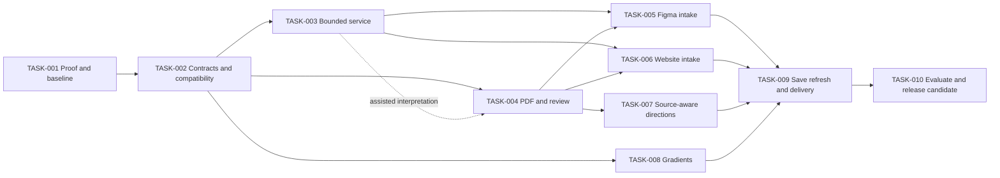

# Brand guideline import — engineering plan

## Plan Control

| Field                    | Value                                                                                                                      |
| ------------------------ | -------------------------------------------------------------------------------------------------------------------------- |
| Canonical PRD            | [Build a color system from an existing brand guideline](../prds/2026-09-25-brand-guideline-import.md), 2026-09-25 revision |
| Plan status              | Executing                                                                                                                  |
| Last updated             | 2026-09-27                                                                                                                 |
| Current release state    | Partial local implementation; source review, extensions and actual application checks verified                             |
| Integration receipt      | Not integrated; local proof on feature branch                                                                              |
| Commit receipt           | Local proof commits `7684f6d`, `3e8795a` and project recovery `c3cef41`; not pushed                                        |
| Deploy receipt           | Not applicable; feature not deployed                                                                                       |
| Live observation receipt | Not applicable; feature not live-observed                                                                                  |
| Critical path            | First useful result: TASK-001 → TASK-002 → TASK-004 → TASK-007; all branches join TASK-009 → TASK-010                      |
| Highest uncertainty      | RISK-001 and RISK-005: source interpretation usefulness and gradient fidelity                                              |

The active goal authorizes execution of this PRD end-to-end on branch `codex/brand-guideline-import`, starting at `3aa0f9c`. TASK-001, TASK-002, the local manual-review slice of TASK-004 and the preview seam of TASK-007 are in progress. Complete dependency-ready work continuously within the specified scope; do not ask to continue after every milestone. New external agreements, private-data processing, deployment and publication require their actual authority, not an assumption carried forward from an unrelated release.

## Strategy

**Outcome:** OUT-001 turns supported sources into usable reviewed models; OUT-002 produces useful extensions and gradients; OUT-003 preserves exact choices through saving and delivery.

**Guiding policy:** Capture evidence first, review consequential interpretation, compile once into the existing model, and use one selected recipe across preview and output. Reuse deterministic capabilities; isolate probabilistic interpretation and network operations.

**Delivery shape:** Ten bounded work packages for the standalone Studio. First prove the uncertain seams; then finish one PDF-to-extension slice. Figma URL input, website and gradient work branch from stable contracts. Storage/portable export and independent evaluation close the integrated workflow. Relative size: the ingestion service and gradient evaluator are substantial new engineering; source modeling and core construction are adaptations. DEC-006 makes new Figma plugin UI, Variables/Styles import and native delivery optional later work. There is no credible elapsed-time estimate before TASK-001 establishes parser, model and render feasibility.

**Stop or reshape conditions:** Unsupported hard rules, no correction-time benefit, a source-permission gap, unacceptable cross-target gradient error, or failure of the visual benchmark must change the affected slice. Do not widen scope, weaken the gate, or replace missing real-source evidence with an unlabeled synthetic fixture.

## Dependency Graph

Parallelize separate adapter implementations after the shared contract stabilizes. Assign one owner to shared model/recipe/storage files. No parallel agent should independently invent or mutate their schemas.

## Milestones and Tasks

### Milestone 1 — Prove source understanding and preserve the existing foundation

**Entry:** Implementation authorized; checkout/release identity rechecked; permitted source fixtures available.

**Exit:** One real-source proof, explicit failure evidence, measured bounds, and versioned contracts ready for the first complete slice.

#### TASK-001 — Prove a real source-to-design journey and gradient fidelity

- **Purpose:** Retire RISK-001 and RISK-005 before investing in multiple adapters or service infrastructure.
- **Maps to:** REQ-001, REQ-007, REQ-009, REQ-015, NFR-002; AC-001, AC-006, AC-008, AC-014, AC-017.
- **Scope:** Permitted fixtures located through `docs/evidence/2026-09-24-brand-color-system-precedents.md`; proposed private evaluation fixture manifest; local extraction/interpretation harness; existing construction and authored execution APIs; isolated gradient prototype. No production source/data mutation.
- **Dependencies:** DEC-001, DEC-003, DEC-004; usable fixture access. A live model comparison additionally requires an approved provider/data configuration.
- **Implementation result:** A native and a difficult/scanned source each produce a reviewable interpretation. Compare manual/deterministic correction with assisted interpretation on identical inputs. Use one reviewed source to create a useful extension in both a component and brand composition. A separate two/three-stop gradient spike proves Studio-to-CSS/SVG/JSON fidelity. Prepare the same small synthetic guideline in PDF, Figma and HTML for later cross-adapter convergence. Freeze human-label rubric and development/held-out split before tuning.
- **Verification:** Run source-to-model assertions and a timed review walkthrough; compare native versus operator-derived PDF values; sample gradient routes against independent rendering/math; record provider cost, latency and failures. Test an explicit source ban and one infeasible brief. Confirm generation and portable exports work with no Figma plugin installed. Optional destination observations are not proof-slice dependencies.
- **Expected evidence:** `docs/evidence/brand-guideline-import/proof.md` with source hashes/permissions, baseline, images, traces, model configuration, proposed-limit measurements, and proceed/narrow decisions; private raw assets excluded from repository artifacts.
- **Recovery path:** Keep harness isolated; discard failed hypothesis and narrow interpretation or export support while preserving accurate extraction; native importer work stays deferred.
- **Authority:** Local proof after implementation authorization; private provider upload and any Figma UI control require the applicable separate authority. Independent contract work can continue without those external actions.
- **Status:** in_progress
- **Execution evidence:** First local proof. Local PDF capture/review and canonical gradient proof are implemented; real-source extraction, negative source-rule checks and synthetic browser/export scenarios pass. The fixture-specific Katalon application harness now preserves 29 colors and 27 source slots through product states and measured brand composition; designer usefulness, assisted-reading comparison, benchmark and broader fidelity proof remain open. TASK-002 has begun its independent local file-contract slice; local manual review and the source-extension preview now exercise those contracts. Full proof and release gates remain open.

#### TASK-002 — Define capture, review, recipe and compatibility contracts

- **Purpose:** Give all inputs and outputs one durable model boundary without breaking existing work.
- **Maps to:** REQ-004, REQ-005, REQ-006, REQ-011, REQ-012, REQ-014, NFR-003; AC-004, AC-005, AC-010, AC-011, AC-013.
- **Scope:** Add capture/draft/review-envelope modules alongside `src/lib/colorSystemModelV1.ts`; strict parsers and migration adapters beside `colorSystemRecipeV1.ts`; consumer inventory for `web/src/lib/authoring.ts`, `saved.ts`, `savedStore.ts` and existing plugin consumers solely for regression protection. No new plugin message/delivery contract required. Proposed source assets remain outside recipe JSON.
- **Dependencies:** TASK-001 demonstrated local capture/model/gradient seams permit reversible contract work now. Assisted-reading and human-quality gates remain open and may revise these contracts. DEC-003; BASE-001, BASE-002, BASE-003.
- **Implementation result:** Typed source locators and exact/converted/sampled methods, partial coverage, conflicts, immutable observations, adoption records and dependency hashes. Lossless conversion of supported reviewed meaning to the existing model. Explicit versioned envelope discriminates solid and gradient designs, source-project references and model limits. Old parsers remain strict. Unknown schema remains retained/read-only.
- **Verification:** Characterization tests for all existing consumers; invalid-reference, unknown-field, oversized packet, exact-precision, rule-stripping and forged-authority negative cases. Changing a rule affects eligibility; evidence-only changes do not unnecessarily erase unaffected decisions. Review migration matrix before writers use it.
- **Expected evidence:** Contract/schema documentation, test receipts and model/recipe version matrix tied to the implementation SHA.
- **Recovery path:** No destructive migration; keep old readers/writers active behind existing routes until new contracts pass.
- **Authority:** Autonomous local changes after implementation authorization; no connector or global-skill changes.
- **Status:** in_progress
- **Execution evidence:** Local commit `c3cef41`; [project contract and compatibility matrix](../evidence/brand-guideline-import/project-contract.md), [targeted checks bound to file hashes](../evidence/brand-guideline-import/project-contract-checks.json). Eight Studio test files / 53 tests and 15 guideline browser scenarios pass on both supported runtimes. Complete TASK-002 contracts, multi-source handling and refresh are still open.
- **Current slice:** A strict, bounded local project envelope reopens existing PDF capture, partial review draft, applied review and selected two-stop gradient. Replay checks source/decision/design bindings, accepts the earlier source-review download, and retains future versions read-only. This is file-based recovery; IndexedDB projects, multiple sources and refresh remain later work. The later [source-structure slice](../evidence/brand-guideline-import/source-structure.md) adds V2 scales and relationships with V1 compatibility.
- **Risk review:** Reuse existing inert JSON, capture, model and gradient validators; add no database or provider. Test file round-trips and malformed replacement before expanding the UI. Keep all existing recipe readers unchanged. Preserve original imported bytes and source provenance; importing records does not authenticate their claimed reviewer or fetch their locators.

### Milestone 2 — Finish one complete import and review flow

**Entry:** Evidence and compatibility contracts pass.

**Exit:** A PDF is imported, reviewed, compiled and used to generate a source-aware direction; remote jobs have privacy, quota, ownership and recovery controls.

#### TASK-003 — Build the bounded ingestion service and model job boundary

- **Purpose:** Support OAuth, public capture and optional interpretation without exposing credentials or importing an unbounded agent runtime.
- **Maps to:** REQ-013, NFR-001, NFR-002, NFR-003, NFR-005; AC-012, AC-016, AC-017.
- **Scope:** Proposed `services/guideline-intake/` API/worker; owner-bound job table; encrypted short-lived assets/tokens; one model adapter; isolated renderer runtime; typed client adapter in `web/src/lib/`. Reuse managed auth if the chosen host provides it.
- **Dependencies:** TASK-002; DEC-001. Host/operator/provider choice gates hosted use; mock/local service can be built first.
- **Implementation result:** Authenticated create/poll/cancel/delete jobs, workspace/source revision binding, owner-scoped idempotency, durable attempt/cost reservation, bounded queues and spend, provider-disable control, retention/deletion, redacted events and error codes. Accept one result; reconcile unknown provider outcomes and never blindly auto-retry them. At most one eligible retry shares the original budget. No model tool access. Provider settings and exact transmitted evidence appear in the UI before analysis.
- **Verification:** Local contract tests with two isolated users, forged result IDs, duplicate submissions, kill/restart, late replies, cancellation, retention clock, exhausted quotas and budget. Static/browser checks prove keys absent from bundles. Run controlled live calls only under approved configuration; record actual usage against estimates.
- **Expected evidence:** Service threat model, operator runbook, request/response examples, configuration/secret inventory without values, deletion/recovery drill and cost receipt.
- **Recovery path:** Disable remote submission and preserve local observations/manual generation; cancel/expire work and delete ephemeral assets without affecting local saved designs.
- **Authority:** Local implementation autonomous after authorization. New accounts, contracts, spend commitments or external deployment require their actual approval; no implied permission from this document.
- **Status:** in_progress

- **Current local slice:** A framework-neutral authenticated HTTP boundary, durable owner-bound jobs and encrypted temporary evidence. Processors are server-registered; no provider or remote adapter is enabled by default. Synthetic processors prove dispatch, spend reservation, retry, cancellation, deletion and restart behavior before live integrations.
- **Risk review:** Reuse the existing Node 22/24 toolchain and request-limiting precedent. One service, SQLite metadata and sealed files avoid separate queues or per-source microservices. Keep payloads out of job metadata and logs; bind consent and results to source/workspace revisions. Run two-user failure injection and a real process restart locally. Managed hosted authentication, operator configuration and actual source/provider adapters remain explicit later integration gates. Node SQLite is experimental on the pinned Node 22 runtime, so host support remains a release check.
- **Execution evidence:** [Intake foundation and crash/recovery drill](../evidence/brand-guideline-import/intake-foundation.md), [source-bound check receipt](../evidence/brand-guideline-import/intake-foundation-checks.json), and [operator runbook](../../services/guideline-intake/README.md). The local foundation passes 52 service tests and 20 client tests on Node 22/24; Studio's 121-test suite and builds also pass. Authentication is a required host adapter, not an installed identity service. Actual source/provider adapters, hosted checks and consent UI remain open.

#### TASK-004 — Ship PDF extraction, source review and model adoption as one slice

- **Purpose:** Remove JSON preparation and prove that source meaning changes real output.
- **Maps to:** REQ-001, REQ-004, REQ-005, REQ-006, NFR-004; AC-001, AC-004, AC-005, AC-018.
- **Scope:** Proposed PDF worker/adapter; Studio import and evidence-review components under `web/src/`; shared compiler from TASK-002; existing core authoring path. PDF.js is lazy-loaded outside plugin bundles.
- **Dependencies:** TASK-002 for the complete local extraction/review/manual-adoption slice. TASK-003 is required only to finish assisted-interpretation integration; build local behavior in parallel with service work.
- **Implementation result:** Upload/page selection, bounded text/context/preview extraction, opt-in selected-page interpretation, grouped source colors, linked evidence, conflicts and correction/adoption controls. Unknown values remain gaps. The designer can finish a clean review in one action or correct consequential assumptions, then generate with adopted constraints.
- **Verification:** Native/scanned/malformed/encrypted/mixed-profile/large PDF fixtures; incorrect OCR digits; a prohibition beside a counterexample; partial batch coverage; two equal families; keyboard/screen-reader flow. Use a negative fixture that removes a ban and prove the expected candidate changes or rejection. Confirm remote payload contains only selected evidence.
- **Expected evidence:** End-to-end PDF import recording, exact model/rule hashes and generated composition, browser accessibility findings, extraction coverage and correction timing.
- **Recovery path:** Preserve local capture; return to manual review if interpretation fails; no remote call needed to use confirmed exact values.
- **Authority:** Local implementation autonomous after authorization; real private-source interpretation follows TASK-003 configuration gate.
- **Status:** in_progress

- **Partial execution evidence:** [Source structure and extension preview](../evidence/brand-guideline-import/source-structure.md). Manual source controls and generic intermediate-shade construction are locally verified. The subsequent [application slice](../evidence/brand-guideline-import/applications.md) adds actual state/layout assessment and source-bound portable replay. Assisted interpretation, automatic supporting directions and full acceptance remain open.

- **Current assisted-review slice:** Add one shared, inert interpretation request/result contract, an explicitly configured OpenAI Responses adapter, and a Studio consent/suggestion panel. Inputs contain only selected captured text/color evidence and explicitly selected page previews. Output refers to existing evidence IDs; it cannot supply authoritative color values or remove prompted restrictions. Suggestions are applied to an editable draft only after an explicit action and still require the existing review confirmation before generation. Preserve the source-bound interpretation receipt for inspection/export. Unsupported visual/OCR values remain unresolved issues; native-precision capture, scanned-value confirmation and durable multi-source project integration remain part of the full contract.
- **Risk review:** Reuse the committed owner/job/budget/client boundaries, V2 draft validator and existing source controls. Keep one provider adapter with no tools, redirects, automatic retry or configurable network endpoint. Provider/model/pricing are server-owned versioned configuration; the adapter is disabled unless supplied by the host. Validate outputs against input references again in the browser. Test real HTTP semantics with synthetic provider responses and the actual Studio controls; live calls and claims about model quality remain behind the outstanding data/provider configuration gate. Existing local review remains usable without the service.
- **Assisted-review evidence:** [Local implementation and verification](../evidence/brand-guideline-import/assisted-review.md), [check receipt](../evidence/brand-guideline-import/assisted-review-checks.json). The shared schema, configured adapter, explicit consent and editable suggestions are implemented. Eighty service tests, 140 Studio tests and 11 assisted-browser scenarios pass on both supported runtimes; the existing 24 guideline scenarios pass on Node 22. Recovery survives in-session draft/source replacement; persistent reload recovery and embedding assistance receipts in projects remain TASK-009. No live model, authenticated deployment, interpretation-quality evaluation or full acceptance is claimed.

### Numeric PDF evidence slice (TASK-002 / TASK-004)

- **Contract:** Read stated HEX, RGB and CSS sRGB values from selected PDF text while retaining fractional channels, alpha, source literals and exact evidence references. CMYK, spot names and Display P3 remain source text; a displayed swatch does not establish an exact digital value. Preserve separate observations even when their rounded preview hex is identical.
- **Architecture:** Add strict capture V2 and project V3 readers. Reuse the existing native-sRGB value type and shared review/model compiler. Keep V1/V2 project readers and hashes unchanged. The review draft's names, families, rules and scales need no second format; only its capture binding changes. Assisted interpretation continues to name existing observations and cannot supply authoritative numbers.
- **Risk review:** (1) Mirror existing precision/hash and PDF.js bounds. (2) Reuse the text capture and model compiler rather than introduce another parser or color engine. (3) Make exact numeric evidence explicit; keep appearance sampling and manual decisions separate. (4) Prove numeric PDF → review → saved project and portable output in the browser before widening extraction. (5) Defer automatic paint reconstruction and profile conversion; retain their literal source evidence for subsequent review work.
- **Verification:** Fractional channels/alpha, same-preview distinct values, malformed notation, unselected pages, encrypted input, false text references, strict old readers, replay, source restrictions, and actual Studio controls. Synthetic numeric fixtures exercise parsing; they do not establish brand usefulness or close full AC-001/AC-004.
- **Partial execution evidence:** [Numeric PDF evidence](../evidence/brand-guideline-import/numeric-evidence.md), including strict native values, retained text witnesses, shared model compilation, browser review and portable V3 project recovery. This does not close the full source/multi-adapter acceptance criteria.
- **Remaining after this slice:** Scanned/manual confirmation and renderer-derived appearance, source conflicts, multiple sources, adapter integrations, persistent projects, and full acceptance remain in their existing tasks.

### Milestone 3 — Complete the three inputs and three authoring jobs

**Entry:** One complete PDF flow proves the shared review/compiler contract.

**Exit:** Figma and website join that same flow; source-aware extensions and gradients produce reviewable outputs.

#### TASK-005 — Add scoped Figma URL intake with plugin-free fallback

- **Purpose:** Read the guideline where it is authored without requiring Enterprise variable access or manual copying.
- **Maps to:** REQ-002, REQ-004; AC-002, AC-004.
- **Scope:** Service OAuth/Figma read adapter; Studio file/node selection; reuse pure normalization/source logic from existing inventory/adapters. Existing current-file packets may be accepted where already supported; no new plugin reader/export feature is required.
- **Dependencies:** TASK-003, TASK-004; EVID-008.
- **Implementation result:** Server-side OAuth exchange/refresh and scoped content reads; capability detection for optional variables; exact node/native-paint evidence, unresolved aliases and source-version identity. Offer an exported PDF or manual values when account/file access is unavailable, without requiring plugin installation. Preserve observed gradients as source evidence even if their form is unsupported for authoring.
- **Verification:** File/node fixtures with styles, aliases, modes, native gradients and mixed profiles; denied access, expired/revoked token, rate limits and partial variable access. All-three-format synthetic anchor/rule convergence begins here. Observe one authorized REST read and test PDF/manual fallback without a plugin; prove zero source mutation.
- **Expected evidence:** Figma capability/access matrix, source packet, fixtures and live read receipt. State OAuth distribution/review status honestly.
- **Recovery path:** Offer exported PDF/manual source input; retain last reviewed snapshot; disconnect deletes local credentials without deleting saved designs. Provider grant revocation is a separate Figma account-settings action. Existing native packets remain optional convenience.
- **Authority:** Local implementation autonomous; OAuth app registration/distribution and actual account access are external dependencies. Existing Figma foreground-control restrictions still apply.
- **Status:** in_progress
- **Partial evidence:** Bounded REST reader, owner-bound job integration, encrypted OAuth connection lifecycle and Studio capture/inspection locally verified. See [reader evidence](../evidence/brand-guideline-import/figma-rest-reader.md), [connection evidence](../evidence/brand-guideline-import/figma-oauth-connection.md) and [Studio capture evidence](../evidence/brand-guideline-import/figma-studio-capture.md). The [native review/project slice](../evidence/brand-guideline-import/figma-review-project.md) now adds color/mode selection, family/scale/rule decisions, generation and strict offline replay. App/host configuration, cross-format convergence and live access remain open.

#### TASK-006 — Add bounded public website capture

- **Purpose:** Recover observed color-system evidence from a page when no portable guideline exists.
- **Maps to:** REQ-003, REQ-004, NFR-001; AC-003, AC-004, AC-016.
- **Scope:** Service isolated browser/capture worker and egress policy; DOM/computed-color/available-custom-property extractor; Studio region and evidence review; captured mode/viewport metadata.
- **Dependencies:** TASK-003, TASK-004.
- **Implementation result:** One public URL capture with explicit scope, usage evidence, incidental-color exclusion and no login/session inheritance. Preserve provenance and limitations for image/canvas/third-party/overlay content. A page with actual tokens is distinguishable from one with only sampled colors.
- **Verification:** CSS variables, media modes, dynamic/animated page, photos/partner logos, blocked pages, oversized pages and every URL threat class in the PRD. Use a deterministic local fixture server and controlled permitted public page. Finish PDF/Figma/HTML same-guideline convergence; inspect omissions rather than hiding disagreement.
- **Expected evidence:** Capture packet/screenshots, scope/coverage report, network threat receipt and cross-adapter comparison.
- **Recovery path:** Fail within bounds with retained safe partial evidence; offer PDF/native packet/manual entry. Do not expand to credentials, cookie import or a crawler to bypass failure.
- **Authority:** Local implementation autonomous after authorization; bounded public read within task scope. Logged-in browser extension excluded.
- **Status:** in_progress
- **Partial evidence:** The [website capture slice](../evidence/brand-guideline-import/website-capture.md) adds a DNS-pinned HTTPS broker, scoped rendered evidence, explicit omissions, screenshot and owner-bound capture jobs. Real Chromium fixtures and adversarial transport checks pass on Node 22/24. The [website review/project slice](../evidence/brand-guideline-import/website-review-project.md) connects source normalization, explicit review, existing generation and offline projects. Cross-format convergence, qualified live hosting and full acceptance remain open.

#### TASK-007 — Expose source-aware extensions and supporting directions in Studio

- **Purpose:** Use the full reviewed brand structure instead of flattening imported guidelines into six equal swatches.
- **Maps to:** REQ-007, REQ-008, REQ-015; AC-006, AC-007, AC-014.
- **Scope:** `web/src/lib/authoring.ts` and new creative-brief adapter; existing `colorSystemProposalV1`, construction/catalog/authoring execution modules; bounded reusable portions of `colorSystemSecondaryStrategyV3.ts`; Studio review/refinement previews.
- **Dependencies:** TASK-004; reviewed model contract from TASK-002.
- **Implementation result:** Choose relevant families/context, preserve source locks, extend scales or add supporting colors, and compare up to three useful distinct directions. Product mode shows actual states; brand mode shows hierarchy/proportion and source-linked composition. Teul policy, historical references and source rules remain visibly distinct.
- **Verification:** Multi-anchor and dual-family fixtures, empty catalog result, prohibited hue territory, authorized exceptions and impossible constraints. Show that a changed adopted rule changes output. Compare current/manual baseline on the same briefs. No whole-wheel fallback or forced step-9 shape for arbitrary source systems.
- **Expected evidence:** Candidate/derivation receipts and before/after component/brand previews; preliminary blinded review before broader tuning.
- **Recovery path:** Existing manual workflow stays accessible; one/no feasible direction is valid. Refine ranking only after feasibility and source fidelity pass.
- **Authority:** Autonomous implementation and agent review after authorization; human visual acceptance recorded only when performed.
- **Status:** in_progress

- **Partial execution evidence:** [Source structure and extension preview](../evidence/brand-guideline-import/source-structure.md). Manual source controls and generic intermediate-shade construction are locally verified. The subsequent [application slice](../evidence/brand-guideline-import/applications.md) adds actual state/layout assessment and source-bound portable replay. Assisted interpretation, automatic supporting directions and full acceptance remain open.

#### TASK-008 — Build gradients as a reproducible authored output

- **Purpose:** Make complementary gradients useful, editable and accurately assessed across supported targets.
- **Maps to:** REQ-009, REQ-010, REQ-011; AC-008, AC-009, AC-010.
- **Scope:** New versioned gradient model, compiler and assessment modules in `src/lib/`; Studio stop/angle/lock controls and real-use previews; CSS/SVG/JSON exporters. A native Paint Style adapter is outside this first-release plan. Do not change existing global gradient prohibitions.
- **Dependencies:** TASK-001, TASK-002. Integration with source-aware brief uses the same reviewed model; final UX joins TASK-007.
- **Implementation result:** Two-to-five authored opaque linear stops; explicit interpolation/hue route; bounded canonical sRGB compiled paint; traceable derivation; continuous constraints/contrast evaluation on both design path and final compiled paint; save/export values identical to preview. Source gradient bans or unsupported paint restrictions block their actual scope rather than disappear. Anchor-only restrictions do not automatically prohibit interior colors.
- **Verification:** Fixed anchors, reversed/duplicate stops, hue wrap/neutral paths, gamut extremes, muddy-interior examples, allowed endpoints/forbidden interior, ideal-path pass/compiled-paint failure, endpoint-contrast trap, dense oracle comparison, CSS/SVG render parity and stop-budget failure. Freeze seed/policy/version for replay.
- **Expected evidence:** Mathematical assessment description, property/negative tests, target parity matrix, editable preview and cross-render images with measured error bounds.
- **Recovery path:** Block unsupported text assessment or affected export; retain usable design/recipe and qualified portable outputs. Unsupported gradient types remain source evidence. Figma destination limitations do not disable Studio.
- **Authority:** Autonomous local implementation after authorization. No Figma document mutation required.
- **Status:** in_progress
- **Partial evidence:** A canonical two-stop source-anchored gradient and conservative contrast checks are locally implemented; native mode/restriction binding is verified in [native review evidence](../evidence/brand-guideline-import/figma-review-project.md). Two-to-five source-stop editing and portable replay now have [local evidence](../evidence/brand-guideline-import/authored-gradients.md). Explicitly permitted catalog stops and complementary suggestions have [local evidence](../evidence/brand-guideline-import/gradient-catalog.md); continuous compiled-paint limits have [local evidence](../evidence/brand-guideline-import/gradient-assessment.md). Continuous route fidelity and human visual acceptance remain open.

### Milestone 4 — Integrate durable work, prove quality and prepare release

**Entry:** All adapters and authoring jobs satisfy their local contracts.

**Exit:** A single standalone Studio flow meets acceptance, including migrations, portable exports and human quality review; optional Figma output observations remain separate from release completion.

#### TASK-009 — Connect source revisions, saved projects and portable handoff

- **Purpose:** Preserve decisions from import through actual use, including refresh and recovery.
- **Maps to:** REQ-011, REQ-012, REQ-013, REQ-014, REQ-016, NFR-003, NFR-004; AC-010, AC-011, AC-012, AC-013, AC-015, AC-018.
- **Scope:** `web/src/lib/savedStore.ts`, `saved.ts`, asset/project stores and source-diff UI; recipe envelope; CSS/SVG/JSON serializers; clipboard/download controls, capability labels and handoff instructions; docs and recovery exports. No new native backend transaction or plugin importer.
- **Dependencies:** TASK-005, TASK-006, TASK-007, TASK-008.
- **Implementation result:** Saved brand projects reference bounded assets, immutable captures and selected recipe revisions. Refresh is an explicit comparison with dependency invalidation. Copy SVG and download SVG serialize the same safe vector swatches/gradient; CSS and JSON reproduce the selected values and applicable semantics. Explain visual shapes versus Variables/Styles and keep destination proof status explicit. The complete authoring/export flow works without the Figma plugin.
- **Verification:** Concurrent tabs, stale revision, quota/full disk, missing/corrupt blobs, future schema, interrupted migration, offline reopen, source diff, cancellation race and unknown profiles. Compare preview/CSS/SVG/JSON paints from one recipe; test clipboard denial/download fallback, escaped labels, zero external SVG references/scripts, and vector structure. Perform Studio assistive-technology walkthrough. Observe Figma SVG import when authorized and available; record missing host evidence without blocking Studio.
- **Expected evidence:** Migration/rollback matrix and recovery archive, exact recipe/export hashes, source-refresh recording, plugin-free browser walkthrough and destination compatibility status.
- **Recovery path:** Keep old records/readers and new stores intact; flags disable new flow; export unsupported newer records read-only; a failed clipboard request offers the identical download. Native delivery stays optional.
- **Authority:** Autonomous implementation after authorization. Optional Figma destination observation uses only actually authorized host interaction and is not a prerequisite for local completion.
- **Status:** in_progress
- **Partial evidence:** Portable PDF V1–V4 and native Figma projects retain unfinished/applied reviews and selected gradients with strict offline replay. Native source/mode and stale-decision proof is in [native project evidence](../evidence/brand-guideline-import/figma-review-project.md). The [device-local library receipt](../evidence/brand-guideline-import/local-project-storage.md) adds explicit save/update/reopen, separate optional PDFs, quota recovery and cross-tab conflict handling. [Selected-output recovery](../evidence/brand-guideline-import/selected-output-recovery.md) retains extension/application selections and historical assistance provenance. [Durable recovery](../evidence/brand-guideline-import/durable-job-recovery.md) preserves existing requests across reloads. [Saved revisions](../evidence/brand-guideline-import/saved-revisions.md) preserve exact historical projects and original-PDF dependencies. [Staged PDF](../evidence/brand-guideline-import/pdf-refresh.md) and [Figma/website comparison](../evidence/brand-guideline-import/native-refresh.md) preserve old work before accepting updates. [Selective design replay](../evidence/brand-guideline-import/refresh-replay.md) restores unchanged paint after renewed review and retains one portable source lineage. [Composition renewal](../evidence/brand-guideline-import/composition-refresh.md) restores pending embedded extensions without old approvals. Full selective result replay and migration/accessibility acceptance remain open.

#### TASK-010 — Run independent evaluation, simplify, and qualify the release candidate

- **Purpose:** Verify the complete requested product, remove accidental duplication, and separate engineering proof from design acceptance and deployment.
- **Maps to:** REQ-014, REQ-015, REQ-016, NFR-001, NFR-002, NFR-004, NFR-005; AC-013, AC-014, AC-015, AC-016, AC-017, AC-018.
- **Scope:** Exact implementation diff, EVAL-001 through EVAL-006, local verification scripts, operator/privacy documentation, source/brand fixtures and release packet.
- **Dependencies:** TASK-009; approved provider/live account configuration for applicable external checks; independent human reviewers for EVAL-004.
- **Implementation result:** Independent source, code, security and design reviews reconciled; simplify pass resolves in-scope reuse/quality/efficiency findings; only proved-obsolete task-local code removed; all mandatory evidence linked. Hosted pilot prepared or performed only with authorized operator/deployment. Public publication remains separate.
- **Verification:** Existing `npm run verify:local` on Node 22 and 24, extended locally for new service/adapter/eval checks; `npm run report:dead-code`; targeted reruns after material fixes; held-out source/design suite; SVG/CSS/JSON and Studio assistive-technology checks; controlled live provider/privacy/quota drill and authorized Figma REST input proof. Native plugin execution is not a release gate. Record any optional Figma SVG observation separately. Never substitute a mock or agent aesthetic score for its named external/human gate.
- **Expected evidence:** `docs/evidence/brand-guideline-import/acceptance.md` linking every acceptance result, unresolved external dependency, exact commit/build/model/fixture versions, independent review dispositions, and final source/design demonstrations.
- **Recovery path:** Keep feature disabled for any failed critical gate; continue unaffected local fixes; report remaining gate precisely. Do not call the whole feature released because the local suite passes.
- **Authority:** Autonomous local completion after implementation authorization. Hosted/public release and human acceptance require their actual authority/evidence.
- **Status:** in_progress

## Verification Ledger

The acceptance inventory reconciles later slice receipts and distinguishes integrated checks from human and external gates. These rows do not claim full acceptance.

| Acceptance ID | Task                                   | Proof method                                                | Expected result                                    | Actual receipt                                                                                                                                                                                                                          | Status                                                                                                                                                          |
| ------------- | -------------------------------------- | ----------------------------------------------------------- | -------------------------------------------------- | --------------------------------------------------------------------------------------------------------------------------------------------------------------------------------------------------------------------------------------- | --------------------------------------------------------------------------------------------------------------------------------------------------------------- |
| AC-001        | TASK-001, TASK-004                     | PDF corpus and browser review                               | Source values and coverage accurate                | [Local evidence](../evidence/brand-guideline-import/numeric-evidence.md); full inventory                                                                                            | Partial: Crane table recovery verified; Robinhood fragmented RGB omission recorded; full annotated corpus and precision/recall review remain                    |
| AC-002        | TASK-005                               | REST fixtures, authorized live read and PDF/manual fallback | Access-aware Figma intake without mandatory plugin | [Local evidence](../evidence/brand-guideline-import/figma-review-project.md); full inventory                                                                                        | Partial: Local synthetic flow verified; actual Studio live read remains                                                                                         |
| AC-003        | TASK-006                               | Browser/network fixture harness                             | Scoped public capture and blocked unsafe requests  | [Local evidence](../evidence/brand-guideline-import/website-review-project.md); full inventory                                                                                      | Partial: Local renderer fixtures verified; host and real transport qualification remain                                                                         |
| AC-004        | TASK-002, TASK-004, TASK-005, TASK-006 | Evidence/conflict assertions                                | No lost source identity or fabricated authority    | [Local evidence](../evidence/brand-guideline-import/source-set.md); full inventory                                                                                                  | Local cross-format extraction and source conflicts pass on Node 22/24; real-source accuracy remains under evaluation                                            |
| AC-005        | TASK-002, TASK-004                     | Review-to-engine negative tests                             | Adopted constraints govern actual output           | [Local evidence](../evidence/brand-guideline-import/applications.md); full inventory                                                                                                | Integrated rule/correction negatives pass; real-source interpretation remains under evaluation                                                                  |
| AC-006        | TASK-001, TASK-007                     | Core fixtures and visual evidence                           | Preserved anchors and rules                        | [Local evidence](../evidence/brand-guideline-import/source-structure.md); full inventory                                                                                            | Integrated source locks and application checks pass; real-source interpretation and visual acceptance remain                                                    |
| AC-007        | TASK-007                               | Diversity/source checks and paired review                   | Useful distinct supporting directions              | [Local evidence](../evidence/brand-guideline-import/supporting-studio.md); full inventory                                                                                           | Partial: Local directions and recovery verified; blinded designer review remains                                                                                |
| AC-008        | TASK-001, TASK-008                     | Gradient property/render tests                              | Reproducible permitted gradients                   | [Authored gradients](../evidence/brand-guideline-import/authored-gradients.md), [catalog suggestions](../evidence/brand-guideline-import/gradient-catalog.md), [V2 Studio](../evidence/brand-guideline-import/gradient-studio-v2.md)    | Partial: editing, source/catalog permission, V2 continuous fidelity and portable parity pass locally; full corpus/rendering and visual acceptance remain open   |
| AC-009        | TASK-008                               | Conservative analysis plus independent oracle               | No false accessibility pass                        | [Gradient assessment](../evidence/brand-guideline-import/gradient-assessment.md)                                                                                                                                                        | Partial: continuous final-paint constraints and declared foreground checks pass locally; full acceptance remains open                                           |
| AC-010        | TASK-002, TASK-008, TASK-009           | Storage/replay/export tests                                 | Selected values survive round trip                 | [Local evidence](../evidence/brand-guideline-import/source-set-storage.md); full inventory                                                                                          | Integrated save/export/replay and capacity-failure matrix passes on Node 22/24                                                                                  |
| AC-011        | TASK-002, TASK-009                     | Source-change integration tests                             | Scoped invalidation and preserved prior revision   | [Selective replay](../evidence/brand-guideline-import/refresh-replay.md), [source-set refresh](../evidence/brand-guideline-import/source-set-refresh.md), [actual rule scope](../evidence/brand-guideline-import/refresh-rule-scope.md) | Integrated selective refresh and exact-design restoration pass; actual changes still invalidate affected work                                                   |
| AC-012        | TASK-003, TASK-009                     | Failure/restart/idempotency tests                           | Safe cancellation and recovery                     | [Local evidence](../evidence/brand-guideline-import/durable-job-recovery.md); full inventory                                                                                        | Integrated local restart/recovery passes; actual host/provider reconciliation remains                                                                           |
| AC-013        | TASK-002, TASK-009, TASK-010           | Characterization and release gates                          | Existing users and output boundaries preserved     | [Local evidence](../evidence/brand-guideline-import/project-contract.md); full inventory                                                                                            | Integrated normal/enabled builds and compatibility checks pass on Node 22/24                                                                                    |
| AC-014        | TASK-001, TASK-007, TASK-010           | Frozen eval suites and human review                         | All accuracy/design thresholds pass                | Local evidence; full inventory                                                                                                       | Partial: Technical source examples exist; full frozen evaluation and human review remain                                                                        |
| AC-015        | TASK-009, TASK-010                     | SVG parser/render, clipboard/download and browser checks    | Usable portable handoff without plugin execution   | [Local evidence](../evidence/brand-guideline-import/gradient-studio-v2.md); full inventory                                                                                          | Integrated portable outputs and safe-vector checks pass; optional Figma destination observation remains                                                         |
| AC-016        | TASK-003, TASK-006, TASK-010           | Threat/deletion/operator drills                             | Privacy/security controls work                     | [Local evidence](../evidence/brand-guideline-import/intake-foundation.md); full inventory                                                                                           | Partial: Local security negatives verified; actual host and operational drills remain                                                                           |
| AC-017        | TASK-001, TASK-003, TASK-010           | Performance and cost harness                                | Proposed bounds measured and enforced              | [Local evidence](../evidence/brand-guideline-import/gradient-studio-v2.md); full inventory                                                                                          | Partial: Gradient UI performance verified; complete capture/provider workload remains                                                                           |
| AC-018        | TASK-004, TASK-009, TASK-010           | Keyboard/AT/browser walkthrough                             | Accessible integrated workflow                     | [Local evidence](../evidence/brand-guideline-import/local-project-storage.md); full inventory                                                                                       | Partial: Eighteen page scans and expanded keyboard paths pass per runtime; four clipped contrast targets pass when visible; actual AT and untested paths remain |

## Decision and Scope Changes

### Device-local project and source recovery

This TASK-009 slice implements explicit save/update/reopen for the existing PDF V1–V4, Figma and website project formats. Keep their exact JSON bytes and existing strict readers. A separate IndexedDB database avoids changing the saved-palette database version or its legacy migration archive. Start with the existing 24-record / 8-MiB aggregate policy for guideline project records as an independently bounded library; the 16-MiB file-import limit does not imply that every imported file fits device storage. Capacity failure retains the previous save and current editor, with project download available. Optional original PDFs use a separate content-addressed asset store, bounded to 100 MiB per browser origin and the existing 50-MiB per-PDF limit. Missing original PDFs remove page previews, not the retained reviewed design. No source asset is silently evicted.

The de-risking review favors the current IndexedDB transaction/revision pattern and the existing source project codecs. Validate and hash outside a short transaction, compare the actual previous envelope and expected revision inside it, commit before reporting saved, and keep future/corrupt records downloadable without granting them execution authority. Test concurrent writes/deletes, quota and upgrade aborts, unsupported records, PDF identity and missing assets in real browser IndexedDB. Keep source-file retention explicit and portable project downloads free of full PDFs. This storage slice is followed by selected extension/application and assistance-receipt persistence, stable remote-job recovery, refresh and the remaining integrated release gates; none is removed from TASK-009.

Local proof is recorded in [project storage evidence](../evidence/brand-guideline-import/local-project-storage.md) and its exact-file receipt. Three simplify reviews covered reuse, quality and efficiency. Fixes isolate corrupt optional assets, bind deletion to reviewed revisions/dependencies, prevent late reopens from replacing newer work and coalesce library scans. Existing file codecs and saved-palette migration behavior remain intact. This is a current-snapshot store; no immutable revision history or full TASK-009 completion is claimed.

### Current local slice: Selected output and assistance recovery

Persist the extension proposal plus its separate rule decisions, the selected application recipe/settings and interpretation receipts alongside the existing source project. Reuse strict replay APIs and compare the selected values rather than substituting a newly generated result. Preserve older project formats and add a versioned outer bundle only where necessary. Follow with remote-job recovery, explicit source refresh and the outstanding generation/evaluation gates. Keep one owner for the exact current design; do not restore a cached success state as execution or source approval.

The de-risking review chooses one outer workspace envelope over separate PDF V5, Figma V2 and website V2 migrations. Its inner source-project string remains byte-for-byte intact; projects with no supplementary results keep their current format. Reuse the existing extension and application evaluators, then compare exact selected paints, geometry, controls and outcomes before publishing a restored selection. Full application execution receipts are recomputed: a Chromium/Node probe found contrast-ratio differences of 1.78e-15 cascading into receipt hashes despite identical paints. The workspace retains no cached contrast ratio or execution receipt as authority. Source/extension values, selected geometry, status and exportability still compare exactly; no numerical tolerance is added here. An application retains its own embedded extension even when it differs from the standalone extension panel. Completed failed assessments remain visible and nonexportable; unfinished controls and cancelled computations do not become selected results. Lift selected outputs to the source editor so edits clear both the visible result and the saved selection. Publish an imported bundle only after all parts validate.

Assistance V1 receipts retain historical provenance, source binding and integrity. They do not contain the original image inputs or pre-assistance draft, so reopening cannot authenticate a provider or replay the draft transition. Do not reapply suggestions, call a model, or grant source approval. First verify strict round trips and rejection cases, then exercise actual save/reopen in Studio and cross-runtime replay. Keep the existing 16-MiB import and 8-MiB aggregate device-storage limits; failed saving preserves the editor and previous stored revision.

Selected-output recovery is implemented locally; verification and exact-file evidence are recorded in [selected-output recovery](../evidence/brand-guideline-import/selected-output-recovery.md). Three simplify reviews identified and resolved stale child state after repeated review, incomplete nested assistance reference checks, duplicate immediate replay and missing cancellation propagation. A real browser round trip preserves exported SVG paints and restores failed assessments without export controls. This completes this local persistence slice only. The next work is stable job recovery and explicit source refresh/revision retention, then the remaining generation, evaluation and integrated release gates.

### Current local slice: Website source review and portable use

Continue TASK-006 through normalization, explicit source review and Studio generation/export. Use the verified full capture hash as source identity; the HTML digest alone cannot identify rendered CSS. Preserve every captured statement, CSS name and occurrence locator. Equivalent computed observations may share a presentation group, but distinct property names and property/pseudo identities remain separate. Supported sRGB CSS values keep their serialized numeric precision and alpha; unsupported spaces, functions and composite appearance stay explicit gaps. Review never promotes observed website usage to corporate approval.

The de-risking review chooses the current native review compiler and controls as precedent. Extract their source-independent interpretation/structure logic with Figma behavior and saved-project replay kept compatible; supply website-specific inventory, numeric admission, statements and model construction through a small adapter. Reuse the existing generation, gradient, SVG/CSS/JSON exporters and owner-bound intake client. Add website provenance notices through the existing direct/derived notice mechanism. Verify value identity, required statements, changed-decision invalidation and offline replay before a complete browser journey. Keep live host qualification separate, preserve PDF/manual fallback, and defer unsupported color conversion rather than silently clipping source values.

The actual browser-created Figma project exposed cross-engine floating-point drift in generated gradient paint. Preserve the existing compiler and validate a saved paint against fresh compilation with a bounded absolute tolerance of `1e-11` only for generated interior channels and the measured error. All original source values, authored stops, positions, metadata and hashes remain exact; the original saved paint is retained. A 65-recipe Chromium/Node probe found zero topology differences and a maximum channel difference of approximately `1.2e-14`. Final-value rounding did not remove boundary cases, so no new compiler version is introduced. Changed topology still fails explicitly. Add adversarial saved-file tests and cross-runtime replay/export checks. This is saved-result portability, not a promise that independent runtimes produce identical new hashes.

This slice is implemented and locally verified in [website review/project evidence](../evidence/brand-guideline-import/website-review-project.md): 401 Studio tests, eight website browser scenarios, the 65-recipe portability matrix and existing PDF/Figma browser regressions pass on Node 22 and 24. Three independent simplify reviews found no quality blocker; their cache/polling efficiency findings were fixed. SVG preview and 390px layout were inspected. This remains a local feature-branch milestone. The next integrated work is project persistence and selected-output recovery across adapters, followed by source refresh and the remaining generation/evaluation gates; live service qualification remains separate.

### Current local slice: Website capture boundary and rendered evidence

Begin TASK-006 with a public-HTTPS broker, immutable browser-safe packet and actual rendered fixture through the existing owner-bound job service. Preserve the one-URL/three-redirect/30-second/20-MiB/5,000-element limits. The captured source is observed usage, not official brand authority. Keep element/pseudo/property usage and named computed custom properties separate; retain exact browser serializations, URL/revision identity, selected subtree, viewport/mode, exclusions, coverage gaps and a bounded viewport screenshot.

The de-risking review favors Node's existing HTTP/TLS primitives, the current job/asset lifecycle and the installed Playwright version. The broker validates every resolved IPv4/IPv6 address and pins the admitted address to the socket while retaining TLS hostname checks. Browser requests are fulfilled through that broker, never continued to arbitrary network destinations. Main-document redirects are resolved in the broker before navigation; redirected subresources initially remain explicit gaps because browser redirects can bypass route interception and serving redirected CSS under the wrong base URL changes its meaning. Use one ephemeral browser per capture, no user sessions, no remote debugging input, and a host-owned termination boundary.

The first feedback loop is a real Chromium render of controlled local fixture bytes with adversarial DNS/transport tests. Untrusted public rendering requires host-enforced network/filesystem/resource isolation; local browser flags and a deny proxy do not prove it. No such host is configured here, so the production processor must require an explicit isolated-host launcher and remain unregistered by default. This does not change the final hosted/real-source acceptance requirement. Native normalization, Studio selection/review, complete project replay and cross-format convergence follow this captured-evidence seam. Keep existing PDF/Figma compilers unchanged.

Implemented and locally verified in [website capture evidence](../evidence/brand-guideline-import/website-capture.md). The source packet and service integration now preserve computed values, separate custom-property names, source identity, exclusions and screenshot agreement. Review fixes add bounded chunk accumulation, cancellation for stalled browser controls, SVG timeline freezing, visible contents text, explicit gap overflow and aggregate evidence limits. This closes the local capture slice only; the next work is website normalization and Studio review. Live hosting and full acceptance remain open.

### Current local slice: Native review, generation and portable project

Continue TASK-005 and the native portion of TASK-009 by exposing the selected declaration model in Studio. One draft binds color inclusion, native modes, the profile decision, labels/families, mode-specific authored scale anchors, source-text interpretation and an explicit acceptance of the captured partial scope. Applying the draft preserves inferred versus observed evidence and compiles through the existing model/rule-adoption machinery. Source text cannot disappear from the review; unresolved meaning and unavailable values retain their generation gates. No external source approval is inferred.

The de-risking review reuses PDF structure controls and rule materialization through small shared seams, keeps legacy PDF readers/hashes intact, and adds one strictly replayed native project envelope. A separate bounded implementation stream handles mode-aware gradients while the primary owner handles native review and save/reopen. Both reuse the existing deterministic generation and SVG/CSS/JSON output paths. Early tests must prove an imported scale can be extended, a captured gradient ban blocks the relevant mode/context, changed decisions invalidate stale outputs, and native save/reopen reproduces the exact reviewed model and selected gradient. A real local browser journey exercises those results with synthetic native capture. Live Figma/model access and visual acceptance remain distinct later gates.

Implemented and locally verified in [native review and project evidence](../evidence/brand-guideline-import/figma-review-project.md): source-linked review, mode-specific scale anchors, shared rule materialization, mode-aware gradients and strictly replayed native project files. The browser journey covers source decisions, actual extension, restrictions, portable output, offline reopen, stale output removal, malformed/oversized input and two-mode slot rename/removal. Source coverage stays partial and profile interpretation stays qualified. Native project saving retains the selected gradient; extension/application recipes still have separate exports. This closes the local review slice, not TASK-005, TASK-009 or any full acceptance criterion. The next adapter work is public website capture through the existing bounded service; configured live Figma/assistance access and the integrated quality/release gates remain separate.

### Current local slice: Native Figma declaration model

Continue TASK-005 with a pure, bounded adapter from validated capture bytes to native declarations, then an explicitly selected working model. Reuse the existing model validator, native sRGB representation, collection/mode identity and provenance notices. Do not route node paints through fabricated Paint Styles or palette headings. Keep the PDF review compilers unchanged until the common review seam is proved; their source-specific assembly is not a suitable native input format.

The de-risking pass favors the existing generic inventory's conservative same-collection alias policy, one immutable packet and one selected model, inspectable source locators, and early adversarial unit cases. Preserve optionality by leaving cross-collection mapping, composed variables, extended collections, native rule editing and native project writing for their own integrated slices. Unknown profile yields value gaps unless an explicit user decision binds the captured channels to an sRGB working interpretation. Retain that qualification through direct and derived value exports. Keep original nodes separate from the unversioned current-variable read; captured text remains unresolved meaning until reviewed. Fail with a narrowing instruction at model limits rather than trimming evidence. This slice does not claim a generation-ready native review or complete AC-002.

Implemented and locally verified in [native declaration evidence](../evidence/brand-guideline-import/figma-native-model.md): pure native inventory, explicit working subset/profile contract and a model that remains blocked pending semantic review. No native review controls or project writer are exposed yet. Next, build source-linked interpretation and structure review over that model, then connect the reviewed result to existing generation and portable save/replay. Preserve source restrictions, unsupported declarations and gap decisions during that step.

### Current local slice: Studio Figma selection and captured evidence

Continue TASK-005 by making the connection and bounded reader usable in Studio: explicit connection check, browser OAuth link, file outline, selected frames, capture consent, job progress/cancellation and an inspectable/downloadable native packet. Extract the shared inert Figma contract from the server reader so the browser validates the same identities and structure. Reuse the existing authenticated client and job service; never import server credentials or Node modules into the browser.

The five-part de-risking review favors the existing PDF/assistance interaction and job precedents, one shared protocol, source selection before dispatch, and a real browser-to-service synthetic test. Source content stays inert. Unknown profile and variable revision remain visible; this capture UI does not by itself admit colors to the exact-sRGB authoring model. Native normalization/review and portable project adoption follow through the existing model seam. Test connection absence, denied access, changed selection, cancellation, stale completion, offline packet inspection and PDF fallback. Keep live OAuth registration/session proof separate.

This slice is locally verified in [Studio capture evidence](../evidence/brand-guideline-import/figma-studio-capture.md). Next, introduce a pure native declaration adapter for node paints, variables and text, feeding shared declaration/model and structure/adoption assembly. A node's style descriptor is a reference, not proof of the complete Paint Style. Keep pinned node values distinct from unversioned variable values; never substitute a current alias resolution into a historical paint. The raw packet remains unchanged. A source-bound user interpretation of recorded channels as sRGB must be inferred, explicit and retained in direct/derived exports, rather than relabeling the source profile. Select the working subset within existing limits (256 colors, four modes including any static binding, 1,024 evidence records, 512 claims and 2 MiB). Keep native collection/mode identity; same names do not merge modes. Preserve exact PDF V1–V4 replay through a new native review/project envelope, and make gradient selection mode-aware. Architecture inspection found existing extension/application mode arguments and native model value/gap machinery reusable; no second color engine is needed.

### Current local slice: Figma account connection

Continue TASK-005 with server-held OAuth state, PKCE, encrypted credentials and same-origin connection endpoints. Reuse the authenticated HTTP boundary and owner identity from the existing job service. Keep one bounded connection record per owner; a new authorization or disconnect changes its generation so late callbacks or token refreshes cannot restore an old connection. Consume state before exchange. Serialize token refresh and require reconnection after an uncertain exchange instead of silently repeating it. No token reaches browser storage or project exports.

The five-part de-risking check favors Figma's documented OAuth flow and existing Node/SQLite deployment, one credential store with explicit transitions, and an early synthetic HTTP round trip before UI integration. Use fixed provider URLs and a fixed callback/return URL. Defer app registration, account grants and hosted identity-provider setup to their actual external gates; local implementation must not substitute Paul's personal credentials. Disconnect deletes Teul credentials and invalidates reads; Figma-side app revocation remains an explicit account-settings action, since the inspected official API documentation does not provide a revocation endpoint. Saved designs remain untouched.

### Current local slice: bounded Figma REST capture

TASK-005 begins with the read boundary: a Figma URL becomes a bounded outline and an immutable packet of selected native nodes. Reuse the existing authenticated job service, encrypted evidence storage and source/model adapter; do not create a second color engine or insert native paints into the PDF printed-value format. A processor receives the server-derived owner identity separately from request data. Its host-supplied credential resolver must use that identity; client input never supplies a token or owner.

The de-risking review favors the existing job and native-model contracts, fixed read-only Figma endpoints, explicit selection, one request per endpoint and no automatic retries. The first feedback loop uses adversarial REST fixtures and a real local job-service round trip. Preserve numeric precision, gradients, variable aliases and modes as inert evidence. Missing nodes, unavailable variable access and unknown color profiles remain gaps. Variables have no documented version parameter, so a current variable read must not be described as belonging to a pinned historical node revision. OAuth registration/storage, Studio selection/review, native-model normalization and authorized live-read proof remain subsequent TASK-005 work, not implied by this reader's tests.

### Current local slice: confirmed values from scanned pages

Within TASK-002/TASK-004, scanned PDF pages gain an inline transcription and rendered-swatch review flow. Capture V1/V2 remains immutable. A separate reviewed-value record retains the selected page region, bounded opaque sRGB raster, method, native value, and the user's confirmation of that exact evidence. Corrections and revocations invalidate the applied review and derived output. Review/Project V4 preserve this record; older project readers and hashes remain unchanged.

The de-risking check follows existing PDF.js rendering, strict source parsing, review compilation and project replay. One validated source inventory feeds the current color engine; no second scale engine or fabricated parser observations. Small raw RGBA crops avoid a new image decoder and allow offline verification of a sampled pixel. An accepted sample remains an approximation in the UI and portable exports. The first feedback loop is the existing scanned fixture through review, generation and offline reopen, with rejection tests for altered evidence, stale confirmation and unselected pages. OCR, private uploads, original PDF paint-space recovery and automated aesthetic acceptance remain separate work.

Verification will include strict contract tests, legacy V1–V3 replay, renderer cancellation/cleanup, an actual browser walkthrough of confirmation/correction/revocation and export disclosure, Node 22/24 checks, and an exact-diff simplify review. This slice does not close the full adapter, source-conflict, human-quality or release criteria. Its implementation and verification are recorded in [confirmed page-value evidence](../evidence/brand-guideline-import/confirmed-page-values.md).

### Completed local slice: source scales and relationships

Within TASK-002/TASK-004 and the reversible preview seam of TASK-007, add a versioned review that retains arbitrary source scale names, slot positions, gaps and exact color anchors. Add explicit source-backed partner, pairing, prominence and role rules. Studio will expose these as review controls and feed the existing construction engine through a thin extension adapter. A generated scale preview is not an assessed application or designer acceptance.

- Keep V1 project/review replay unchanged; write richer work as V2. Rule selectors refer to captured observation IDs, named families or stable scale IDs, never temporary model positions.
- Applying a review records the user's interpretation. Editing a family or scale may invalidate a rule's prior adoption; show the affected decisions and require explicit review against the new proposal hash.
- Verify source preservation, exclusions/reordering, invalid references, scoped prohibitions, stale decisions, portable replay and the real browser controls. Preserve all full acceptance gates below.
- Rollback: the experimental guideline surface remains disabled by default. V1 readers continue to function; an older version retains V2 files read-only.

### Current local slice: applications from reviewed source colors

TASK-007 now connects source and proposed shades to five separate product state applications and measured brand layouts. One shared geometry description must drive the displayed SVG and its measured areas; product labels reuse the repository's existing licensed outline data. A required partner in the rest state cannot satisfy a missing partner in hover. User-selected color roles stay explicit and the application engine supplies pass/fail results, including failures that remain visible for correction.

The de-risking check favors existing authoring execution, construction, geometry, recipe and delivery APIs. It adds no color engine, source-mode inversion, provider or new global approval policy. Source-only applications use an unchanged apply proposal; extensions must be regenerated with their original source and actual recorded rule decisions. Portable application recipes are replayed before export. The UI starts with one inspectable direction and role choices; automatic suggestions/ranking remain a subsequent part of TASK-007, not a claimed outcome of this slice.

Local verification is recorded in [application evidence](../evidence/brand-guideline-import/applications.md) and its file-bound receipt. Five product states, three measured brand layouts, explicit generated-color purpose, failures, portable export and source-bound application replay are implemented. Full TASK-007 and TASK-009 acceptance remain open.

| Date       | PRD/decision     | Learning                                                              | Plan change                                                                                                         | Reverification                                                                        |
| ---------- | ---------------- | --------------------------------------------------------------------- | ------------------------------------------------------------------------------------------------------------------- | ------------------------------------------------------------------------------------- |
| 2026-09-25 | DEC-001, DEC-002 | Core source model already exists; remote input does not               | Add adapters ahead of current model; retain current-file plugin fallback                                            | Contract/convergence checks                                                           |
| 2026-09-25 | DEC-004          | Existing gradient bans can be source-derived                          | Separate new gradient model; preserve bans                                                                          | Explicit prohibition fixture                                                          |
| 2026-09-25 | DEC-006          | Paul accepts standalone authoring and copying/exporting back to Figma | Replace required native delivery with SVG/CSS/JSON; retain Figma URL intake, make plugin fallback/importer optional | Plugin-free workflow, portable render/serialization and destination capability labels |

### Current local slice: interrupted job recovery

TASK-009 / REQ-013 continues with recovery after a reload or an uncertain submission response. The de-risking review found that the current capture and assistance recovery paths repeat `submit`; server deduplication usually reuses the job, but a missing job can create work. Add a hash-only lookup of the original stored request, independent of today's processor configuration, with no provider dispatch, reservation or payload upload. An authenticated session exposes a purpose-bound opaque owner fingerprint; bound requests reject account changes before reading or mutating jobs. This fingerprint is distinct from the internal owner storage key and is not authentication.

Then retain the exact submitted input/profile and source context in a separate bounded local recovery journal before dispatch. Existing project formats and palette storage remain unchanged. Authenticate before displaying owner-partitioned records. Recovery is explicit and can only fetch an existing result; missing, deleted or expired jobs require a new user action, never automatic submission or retry. Saved consent remains historical. Keep completed records until retained or explicitly discarded. Local lifecycle cleanup aborts waiting; explicit cancellation owns the remote mutation. Stable source/draft identity must be separate from mount IDs and operation tickets, so a late result cannot overwrite newer work.

Verify unknown response and known-job recovery, missing/deleted/expired requests, provider removal and account-switch races first at the service/client boundary. Then test reload points, two-tab conflicts, quota/corrupt records, ready cancellation races and newer-draft protection through the journal and real Studio UI. Existing server SQLite/assets, strict source readers and input parsers remain the authority; no second color engine, generic scheduler or new live provider is introduced. The first service step and subsequent local journal implementation have separate evidence below; full AC-012 remains open.

The first step is implemented and locally verified in [existing-request recovery evidence](../evidence/brand-guideline-import/request-recovery.md): 187 service tests and 426 Studio tests pass on Node 22/24; the three browser journeys pass 36 scenarios per runtime. Existing controls use owner-bound lookup and never resubmit during recovery. Missing/deleted jobs release controls while account changes and transport uncertainty retain the pending record. Three simplify reviews have no remaining findings. The durable journal is the subsequent implementation slice; AC-012 remains open until all required recovery and revision behavior is qualified.

Journal implementation decisions: use a separate IndexedDB database with small metadata records and separately read payloads, at most eight entries / 64 MiB total / 32 MiB per entry. Commit the exact submission/profile and optional complete PDF workspace snapshot before dispatch. Keep completed records through suggestion application until explicit removal or expiry. Recovery evidence is temporary for 24 hours; Studio removes expired known-format records when next running a local cleanup, including on opening the guideline workspace. This is a browser cache, not encrypted account storage, and the consent/preparation copy must say so. Never evict an unexpired record to make room. A failed or unsupported record remains unchanged and cannot dispatch. Use short atomic revision/hash comparisons for update/remove; no polling leases or scheduler. Authenticate before displaying an owner's list and again before opening its content. Recovering a PDF explicitly installs the validated pre-assistance snapshot under its original workspace ID without attaching it to an existing library save; local operation tickets remain separate from that stable identity.

The durable journal is implemented and locally verified in [durable recovery evidence](../evidence/brand-guideline-import/durable-job-recovery.md). Status updates change only small metadata records; retained input/project/image bytes stay immutable. Explicit reload recovery, owner partitioning, cross-tab publication checks, quota rollback and retention are covered by the real browser journeys. The subsequent saved-history slice below preserves earlier projects. Explicit source refresh remains open, alongside the broader acceptance and release gates.

### Locally verified slice: immutable saved revisions

TASK-009 / REQ-011, REQ-012 and NFR-003 gains retained revisions before explicit source refresh. The previous save path replaced its record; rejected refresh and historical inspection need the original capture, review and selected designs to remain recoverable. Extend only the existing guideline project record with a V2 envelope and bounded older snapshots. Keep the IndexedDB database/stores, portable project codecs, optional PDF assets and saved-palette library unchanged. V1 records remain readable and are retained as the first historical snapshot on their next explicit update. No missing earlier revisions are invented. Older clients recognize V2 records as unsupported and cannot overwrite them.

The de-risking review uses the current short atomic save/CAS transaction rather than a second database or a non-atomic history journal. Keep head and previous snapshots in the same record: the existing 8 MiB total project budget covers all revisions, at most 32 retained revisions per project, with no silent eviction. This bounds reads and preserves current quota semantics. Separate raw PDFs keep their shared 100 MiB budget; deletion must disclose dependencies from historical revisions as well as current heads. Future/corrupt records remain read-only and downloadable. Source refresh and multi-source reconciliation remain subsequent work, not implied by storing history.

Expose each saved project's revision list, exact historical download and explicit open. Opening an older revision only changes the editor; the saved head remains unchanged. Updating afterward appends a new revision while preserving both the previous head and the opened historical snapshot. A cross-tab head change or deletion during validation prevents historical publication. Deleting a saved project explicitly deletes that project's whole revision history, with confirmation copy stating that scope; optional PDF assets remain independently removable.

Verify V1-to-V2 migration and old-client rejection, exact bytes/selected output parity, old-revision open without mutation, restoration by append, history and byte capacity, transaction rollback, cross-tab stale edits/deletion, corrupt/future history, historical PDF dependency deletion, and actual PDF/Figma/website controls. Use the existing browser IndexedDB/storage harness and strict project codecs. Then integrate source comparison and dependency invalidation using the engine evidence; do not blindly renew decisions under a new capture hash.

## Release Checklist

- [ ] All Must requirements have passing acceptance receipts.
- [ ] Every supported format has real-source evidence and honest coverage limits.
- [ ] Extraction accuracy, constraint invariants and visual quality pass separately.
- [ ] Negative, cancellation, recovery and source-refresh scenarios pass.
- [ ] v1 compatibility, migration and rollback rehearsed.
- [ ] Security, private-data settings, deletion, quotas and operator readiness verified.
- [ ] Preview/save/SVG/CSS/JSON use the same selected values; clipboard failure has download fallback.
- [ ] Local Node 22/24 verification and bundle boundaries pass; no hosted CI added.
- [ ] Exact-diff simplify and independent review findings resolved.
- [ ] Human visual acceptance and Studio assistive-technology evidence recorded; optional Figma destination status kept separate from release gates.
- [ ] PDF/website import, review, generation, save and export succeed without a Figma plugin; URL input is verified through authorized REST reads.
- [ ] Documentation, support/recovery and post-launch measurement owner ready.
- [ ] Actual release authority confirmed; integration, push, deployment and live observation reported individually.

The specification passed the **ready** stage before execution. During implementation, record partial evidence without promoting an entire acceptance criterion. Use the complete-stage validator only after every required task, criterion and release gate has an actual passing receipt.

Immutable saved revisions are locally implemented and verified. See [saved revision evidence](../evidence/brand-guideline-import/saved-revisions.md) and its file-bound check receipt. Node 22/24 pass 435 Studio tests, 25 guideline storage scenarios plus nine palette regressions, seven output-recovery scenarios, and proof builds. Actual V1-client compatibility, atomic append rollback, historical PDF dependencies and 390px history controls are covered. TASK-009 remains in progress; AC-011 selective source refresh is not complete.

### Locally verified slice: staged PDF source comparison

TASK-009 / REQ-012 first gains an explicit PDF refresh path. A separate PDF session captures the designer's selected updated pages while the current source, review and designs remain open. Compare validated observations by unique page/bounds/kind locators; equal colors alone never establish identity. Duplicate locators, moved evidence, altered referenced text and changed capture scope stay visible and require review. Exact unchanged color decisions and dependent authored scales/rule interpretations can seed a new unfinished draft; changed or ambiguous dependencies cannot inherit an applied decision. Changing source label/locator/revision or extraction semantics prevents automatic carryover. The source hash itself is expected to change and is never rewritten.

De-risking: reuse PDF.js capture, existing strict draft validators and the new atomic local-history writer. Keep a pure comparison/proposal module plus one staged UI. No fuzzy matcher, remote service, new model schema or weakened dependency hash. Prove changed-color, unrelated-page, changed restriction, duplicate locator, removed evidence and scope-change cases before connecting the UI. Rejection and cancellation preserve the current project byte-for-byte. Acceptance first saves the exact current project through the existing revision check; quota/conflict/cancellation failure prevents replacement. A stale proposal cannot apply after the current review changes.

This slice carries editable interpretation only; applying the new source review remains explicit. Manual transcription/sample witnesses remain bound to their original PDF and require fresh confirmation for changed bytes. Existing designs stay in the preserved local revision; new-source designs require fresh assessment. Cross-source Figma/website refresh, persistent carryover lineage and selective automatic result replay remain subsequent work, so AC-011 stays open. The comparison receipt can be downloaded but is not a source-authority credential.

The staged PDF path is locally verified in [PDF refresh evidence](../evidence/brand-guideline-import/pdf-refresh.md). Both supported runtimes pass 444 Studio tests, ten actual refresh browser scenarios, 25 storage scenarios plus nine palette regressions, and proof builds. Independent review fixes enforce unique supporting text for carried color decisions, precompute dependency safety, and share source-rule remapping with assistance/compilation. No-op recapture, rejection, quota failure, stale editor/save cancellation and 390px controls are covered. This is partial AC-011 evidence; no automatic applied-review/design carryover or live-source quality claim is made.

### Locally verified slice: Figma and website source comparison

Extend the staged refresh path to the existing native Figma and website readers. A new captured packet stays separate while the current source/editor remains intact; old projects still open normally. Comparison uses validated source-specific identities: Figma file/node/property or collection/variable/native mode, and website final URL plus element locator/pseudo/property/custom-property name. Capture-generated IDs and equal paints cannot establish continuity. Inspect raw native context, aliases, labels, profile/gaps and scope as dependencies; source authority remains unknown. Unchanged editable color/family/scale/statement choices may carry into a proposed draft, with changed or ambiguous dependencies unresolved. Profile and partial-scope acceptance remain explicit for the new source.

De-risking follows the now-verified PDF precedent: one shared comparison/decision mapper for native sources, thin source-specific normalization, existing strict review/project builders, and the existing local save/CAS before publication. Do not change old source IDs, relax parser/hash contracts, add a network service, or rerun the source job on rejection. New capture transport and old editor state remain separate. Source-editor edits and source replacement invalidate staged acceptance; failed save/cancellation leave the current project intact. The capture's existing download remains available if review is too large to compile. No-op capture comparison ignores capture timestamps while preserving actual version/content changes.

Verify native mode/alias edits, unchanged declarations after unrelated node changes, website record-ID renumbering without identity loss, changed role/text/context, source/scope changes, immutable old project, failed/stale acceptance, real reader-to-comparison controls and offline captures. Existing native/website capture, review, storage and output recovery regressions remain required. Persistent carryover lineage and selective replay of applied results remain the subsequent completion work for AC-011.

The native comparison path is locally verified in [Figma/website refresh evidence](../evidence/brand-guideline-import/native-refresh.md). Node 22/24 pass 459 Studio tests, fourteen native refresh browser scenarios, fourteen Figma capture scenarios, nine native review scenarios, eleven website scenarios, ten PDF refresh scenarios, and 25 storage scenarios plus nine palette regressions. Proof builds, lint and TypeScript pass. Independent review fixes cover ancestor context, all-mode update identity and shared-context hashing. Only safe editable decisions carry into the proposed draft; applied result replay and persistent carryover lineage remain open under AC-011.

### Locally implemented slice: preserve design intent across a reviewed source update

Continue TASK-009 / REQ-012 by retaining one bounded, flat refresh lineage in a new optional workspace envelope. The lineage holds the previous source project and selected outputs, target capture hash and recomputable comparison hash. It never nests prior workspaces or replaces immutable local revision history. Existing project formats, source hashes and strict same-review output readers remain unchanged; V1 workspaces remain byte-compatible, and older clients see the new envelope as read-only.

De-risking: use the existing source codecs, correspondence proposals and generation/assessment APIs. After the new source review is applied, remap only unchanged source identities into the actual reviewed model. Check final color labels/values/families, mode, scale anchors and relevant source-rule dependencies. Recreate the original gradient, extension and application requests under fresh source/review hashes and require identical selected paint. Changed or ambiguous dependencies stay stale. The application's embedded extension is replayed independently of the standalone extension. Manual PDF values have no automatic correspondence and remain stale until fresh source confirmation.

Preserve explicit extension-review gates: copying an old proposal hash or silently renewing its decisions is forbidden. Replayed extensions with pending rule decisions appear as needing review; dependent applications cannot become exportable until those decisions are actually made. The designer can check and restore unchanged designs after applying the updated source review. Keep prior evidence downloadable, distinguish ready/restored, review-required and stale outcomes, and invalidate asynchronous restoration when the editor changes.

Test portable lineage integrity, bounded/nonrecursive old evidence, V1 compatibility, wrong-source/tampered receipts, unrelated note versus changed anchor/role/rule/mode, independent generated bindings, retained exact paint, pending decisions, cancellation and actual save/reopen/restore controls across PDF/Figma/website. Run meaningful targeted tests before integrating the UI, then supported-runtime browser/storage regressions. This slice must not infer approval from equal RGB values or weaken current source validation.

The [original design replay receipt](../evidence/brand-guideline-import/refresh-replay.md) records the initial implementation and its pending-composition limitation. The subsequent [composition renewal slice](../evidence/brand-guideline-import/composition-refresh.md) closes that specific gap using blocked editable work and fresh decisions. Manual PDF source-value continuity and multi-source refresh remain open. TASK-009 and AC-011 remain incomplete.

### Current local slice: editable source gradients

Advance TASK-008 / REQ-009 with one shared PDF/Figma/website editor for two-to-five reviewed opaque source stops, stop positions, angle, explicit OKLab/OKLCH hue route and stop locks. Source values remain exact; a stop lock prevents editing that stop until explicitly unlocked. Color selection chooses an existing reviewed value and never rewrites the source. Add/remove controls respect the two/five bounds and endpoint positions. Clear stale preview/export whenever controls change, and retain the exact compiled selection on save/reopen.

De-risking: reuse the existing five-stop compiler, continuous compiled-paint contrast assessment and CSS/SVG serializers. Introduce one workspace V3 selection field and flat lineage V2 previous-selection field instead of three new source-project formats. Legacy source readers and saved hashes remain unchanged; opening legacy data does not migrate it. A workspace cannot contain two active gradients. New selection construction/replay validates every source reference, mode, scope, position, lock and route. Refresh maps all unchanged anchors and preserves selected paint. Keep derived supporting colors and continuous ideal-path certification in their existing remaining tasks; do not claim those from source-stop editing.

Verify strict legacy rejection/new-reader round trips, forged source channels, omitted source references, count/order/position/route errors, scoped bans, multi-stop refresh, editor lock behavior, actual download/reopen and native/PDF UI regression. Inspect real multistop artwork and controls at desktop and mobile widths. Existing foundation compiler tests remain the color-math baseline; no new color engine or native Figma mutation is required.

The shared editor and workspace/lineage formats are locally verified in [authored gradient evidence](../evidence/brand-guideline-import/authored-gradients.md). Five source stops survive editing, offline save/reopen, CSS/SVG/JSON export and an unchanged-anchor PDF refresh; deferred generation cannot interrupt a newer local open. Legacy selected paint and source-project formats remain unchanged until edited. Full TASK-008, AC-008/AC-009/AC-010 and visual acceptance remain open.

### Current local slice: source-aware supporting directions

Continue TASK-007 / REQ-008 through the existing catalog proposal, authored execution and final application/diversity gates. First implement and prove the imported-review adapter, then connect comparison and selected-result persistence to Studio. Choose source anchors, intended context/mode, fixed source paints and an actual catalog; preserve every original value and family. Historical references retain their digital-approximation disclosures. Radix mode mapping is an explicit request choice and its published scale is never relabeled as the brand's original system.

De-risking follows the existing application geometry, catalog materializer and bounded authored-run precedent. One provider supplies at most eight candidate families. Brand mode checks one selected new paint per family; product mode checks at most three coherent active-state solutions with the published Radix step 9 fixed as rest. Arbitrary imported source scales are never forced into that shape. Disabled fill and label are explicit source choices. Existing core feasibility and material-diversity ranking remains authoritative. Source-distance and proposed companion relationships are reported separately from application checks; the current ranking is not a beauty score or the completed visual benchmark. No new color engine, whole-wheel fallback, inferred global Primary or replacement source scale is introduced. A bounded search without a result reports what was inspected rather than declaring universal impossibility.

Retain the source-wide closed-palette gate. Let existing application checks scope other unresolved evidence and rule decisions to actual consumers, so an unused broken alias cannot block valid paint. Catalog additions create separate families and sources; they cannot change existing rule dependencies in this adapter. Assert exact retention of all source adoptions and fail closed if this invariant changes. No additional decision API or agent renewal is needed. Verify dual anchors, fixed source paints, context/mode binding, source exclusions, bans/territories, source-bound replay, cancellation, actual product states/brand areas and portable delivery before connecting the UI. Human usefulness and broader ranking work remain separate acceptance gates, not inferred from numerical success.

The catalog adapter and source-bound portable replay have partial local evidence in [supporting directions](../evidence/brand-guideline-import/supporting-directions.md). Comparison controls, selected-project persistence, source refresh replay, usefulness ranking and visual acceptance remain open. No Studio user-facing generation capability is claimed from the adapter alone.

### Current local slice: supporting-color comparison and retained choice

Connect the verified TASK-007 adapter to a shared Studio comparison surface for all three reviewed inputs. Use existing source-mode choices, local operation guards, measured SVG geometry and download helpers. Designers choose retained source paints and reference colors, compare at most three eligible applications, then explicitly keep one. Color and library evidence belongs beside the preview; source distance and contrast are not visual-quality scores. Empty, blocked, loading/cancelled, selected, edited and export-failed states must remain useful at desktop and mobile widths.

Workspace V4 stores only the chosen supporting envelope alongside the unchanged source-project bytes, current strict two-key legacy outputs and optional gradient. A runtime-only optional supporting selection avoids a second parallel editor state tree. Flat refresh lineage V3 retains previous supporting work; renewed review and exact dependency/paint checks determine restoration. Old workspace versions cannot admit these new fields or lineage semantics. Test malformed selections, wrong source/review, legacy compatibility, offline project/library reopen, later local-open races, exact SVG/JSON export and source refresh before claiming the UI integrated. No new provider, Figma mutation or release authorization is needed for this local slice.

The shared comparison and persistence slice is locally verified in [supporting Studio evidence](../evidence/brand-guideline-import/supporting-studio.md). Independent review fixes bind native downloads into the operation guard, stop stale work, clear cancellation watchers, retain visible exclusion recovery, and reuse frozen in-run directions. The fixture with unsuitable fixed product paints remains blocked; a separate suitable synthetic source proves the five-state path. Full TASK-007, TASK-009, AC-007 and human visual acceptance remain open.

### Current local slice: declared gradient use and continuous paint limits

Advance TASK-008 / REQ-009–010 with an explicit, saved gradient-use contract. Designers can name an opaque source foreground, contrast target and portion of the gradient line behind text, and add their own allowed/excluded OKLCH limits over authored stops or the entire rendered paint. These are additional designer constraints, not inferred source rules or exceptions to a guideline. Existing source bans and unsupported source relationships remain blocking. Reuse canonical V1 compiled paint and SVG/CSS serializers; do not change legacy design bytes or claim dense sampling proves continuous fidelity.

De-risking favors a separate bounded assessment module over a new color generator. Enclose each continuous sRGB interval in conservative OKLab/OKLCH and luminance bounds, subdivide uncertain intervals, and return unassessed when the budget or rendering allowance prevents proof. Witness samples may establish failure but never authorize a pass. Keep nominal failures distinct from unresolved margins. Account for a two-level RGB rendering allowance based on the existing Chromium CSS/SVG comparison; source channels remain unchanged. Compare against an independent dense oracle and adversarial endpoint/interior cases. Continuous ideal-path fidelity certification remains open.

A new authored selection/versioned workspace retains the use and constraint inputs with the exact selected paint. Failed assessments remain inspectable and saveable, but cannot deliver a passing SVG/CSS result. JSON recovery retains the inputs for correction. Reopen and export recompute assessment; refresh remaps the foreground along with stop dependencies. UI controls, unchanged legacy exports, saved recovery and negative source/constraint cases need browser evidence before this slice is locally verified.

The declared-use contract and shared Studio controls are locally implemented. [Gradient assessment evidence](../evidence/brand-guideline-import/gradient-assessment.md) records the file-bound verification. Workspace V5 and flat lineage V4 preserve inputs and exact paint; foreground-only source changes invalidate replay. Failed and unresolved checks preserve JSON/project recovery while withholding SVG/CSS. TASK-008, TASK-009 and full AC-008/AC-009/AC-010 remain open.

### Current local slice: catalog-supported gradient exploration

Advance TASK-008 / REQ-009 with actual suggested gradients and editable proposed library stops. Retain the original reviewed model and source hash. Distinguish source and catalog references in a new authored selection; catalog values are proposed additions, never source-reviewed colors. Bind explicit designer permission to the source review, gradient scope/mode, source references, selected catalog/family/scheme and permitted members. That permission cannot override source bans, conflicts or unsupported relationships.

De-risking reuses the existing bounded catalog retrieval and V1 gradient compiler/continuous paint checks. Add one detached synchronous lookup over the existing pinned catalog cache so selected work reopens without rerunning unrelated solid applications or depending on current retrieval rank. Preserve existing catalog identities/hashes. Suggestions inspect at most eight families and bounded member/path options, return at most three materially distinct checked gradients, and keep source relationship separate from visual quality. Source colors stay exact and source stops remain locked. New stops, route, angle and positions remain editable after an explicit choice.

Version the authored selection, workspace and flat lineage together; keep legacy bytes/readers strict. Reopen revalidates exact member identity and current gradient constraints. Refresh remaps source references/foreground only, revalidates catalog pins, and requires exact chosen paint. Shared Studio controls must preserve cancellation and later-open guards across PDF/Figma/website. Verify forged catalog membership, wrong scheme/version, source bans/conflicts, permission scope, lost source locks, distinctness, failed assessment, cancellation, edit/save/reopen/export and source refresh. Continuous ideal-path fidelity and human visual acceptance remain required subsequent work; suggestions cannot close those gates by passing sampled or numerical checks.

The catalog gradient slice is implemented with shared PDF/Figma/website controls. A designer chooses one to three source references and explicitly permits a library; at most three distinct passing suggestions can be compared, selected, edited and retained. Workspace V6 and flat lineage V5 bind original source/review identity, exact library membership and current gradient constraints. The source model is unchanged. The [verification receipt](../evidence/brand-guideline-import/gradient-catalog.md) records executed checks and their limits. Source distinctness uses the existing authored-candidate threshold; source proximity and exploration ranges are explicit heuristics, not a quality score. TASK-008, TASK-009, full AC-008/AC-009/AC-010 and human visual acceptance remain open.

### Current local slice: continuous gradient compilation fidelity

Advance TASK-008 / REQ-009 and EVAL-005 by checking the entire gamut-mapped intended route against the saved canonical sRGB paint. The existing 4,096-point compiler remains the compatibility baseline, including its source anchors and exact serialized paint. Its sampled maximum is not a continuous error bound. The target is at most 0.005 Euclidean OKLab error over every interval.

De-risking follows the existing separate, bounded paint assessor. Add an independent interval verifier before changing compilation or saved formats. Enclose the actual Local MINDE branches, including uncertain comparisons, early returns and the previous clipped value retained by an in-gamut search step. Mapping is part of the intended route; comparison with an unmapped route would change the product contract. Subdivide uncertain intervals; budget exhaustion is unassessed. Samples may find a failure but cannot establish a pass. A bounded numerical spike must show correctness and useful latency on neutral, saturated, shorter/longer-hue and multi-stop fixtures before Studio adopts this check.

Use outward arithmetic and certified root/trigonometric bounds for the continuous mathematical model. Separately state any allowance needed to cover the current JavaScript compiler's native transcendental arithmetic; do not claim a formal guarantee for arbitrary JavaScript engines from a fixed padding constant. Bind results to the design hash and the verifier's numerical profile. No saved success is trusted. Keep the verifier separate from the existing paint constraints and contrast reports, which answer different questions.

Verification covers all mapping branches, source endpoints, near-neutral paths, between-sample failure, exhausted budgets, altered saved data, dense independent regression oracles and elapsed work. Preserve legacy CSS/SVG/JSON exactly. Defer a new compiler version until evidence shows where additional stops are necessary; defer browser integration until the independent verifier has a sound, useful contract. This slice alone does not close TASK-008, visual acceptance or the release goal.

The [bounded feasibility result](../evidence/brand-guideline-import/gradient-fidelity.md) establishes a real between-sample counterexample and rejects direct production adoption of the naive verifier. The implementation lives in `scripts/experiments/gradient-fidelity/`, outside product builds. Four of seven representative inputs receive a conditional bound; three remain unassessed within the work budget. Next, prototype interval-guided compilation with error margin before introducing a V2 design or new export gate. TASK-008 and continuous fidelity acceptance remain open.

### Current local slice: compilation with fidelity margin

Keep the seven frozen inputs and the 64-stop ceiling. First compare candidate paints with a tighter sampled construction target, then let unresolved interval evidence guide extra stops. Validate and hash candidate paint separately from the saved V1 design; never present an experimental paint as a valid V1 serialization. Preserve all authored anchors. Measure complete compilation plus checking, including unsuccessful attempts, and keep a global work limit. A speedup that merely reaches an unresolved result sooner is not success.

De-risking reuses the existing experiment, scalar mapper and strict source parser. Test the simplest margin change before adding derivative algebra or changing the mapper. If independent interval boxes still dominate, use a bounded correlated-error prototype and compare it against the same raw fixtures; retain fallback enclosures at numerical singularities. Any new production version must remove or qualify the current native-math assumption, preserve old reads and establish actual browser latency before gating export. No production format change is authorized by a passing experimental sample alone.

The [centered-bound result](../evidence/brand-guideline-import/gradient-centered-fidelity.md) conditionally resolves all seven frozen cases at both construction margins with at most 50 stops. Twenty-seven experiment tests pass on each supported runtime. The longest route still takes about 4.0 seconds on Node 22 and 2.5 seconds on Node 24 in single observations; no p95 or browser responsiveness is established. Native-error coverage remains an unqualified assumption. Stop tuning this prototype and advance to the versioned mathematical-route feasibility gate before any Studio integration. TASK-008 and its full acceptance criteria remain open.

### Current local slice: exact-source mathematical gradient reference

Advance TASK-008 / REQ-009 / EVAL-005 by replacing the experimental native-coordinate allowance with a separately versioned mathematical reference. Exact stored binary64 RGB channels and transform constants define the inputs; certified roots, powers, atan/atan2 and pi enclosures define source coordinates and interpolation. Native calculations only propose paint. Preserve existing V1 design readers and exports. The experimental V2 receipt identifies this new reference and cannot masquerade as certification of native V1 arithmetic or browser rendering.

De-risking retains the same mapper, centered bounds, source locks, frozen fixtures and work ceilings. Use interval comparisons for normalized gamut and JND thresholds; represent uncertain mapper branches conservatively. At unresolved neutral or hue-route decisions, report unassessed instead of silently choosing. Both-neutral V2 routes use zero hue; borrowed or identical source hues have zero delta. Check analytic angle identities, native regression samples, perturbed native angle functions, exact anchors, negative fidelity cases and both supported runtimes. No production integration or saved migration follows until the new reference passes independently reviewed feasibility and browser performance work.

The [V2 reference result](../evidence/brand-guideline-import/gradient-reference-v2.md) removes native-coordinate padding and binds a new mathematical reference. Thirty-seven tests pass on both supported runtimes, including an independent fixed-point angle oracle and a negative exact-tolerance test. All frozen candidate paints pass at both construction margins, but the longest route takes about 5.0 / 5.6 seconds on Node 22 / 24 in single observations. A diagnostic CPU profile identifies outward rounding and certified rational-power arithmetic as the main cost. Optimize that kernel with exact equivalence tests before shared-core integration and browser-worker qualification. No product format or export behavior changed; TASK-008 remains open.

### Current local slice: bounded arithmetic performance

Advance TASK-008 / NFR-002 using the recorded CPU profile. Replace BigInt neighbor stepping with exact 32-bit carry/borrow operations, eliminate discarded interval allocations during validation, and use exponentiation by squaring for certified integer-power residuals. Keep all endpoint validation, outward rounding, residual inequalities, numerical-domain refusals and work budgets. These are internal arithmetic changes, not new color or acceptance policies.

De-risking compares neighbor results against an independent BigInt oracle across signs, subnormals, exponent boundaries and deterministic bit patterns. Verify every supported rational exponent against exact integer residuals, retain bad-seed/underflow tests, rerun the reference suite on Node 22/24, and measure the same complete candidate workloads. A faster unassessed outcome is not success. If the measured gain is useful, follow with an isolated browser-worker feasibility harness for cancellation and responsiveness before promoting code into Studio.

The isolated browser feasibility harness builds a minified worker using the same margin compiler plugin and V2 checker. Each request has its own worker; abort terminates it and prevents late delivery. Measure all seven fixtures 30 times at the 0.0025 construction target, including worker startup and both compatibility/candidate compilation. Observe main-thread long tasks, cancellation after a worker-start message, invalid input, unavailable workers and recovery after cancellation. This is a harness over synthetic inputs, not Studio integration or UI acceptance.

The two-run browser smoke retained passing bounds and zero observed main-thread long tasks, but the difficult longer route still took about 2.9 seconds. Specialize the private integer-power residual helper for its actual nonnegative point inputs: scalar lower/upper products round outward, underflow clamps only the lower bound to zero, and final interval validation still rejects overflow. Retain exact-rational tests over all supported exponents. Worker dispatch/decoding errors must also terminate promptly; test a real structured-clone failure instead of waiting for the job timeout.

The [completed arithmetic and worker feasibility slice](../evidence/brand-guideline-import/gradient-worker-performance.md) records 43 passing experiment tests on Node 22 and 24. All 210 browser generations pass, with a worst-fixture p95 of 1.83 seconds, no observed main-thread long tasks and 0.5 ms cancellation acknowledgement. This establishes feasibility on the recorded machine and frozen corpus; it does not close integrated NFR-002 / AC-017 or change V1 export decisions. Stop isolated kernel tuning and advance to a versioned shared-core compiler and Studio worker integration, preserving old saved data, source constraints and separate final-paint accessibility assessment.

### Current local slice: shared gradient V2 and Studio verification

Advance TASK-008 / TASK-009 with the reviewed mathematical reference and a distinct V2 design. Extract common validated input, sampled construction and paint serialization without changing V1 bytes or strict readers. V2 uses a 0.0025 construction target, exact authored anchors and the existing 64-stop limit; the complete continuous check remains the export gate. Structural parsing verifies shape, values and hashes but never supplies an accessibility or fidelity pass. Failed/unassessed selections remain saveable for correction.

De-risking preserves the old constructors for explicit legacy replay and uses a new authored selection/workspace/lineage version for V2. Refresh remaps source bindings, retains exact selected paint and discards prior verification. A worker performs new generation, suggestion verification, reopen assessment and final-paint checks. Its response must bind the request, current source/review, design, paint, policy and mathematical-reference version. Client-owned verification is ephemeral: no saved success, frozen object or storage cache can restore it. Abort, edits, replacement selections, source changes and unmount invalidate pending work and exports.

Reuse Studio's operation-context guard and source/catalog permission reconstruction. Keep strict old PDF/native readers and wrappers; never disguise a new paint as a V1 design. Test legacy byte recovery, altered but hash-valid paint, forged cached success, old-envelope rejection, exact refresh, source/catalog restrictions, late replies, unavailable workers and cancellation/recovery. Then verify actual Studio generation, suggestions, reopen/export and the declared browser workload. Render and human quality gates remain separate. Promotion retires duplicate experiment implementations while retaining historical receipts and regression fixtures.

Implementation now uses the promoted shared core, V2 paint, authored selection V4, Workspace V7 and lineage V6. New generation, suggestions and reopened output run through a bundled worker with current source/paint/policy binding. Legacy V1 bytes stay exact. Independent review corrected cancellation discarding unsaved paint, offline worker loading and save operations invalidating settled receipts; pending-operation ordering and source validity now have separate captures. See [shared gradient and Studio evidence](../evidence/brand-guideline-import/gradient-studio-v2.md) and its source-bound check receipt. Full PRD acceptance remains open.

The integrated seven-input / 210-generation production workload passes on the recorded M4 Pro/Chromium environment: worst-fixture p95 1,914.3 ms, no generation long task at or above 50 ms, deterministic paint and passing numerical receipts for every attempt. Both full Node 22/24 release gates and Studio suites pass. See the source-bound receipt for exact scope; cold-load, other-device, broader-source, live-host and human acceptance gates remain open.

### Current local slice: restore compositions awaiting renewed extension review

Advance TASK-009 / REQ-012 / AC-011 by restoring unchanged composition paint and layout after a source refresh, even when its embedded extension needs fresh rule decisions. Keep the old approval in history only. Restore the current proposal as blocked, display its complete affected rules, and reassess the retained composition after explicit decisions against that proposal. A distinct standalone extension must not replace the composition's embedded extension. Save/reopen must retain pending work without granting export permission.

De-risking follows five decisions: reuse the existing blocked application result and strict project reader; share the existing extension review controls and decision format; distinguish restored paint from renewed permission; prove one pending composition before expanding browser coverage; defer new persistence formats, manual PDF correspondence and multi-source merge. This avoids another executor or migration. Verify exact paint and geometry, absent/old/rejected decisions, failed applications, changed source dependencies, portable recovery and cancellation by a newer project operation. Pending applications must have no recipe and an actual source-rule-review diagnostic. Preserve all other assessment failures. This slice is locally verified; full AC-011 remains open.

Browser verification exposed an unstable compiled-evidence comparison: a renewed Figma profile decision can sort before native color evidence. Scale replay now compares unchanged mapped declarations with the current reviewed draft, while preserving source identity, anchor, mode, family, slot and governing-rule checks. Existing source compilers and strict saved readers remain unchanged. An explicit changed-scale-evidence regression prevents widening that permission. Review also fixed stale checking text after a newer save, and mobile notices wrap long rule identifiers. The existing PDF browser regression now waits for worker generation to settle before saving.

The [composition renewal receipt](../evidence/brand-guideline-import/composition-refresh-checks.json) binds the exact source files, both supported runtimes and four browser scenarios. Node 22.13.1 and 24.19.0 each pass 549 Studio tests in 46 files, lint and the explicitly enabled production build. The new production scenario and existing selected-output, PDF and Figma/website refresh regressions pass on both runtimes. No plugin/shared-core code changed; the prior full release-gate receipts remain historical evidence for that core revision. This closes the pending embedded-composition recovery slice, not TASK-009 or full AC-011.

### Current local slice: reconfirm manually reviewed PDF colors

Advance TASK-009 / REQ-012 / AC-011 by presenting prior active manual values after PDF refresh, rendering their exact regions from the new PDF, and requiring fresh explicit confirmation. Derive unique correspondence from page/bounds/dimensions, renderer context, exact raster and method-specific value/literal. Equal RGB alone never supplies identity. Missing, revoked, replaced, excluded, changed or ambiguous values remain stale. Carry related source structure only when every dependency survives, through an explicit restoration action that preserves later user edits. Apply the new source review before checking previous designs; extension approvals remain separate.

De-risking follows current V4 witnesses, confirmations, source inventory and strict recovery readers. Keep the original capture-only comparison hash and all saved formats unchanged; derive manual correspondence from the two current drafts each time. Reuse the manual editor and renderer, with an exact saved-region path to avoid percentage round-trip pixel drift. Prove this renderer path and pure correspondence/structure rules before browser integration. Keep moved or changed regions as new reviewed evidence; defer any relaxed correspondence policy and multi-source merging. A bounded independent contract review supports this approach and identifies complete family membership, edit preservation and fresh rendering as required checks.

Verification must cover exact unchanged recovery and changed-source refusals, old/corrupt confirmations, duplicate mappings, missing family members or scale evidence, modified rule text, user edits after refresh, historical project replay, pending save/reopen, cancellation/new project during rendering, exact gradient/application output and desktop/mobile controls. The browser must use fresh PDF rendering and explicit confirmation. Synthetic fixture success does not establish corporate authority or visual acceptance. This slice is locally verified; TASK-009 and full AC-011 remain open.

The [manual PDF continuity evidence](../evidence/brand-guideline-import/manual-pdf-refresh.md) and source-bound receipt record 571 Studio tests in 47 files, lint, enabled production builds and three browser suites on Node 22/24. Production browser checks use actual fresh PDF crops, both manual methods, exact compiled gradient paint, generated extension values, composition SVG, pending save/reopen, and project replacement during rendering. Changed regions, unsupported correspondence, missing approvals and incomplete dependencies stay stale.

Independent reuse, quality and efficiency reviews are resolved. Restoration exceeding the existing scale/byte limits leaves the current draft intact and explains the limit. Exact retained geometry bypasses rounded display coordinates. Preparing the invariant comparison once and caching immutable witness appearance hashes avoids rehashing large crops on each label edit. Current edits still recompute structure dependencies. The existing manual-value browser suite now runs the production bundle so offline replay exercises the bundled worker rather than development-server imports. No shared core/plugin behavior changed; their full release gates were not rerun for this Studio-only slice.

### Source-set slice: reconcile a working palette from multiple guidelines

Advance TASK-002 / TASK-004 / TASK-009 and REQ-004/005/006/011 with a source-set workspace over existing strict source projects. Preserve each added project verbatim. Let the designer select one source mode from each project and a shared brand or product use, review suggested subject matches, inspect conflicting exact values, and explicitly select a source value with a reason. Equal labels propose correspondence; they do not establish authority. Unknown source versions, duplicated capture/mode entries and combined limits must fail without replacing current work.

De-risking reuses ColorSystemModelV1 and the existing authoring UI/engines. Keep the four semantic context names; the chosen use admits its normal and gradient contexts only. Use stable entry IDs and bounded derived IDs. Retain original source/coverage/evidence; reset rule adoptions and create fresh ones only on Apply. Project each source color and group membership onto reviewed logical subjects so choosing PDF paint cannot bypass a Figma ban. Retained scale selectors remain scale selectors, so extending a scale changes their dependencies. Block a target scale when a rule from another source governs an overlapping family or scale: color-purpose matching does not establish permission to grow that group. Unavailable scales retain static member selectors for existing-paint assessment. Source scale anchors retain their original exact values: a scale conflicting with a chosen representative is unavailable, with an explicit explanation. Preserve the original scale in its embedded project. Do not silently weaken unsupported rules, mode gaps or prohibitions. Current source-project compilers emit no nested territory fragments or source conflicts; reject those unsupported forms explicitly until their own fresh-review contract exists.

A separate versioned source-set envelope preserves source bytes, mode/subject/resolution decisions, reviewed model and selected output; its reader rebuilds meaning and replays outputs instead of trusting saved success. Existing single-source codecs remain unchanged. The first complete workflow must accept reviewed sources directly from the PDF/Figma/website panels, support strict download/reopen, and drive existing extension, supporting-color, composition and gradient tools. Device-library integration and selective multi-source refresh remain part of the full task. Verify both observations and methods survive conflict, fractional channels at equal display hex disagree, stale choices fail, source reorder preserves identity, conflicting-source rules still constrain chosen paint, unchanged scale anchors survive, unresolved sets cannot generate, and browser edits/open/cancel cannot publish stale work. This slice is implemented; local verification is recorded below.

The source-set implementation now supports direct additions from all three review panels, up to eight preserved source projects, selected source modes, reviewed subject matching, explicit conflict choices, fresh merged rule adoptions and shared design controls. Its separate V1 envelope saves/reopens original source bytes, decisions, extensions, supporting selections, compositions and gradients through the existing strict output readers. Transient failed imports preserve valid export; cancelled old file reads cannot replace newer work. Source identity and pending-operation identity are separate so saving does not invalidate completed gradient proof. Source sets currently require download for persistence; the device library remains unchanged.

Independent reuse, quality and efficiency reviews led to dynamic retained scale selectors, an engine-level block on unreviewed cross-source membership expansion, separate validation/import errors and bounded exact-byte source validation receipts. All source bytes must pass their strict reader before caching; model projection still runs for every changed working decision. Temporary conflict choices clear on edits/replacement. Verification and runtime results are recorded in [source-set evidence](../evidence/brand-guideline-import/source-set.md). This is a locally implemented slice of TASK-002/004/009; those full tasks and full acceptance criteria remain open. Next: device-library admission and selective source-set refresh without discarding unrelated source decisions.

### Source-set device library: preserve work between sessions

Advance TASK-009, REQ-011 / NFR-003 and AC-010 / AC-013. Reuse the existing IndexedDB library, bounded revision history, atomic conflict checks, recovery downloads and save/open controls. Add a storage-level project dispatcher for source sets; keep the single-source reader narrow so refresh and interpretation cannot accidentally accept a combined workspace as a source. Source-set records get their own versioned envelope, which older clients retain read-only. Existing V1/V2 records and embedded source JSON stay byte-exact.

De-risking: current single-source storage is the precedent; no second database, auto-save, account or migration service. Combined projects embed reviewed evidence and selected crops, but do not borrow original PDF assets or promise full-page previews. The existing 24-project / 8 MiB shared budget and 32-revision limit apply, with no eviction. Prove strict replay and history first, then browser reload, cancellation, concurrent updates and full-storage recovery. Preserve selected results exactly. Selective source-set refresh remains the next dependent step; a source replacement must be recoverable before it can be adopted. Rollback leaves the new envelope downloadable as retained data in earlier Studio versions.

The device-library slice is implemented and locally verified under DEC-020. The [storage evidence](../evidence/brand-guideline-import/source-set-storage.md) records exact source/output recovery, retained history, pinned older-client behavior, concurrent writes, cancellation and capacity protection. Reuse/quality/efficiency review is resolved; extension completion now respects newer project operations, and successful device reopen clears unsaved conflict form state. Node 22/24 each pass 594 tests, lint, the enabled production build and four relevant browser suites. No shared core/plugin changes; full TASK-009 / AC-010 / AC-013 remain open. Next: stage and compare one refreshed source within a saved set while preserving unaffected decisions and making earlier work recoverable.

### Refresh one source in a combined guideline

Advance TASK-009 / REQ-012 / AC-011 using the existing source correspondence and exact-design replay engines. Stage a reviewed replacement from its review panel or project file, show the source and interpretation changes, and save the complete current set before acceptance. Keep other sources byte-exact. Carry editable purpose/value choices only through unique unchanged source evidence, selected modes and reviewed meaning; reset affected choices and require a fresh merged review. Preserve the immediately previous set as flat V1 bytes in a new V2 project envelope, so pending review and design restoration survive download/reopen without recursive history.

De-risking: reuse per-source PDF/Figma/website comparisons, the shared device history and existing design engines. Factor a reviewed-model replay context instead of constructing a fake single-source project. Namespaced family correspondence and per-source authority invalidation are required: identical paint or a representative subject ID alone cannot establish continuity. Keep strict V1 source-set and older single-source readers unchanged. Independent contract review notes that the existing complete-context rule comparison is conservative for disjoint rules; prove selective rule applicability before claiming full AC-011, without dropping palette, absent-role or zero-count requirements. Start with pure source/projection tests, then actual review-panel update, save-before-accept, rejected/failed replacement and portable restoration in the browser. No new capture service or authority inference. Rollback retains V2 projects read-only in earlier Studio versions.

The source-set refresh workflow is implemented under DEC-021. The [refresh evidence](../evidence/brand-guideline-import/source-set-refresh.md) records the staged comparison, saved predecessor, fresh review, exact-design recovery and cancellation boundaries. Device history retains prior full work; the portable V2 envelope embeds one flat V1 predecessor. Independent reuse/quality/efficiency reviews are resolved. Full TASK-009 and AC-011 remain open because rule comparison still conservatively covers the whole working use; the next implementation gate is before/after rule applicability without weakening global or absent-color requirements.

Local refresh verification passes on Node 22/24: 604 tests in 50 files, strengthened source-set refresh cases, lint, enabled production build/typecheck, production source-set flow, real IndexedDB storage and native/composition refresh regressions. The [source-bound receipt](../evidence/brand-guideline-import/source-set-refresh-checks.json) records results and candidate hashes. No shared core/plugin changes and no integration, push or deployment.

### Compare rules against the retained design

Advance TASK-009 / REQ-012 / AC-011. Defer rule comparison until the exact artifact has been reconstructed. For compositions and supporting selections, reuse the core relationship evaluator on every actual old and new application, including generated colors; omit only rules explicitly not applicable to every application on that side. Added/removed or changed rules that become applicable must still invalidate old results. Keep palette membership, zero-count requirements, prominence and absent required roles through their existing evaluator semantics.

De-risking: the existing core evaluator is the authority, so no new predicate implementation, fake application, stripped model or new schema. A standalone scale extension compares rules whose structural dependencies intersect its scale, family, anchors or generated members; keep global palette/count/prominence/role semantics conservatively. Gradients keep the existing gate for unsupported relationships and closed palettes; only example/permission/rejected rules that the gate does not enforce can be excluded from dependency comparison. Pure source correspondence and exact paint/geometry checks remain unchanged. Derive composition renewal from its actual fresh execution diagnostic, rather than treating every pending extension rule as affecting every application. Prove newly applicable and global/absent-color negatives before a browser restoration scenario. This is an in-progress adaptation of existing replay, not a new meaning or approval format.

The adaptation is implemented under DEC-022. Pure scope tests and real replay scenarios cover inactive and newly active rules, global constraints, missing roles, generated colors, exact exports and gradient restrictions. The [verification receipt](../evidence/brand-guideline-import/refresh-rule-scope.md) records the production restoration flow and supported-runtime results. The three simplify reviews found no actionable issues. No new schema, shared core change or inherited approval was introduced. Next, reconcile the existing acceptance evidence across the complete Studio journey; do not add another source adapter or generation engine.

### Verify the complete standalone candidate

Advance TASK-010 / AC-010–013 / AC-015–018 with the existing local runner. Preserve its normal-build path and add an explicit `--guidelines` profile that also runs intake lint/tests/audit, an enabled Studio build and the existing guideline browser/contract/performance scripts. `--studio-only --guidelines` covers the standalone product without requiring the optional plugin release. Each harness retains its actual production/development boundary; the receipt must not describe all adapter fixtures as production tests.

De-risking uses the current runner, scripts and receipts rather than a second orchestration framework. Run browser harnesses sequentially and close owned baseline servers before changing build profile. Override inherited feature flags and server URLs so they cannot substitute another candidate. Record normal and enabled build artifacts separately, and fail on an altered enabled build. Keep the existing fail-fast, cancellation and owned-process cleanup behavior. The current 30-repeat gradient workload remains the gate default; a caller's reduced experiment setting cannot qualify the run.

First verify runner behavior with focused process/receipt tests, including disabled/enabled builds, intake cwd, source flag isolation, failure and artifact drift. Then review the diff and run the standalone profile on Node 22 and 24. Diagnose the first failure and rerun affected checks after fixes; do not expand product scope in response to a test-harness mismatch. This work verifies local integration; host qualification, actual assistive-technology observation and independent human evaluation remain separate acceptance gates.

The local profile is implemented and independent review is resolved. Review corrected the managed browser evidence path and separated the admitted Katalon experiment from the clean-checkout fixture gate. The first integrated attempts exposed a browser process exit (isolated feedback rerun passed) and an obsolete V1 gradient expectation in the original PDF walkthrough. Preserve failure receipts and update that walkthrough to verify V2 compilation and fresh assessment; the complete Node 22/24 profile remains in progress.

That walkthrough also caught a product regression: starting a rejected/read-only import, reattaching the same PDF, or publishing a separate scale invalidated a completed gradient receipt while leaving its source and selection unchanged. Separate source-review epochs from operation cancellation in the PDF and shared native review editors, following the source-set editor's existing distinction. Pending workers still cancel on newer operations; actual source/review replacements invalidate completed proof. Reuse the original PDF recovery negatives and extend the production worker race harness to cover exact native exports after unrelated output changes and rejected imports. No stored proof is trusted on reopen; new selections and reopened projects still require fresh worker verification.

### Compare actual extraction across source formats

Advance AC-004 within TASK-006 / TASK-010 using the committed Harbor PDF and equivalent authored Figma REST/HTML inputs. Keep an independent annotation manifest with exact expected channels, statements and explicit fixture review decisions. Use the existing PDF parser, bounded Figma reader with fixture transport, and actual website renderer with local authored HTML. Do not add a source adapter, OAuth service or new generation engine for this comparison.

De-risking: compare semantic subjects and actual paint eligibility, while preserving each adapter's distinct mode, profile, locator and source status. A website observation must not become an approved brand declaration. Include an intentional Ocean-value conflict and an unselected sentinel. Unresolved conflict must block generation regardless of source order; choosing the PDF value must retain the other sources' observations and prohibitions. The existing relationship evaluator assesses actual foreground/background use and contrast. Keep fixtures synthetic, source-linked review decisions explicit, and live account/renderer qualification and human correctness separate. Run this bounded extraction harness after the current browser suite releases its owned processes; add it to the normal guideline profile only after it passes.

The final diagnostic workload exposed a performance failure: the longer-hue case measured 2,064.8 ms p95 against the unchanged 2,000 ms limit; the other six fixtures passed. The retained [failure receipt](../evidence/brand-guideline-import/standalone-performance-failed.json) separates this from functional correctness. A bounded shared-core optimization replaces the four-product temporary array/spreads with identical scalar arguments. Validation, evaluation order, outward rounding, tolerances and budgets stay unchanged. The seven resulting fidelity receipts are byte-equivalent in the Node diagnostic; its longer-hue mean fell from 2,488.9 to 2,414.5 ms, which is diagnostic evidence, not the browser acceptance result. Three incremental simplify reviews found no issues. Because this touches the shared core, the final checks must include the plugin release gate as well as the guideline profile on both runtimes.

The first complete Node 22 gate passed every functional check but still missed timing at 2,080.9 ms p95. Its [gate receipt](../evidence/local-gates/2026-09-26T11-40-49Z-a65894a/receipt.md) and [performance failure](../evidence/brand-guideline-import/standalone-performance-failed-2.json) remain retained. CPU profiling identified repeated interval validation/multiplication/scaling work. The follow-up specializes scalar multiplication and computes the common first 26 sine/cosine remainder steps once. It preserves validation order, signed-zero/subnormal behavior, overflow rejection, arithmetic order and outward bounds. Seven independent fidelity receipts remain exactly equal; added rational-oracle tests cover scalar edge cases. Three incremental reviews found no issues. Browser timing must pass before these changes qualify; the two-second limit remains unchanged.

The final [integration verification](../evidence/brand-guideline-import/standalone-integration.md) passes all 39 steps on Node 22.13.1 and Node 24.19.0 after fresh Node 24 installs. Both include full plugin gates, 613 Studio tests, intake checks, normal/enabled builds and the complete browser/source/recovery workload. All 420 gradient generations pass; longest-case p95 is 1,614.3/1,631.2 ms. [Cross-format extraction](../evidence/brand-guideline-import/cross-format.md) passes both runtimes. Update the acceptance inventory from this current evidence; independent designer review, real-source evaluation, actual screen-reader use and live-host qualification stay open. The subsequent production-browser and pinned axe slice is recorded below; it uses no rule exclusions or simulated screen-reader acceptance.

### Check the accessible standalone journey

Advance AC-018 using the existing Playwright production preview and local synthetic PDF/Figma/website fixtures. Add a pinned development-only axe integration; scan the complete visible page at empty, loaded, review, generated, saved, error and 390px states. Exercise Studio tabs, import/review actions, generation and export with actual keyboard events. Keep automated violations and incomplete findings in the receipt, and do not suppress rules or treat scans as actual screen-reader use.

De-risking: start with the current built candidate and fix only observed interface defects. Preserve generated/source colors; any shell contrast change stays scoped to interface controls. Reuse existing import/export paths, own all test processes, and reject unexpected remote requests. Source adapters, color math, permissions and storage contracts stay as verified. Run focused affected checks and the new browser journey on both supported runtimes; retain human assistive-technology observation as a separate acceptance requirement.

The [accessibility verification](../evidence/brand-guideline-import/accessibility.md) now passes twelve full-page scans and the tested keyboard journey on Node 22/24. Scoped fixes correct inactive navigation contrast and named groups/gradient preview semantics. Each focused gate also passes the normal Studio smoke, 613 Studio tests, 61 script tests, audit, lint and both build profiles. Three independent simplify reviews are resolved; off-origin test requests are blocked. The mobile Figma table retains four incomplete contrast nodes, while keyboard horizontal scrolling is verified. Screen-reader use, advanced-editor coverage and full AC-018 remain open.

### Prepare source and design evaluation

Advance TASK-001 / TASK-010 / AC-014 by reusing the verified production readers, source pins and existing development proof. Recheck original-file hashes and current import limits before selecting cases. Keep private sources and rendered source material outside distributable fixtures. Do not treat historical reserved rounds as newly unseen, available assets as reconciled annotations, or successful extraction as measured accuracy. Avoid a new evaluation framework until the case and reviewer contracts are concrete.

The evaluation preparation packet binds six source candidates, a fresh V2 Crane extraction, the actual oversized Robinhood refusal and the rendered Katalon development proof. Three available originals fit the current PDF limit; Medium/Coinbase original PDFs remain unavailable at their recorded paths. No held-out corpus, manual baseline or human rating is claimed. Two independent designers had been requested at this checkpoint; DEC-028 now supersedes that staffing request with Paul as final reviewer. Continue case selection and annotation preparation; live service and assistive-technology qualification remain separate.

### Assemble reproducible source-evaluation inputs

Advance AC-001/003/014 and EVAL-001/002 with an evaluation corpus over the existing readers. Freeze candidate product commit `f797888` before inspecting new cases; do not tune code against held-out inputs without preserving the failed round. Keep original files, restricted page material and full raw web snapshots private. Public source lookup supplies candidates, not approved brand permission. Observed website paint, explicit guideline text and inferred meaning remain distinct.

De-risking reuses source capture packets, strict parsers, the cross-format harness and the PRD thresholds. Keep acquisition, annotation and scoring separate; never derive expected values from the importer output being measured. Start with a bounded public page and independently inspect its HTML/CSS before extending the corpus. Record every transformed or missing resource and count partial/rejected cases honestly. Do not treat frozen offline source replay as a qualified live renderer host. Preserve two-reader annotation and two-designer visual acceptance as unresolved human gates. Defer a general scoring framework until the concrete case records demonstrate the needed fields.

The [two concrete development cases](../evidence/brand-guideline-import/development-source-cases.md) now include private source-first review packets, exact captures and an unopened human-review record. Crane independently shows 34 digital specifications but only 17 captured HEX observations; two RGB/HEX pairs conflict. The integer syntax is supported, but labels and values occur in nonconsecutive PDF items. The existing source text is retained without a specific omission gap. GOV.UK preserves all 20 annotated swatch occurrences, reaches the inherited-property cap, and reopens through the normal Studio project reader with scope and all statements still unreviewed. These are development observations, not qualified corpus metrics. Product commit `f797888` remains unchanged.

Next bounded TASK-004 / AC-001 / EVAL-001 work is to address the observed table-evidence omission. Preserve the failed capture and source annotation; first demonstrate the mechanism with a fictional nonconsecutive table, then choose the smallest source-linked recovery or explicit gap path. Do not loosen arbitrary-triplet admission, combine ambiguous columns, discard RGB/HEX conflicts, or break old capture replay. Reassess the development case afterward without relabeling it held out. Complete the remaining corpus and human gates independently.

### Recover explicitly labeled PDF table values

TASK-004 / REQ-001 / AC-001 / EVAL-001: preserve the `f797888` failed development capture and implement a versioned table-evidence path. The existing exact-value parser already handles integer RGB notation; the missing capability is associating spatially aligned source cells whose PDF text order differs from reading order. Reuse Capture V2 fields with a new explicit extraction version, keeping the old version's admission rules unchanged. The same bounded association function must drive extraction and untrusted replay validation. Preserve both original text references and their combined bounds; never synthesize an uncited source text item.

De-risk review: recent numeric/adjacent-evidence code supplies the parser, native values, limits and replay precedent. Keep one association helper instead of a second parser or a general PDF layout engine. Support an explicit RGB label and a complete integer triplet in a nearby aligned cell; reject multiple plausible labels/values, intervening text, overlap and attached expression fragments. Retain unresolved rows as visible page gaps with manual confirmation available. Prove this on a fictional, deliberately nonconsecutive table before rerunning the real source. Preserve implementation optionality through the extraction-version boundary; defer generic table semantics and automatic channel-conflict precedence.

Verification: real PDF fixture extraction, source-reference/geometry tampering negatives, ambiguity and resource-bound cases, legacy capture/project replay, enabled Studio import/save/reopen, and the preserved Crane development comparison. Run affected Studio checks on Node 22 and 24; do not rerun unchanged plugin mathematics or general benchmarks without a new concern. Apply the three simplify reviews to this exact diff and retain human/host acceptance separately. Rollback restores the previous extractor; newly created table captures require the new reader, while old captures keep their existing evidence contract.

The [table-evidence verification](../evidence/brand-guideline-import/pdf-table-evidence.md) implements DEC-023 and recovers the 17 omitted Crane RGB statements without changing its source text or HEX observations. Two conflicting channel pairs remain distinct. Node 22/24 each pass 631 Studio tests, lint, audit, both builds and the affected production/manual/cross-format flows; final production runs verify page-numbered warnings. The synthetic PDF regenerates byte-exactly. Three simplify reviews are resolved, including finite geometry and strict locator validation for table and adjacent evidence. The frozen failed capture and failed local attempts are retained. Full corpus accuracy, independent designer review, assistive-technology use and live-host qualification remain open; Studio remains the standalone authoring surface.

### Test a source-preserving export of the Robinhood color chapter

Advance TASK-001 / AC-001 / AC-014 using the available, hash-pinned original and the existing 50 MiB fallback boundary. Keep the oversized-original refusal intact. Prepare one private selected-page PDF with explicit original-page mapping, parent/derivative hashes and complete selected-scope text/render checks. This is one development document lineage, not an additional independent original or a held-out system.

De-risking: use standard local page extraction rather than changing import limits, adding a conversion service or altering source values. Independently annotate printed digital specifications and scoped permissions/prohibitions before running Teul; preserve conflicts, illustration-only tint/shade permission, assigned accents and gradient bans. Reuse the current capture, strict replay and review packet. Compare what the reader actually retains, including omitted supported-looking notation, without filling human-reader or designer fields. Freeze `a8a3b6e` for this comparison. Resolve any observed defect as a subsequent bounded slice and retain the failed round. No source distribution, remote upload, authority waiver or new palette approval is included.

The [Robinhood case](../evidence/brand-guideline-import/robinhood-development.md) now binds the original, a 3,043,076-byte derivative, exact selected-page text/render parity, source-first annotation and both runtime comparisons. The 20-page Studio import and exact offline project replay work. The reader captures all 50 HEX statements but no RGB statements, with no omission warning; fragmented spaced-hyphen notation preserves three source conflicts only in raw text. The private project leaves all 27 rule proposals unreviewed and contains no adopted model or generated output. Independent source/designer ratings remain blank. Next, extend bounded source-evidence recovery for these complete labeled fragments using a fictional fixture and strict compatibility negatives; keep this failed candidate and original-size refusal intact.

### Recover fragmented labeled RGB expressions

Advance TASK-004 / REQ-001 / AC-001 / EVAL-001 from the frozen Robinhood failure at `a8a3b6e`. The previous turn made progress by binding the source-preserving derivative, source-first annotation and failed extraction. Current work begins at clean local `52b4869`; no upstream or live-service claim is required for this local repair.

De-risk review: reuse the table reader, exact integer-channel parser, Capture V2 references and production replay. Version the new fragment policy separately from table-1. Only an explicit RGB label plus one complete, nearby, horizontally aligned expression can establish a value; support spaced hyphens as printed table separators without loosening CSS/manual/legacy grammars. Keep every original fragment and union bounds, at most eight references, and bounded whole-page ownership checks. Ambiguous, malformed, truncated or unsupported labeled rows produce a visible coverage gap. Source conflicts remain separate statements.

One shared function must derive extraction and untrusted-replay witnesses. Start with synthetic fragment and atomicity tests, then actual PDF text extraction. Preserve the Robinhood failed baseline; write new comparison and browser receipts separately. Recheck Crane and both supported runtimes, including import/highlight/save/offline reopening. Apply simplify to this exact diff. Defer general layout inference, channel-conflict precedence, import-limit changes and human design qualification. Rollback can restore the former extractor while retaining readers for existing saved captures.

The [fragment-recovery evidence](../evidence/brand-guideline-import/pdf-fragment-evidence.md) now implements DEC-024. Robinhood retains all 100 annotated statements and three conflicting RGB/HEX occurrences; Crane retains all 34 statements and its two conflicts. Original text/HEX observations and legacy captures remain unchanged. Node 22 and 24 each pass 651 Studio tests and the nine-step affected gate. Actual Robinhood production imports retain all 27 unreviewed rules, highlight the conflicting RGB evidence and reopen byte-exactly offline. Three simplify reviews are resolved. Full source accuracy, correction time, designer acceptance, assistive-technology use and live-service qualification remain open. Continue the frozen source/design evaluation; do not count either repaired development case as held out or convert technical correctness into design approval.

### Reconcile source exposure and test conflicting authority

Advance TASK-001 / AC-001 / AC-002 / AC-014 at frozen product commit `3d8d6ab`. The previous authoring evaluation already inspected and executed OpenWeb and Sweetgreen; correct the older claim that they remain unseen. Keep their failed historical rounds intact and use them only for development. A bounded positive exposure ledger does not prove that unlisted systems are unseen.

De-risk review: reuse the existing source-first annotation, private evidence packets and strict PDF replay. Read the private brand's selected native Figma subtree in the background without mutation, preserving printed-versus-native disagreements and explicit access/format limitations. Do not convert a custom MCP inventory into a purported REST capture or claim Studio OAuth qualification. Inspect the compact OpenWeb palette and rule scope before running the unchanged PDF reader; retain contradictory rules and prohibited output requests. Keep human-reader fields blank, source originals private, and design acceptance separate. No new acquisition service, source correction or generation permission is introduced by this evaluation work.

The source-authority evidence now records both cases. OpenWeb's sixteen numeric statements survive strict replay on Node 22/24 and actual production import/offline reopening on Node 22. Ten of sixteen rule prompts are repeated confidentiality footers, and split context leaves important qualifications outside the suggested decision. A Poppler/PDF.js render difference is preserved in an addendum rather than mislabeled as hidden source text. One private brand's fourteen swatches include one native/printed conflict; that source's custom MCP inventory does not close Studio OAuth. The positive exposure inventory corrects the unseen-source claim and retains all failed rounds.

Next bounded TASK-005 / REQ-005 / AC-005 / EVAL-002 work: improve review context and repetition using the existing source inventory and immutable capture. Group repeated statements with every locator available, preserve document restrictions, and show nearby qualifying clauses without automatically changing their meaning or scope. Establish fictional fixtures and compatibility checks before revisiting this development source. Do not adopt rules, resolve conflicts, alter private originals, or count grouped UI items as improved interpretation accuracy. Correction time, the complete corpus, live hosts and human acceptance still require their own evidence.

### Make repeated statements and nearby context reviewable

Start at clean `7f394e5`. Deliver one shared presentation for identical statement text across PDF, Figma and website review, preserving every existing draft entry and source locator. Select an occurrence to inspect and edit its own meaning/scope. Only an explicit, reasoned non-governing decision can be copied to other unresolved identical statements; preserve already reviewed occurrences and all native mode scopes. Positive rules are never propagated by grouping.

De-risking follows the existing review contracts and edit/invalidation paths. Group exact text only; do not normalize away differences, classify document restrictions automatically, change capture hashes, or migrate saved drafts. PDF context uses bounded nearby geometry and is labeled as a partial viewing aid, not a new source assertion or inferred rule. The source page and all original text remain available. Reuse the existing tokens, selects, buttons and disclosure controls. Verify fictional duplicate/qualifier/conflict cases first, strict save/reopen compatibility, batch-action invalidation, keyboard/mobile behavior and the preserved OpenWeb case. Review reuse, quality and efficiency on the exact diff. Keep real correction-time and designer evaluation open.

Implemented and locally verified under DEC-025. The [statement-review evidence](../evidence/brand-guideline-import/statement-review.md) and [bound receipt](../evidence/brand-guideline-import/statement-review-checks.json) advance TASK-004/TASK-005/TASK-006, REQ-004/REQ-005 and AC-005/AC-013/AC-018; the complete tasks and EVAL-002 remain open. There is one shared card component and no new saved-project schema. The desktop source pane stays visible during deep review. Removing the presentation/helper changes restores the old view without a data migration.

Both supported runtimes pass the thirteen-step affected profile and all 658 Studio tests. The final focused browser check additionally proves that explicit exclusion invalidates an applied PDF review and that long text scrolls by keyboard. Seven unit tests, three focused accessibility scans per runtime, the existing twelve full-page scans and eleven verification-runner tests pass. The unresolved full-page mobile contrast check remains recorded. Independent reuse, quality and efficiency reviews are resolved; factual draft labels and bounded long-text scrolling address their findings.

The real OpenWeb production import retains its capture and initial draft, then displays seven groups for sixteen source rule statements. The explicit agent action excludes ten duplicate access notices while retaining six unresolved statements. Nearby white-use context is visible; the document stays onscreen at desktop width, 390px has no horizontal overflow, and the project reopens byte-exactly offline. All thirty-eight previously recorded private artifacts remain unchanged. Human correction time and design quality have not been measured. Next: continue the frozen real-source/design evaluation and actual assistive-technology walkthrough. Live service qualification still needs its configured host and operator authority. No push, merge or deployment is claimed.

### Verify advanced keyboard editing and clipped source text

Start at clean `dd44133`. Advance TASK-010 / NFR-004 / AC-018 through the existing production accessibility harness. The four unresolved mobile contrast nodes report partial obstruction inside the horizontal source table. Preserve the original findings, scroll the actual table to expose each target, and record a separate contrast result for that visible state; do not hide nodes, change paint to make the test pass or suppress rules. Extend actual keyboard navigation into source scales, invalid positions, rich relationships and gradient-use constraints, with expanded desktop/mobile scans and recoverable error checks.

De-risking: reuse the current fixtures, production controls, bounded tab navigation, axe, local server ownership and receipt formats. Add no new UI system or saved format. Fix only observed product defects, with source/generated paints preserved. Keep full raw reports and partial checks. Run the affected harness on both runtimes, then only the additional checks required by any product change. Apply simplify to the exact changed harness/product diff. Actual screen-reader observation, all-editor coverage and human design evaluation remain separate requirements; the narrower evidence must not imply complete AC-018 acceptance.

Implemented and locally verified in [advanced accessibility evidence](../evidence/brand-guideline-import/advanced-accessibility.md). The expanded journey exposed a real input-name defect: an invalid scale position included its nested error in the accessible name. A stable label reference fixes it while preserving the separate error description. The negative scenario now verifies both. Four clipped mobile table targets pass independent checks when fully visible; original incomplete findings remain recorded. Eighteen page states and the advanced keyboard paths pass on Node 22 and 24, alongside all 658 Studio tests and the eight-step affected gate. The exact-diff simplify reviews are resolved. Receipts and raw reports are archived separately from later runs.

The mobile screenshots also show several authoring forms on a single long page. Next, compare this with the PRD's choose-what-to-make flow and resolve any implementation gap before treating technical accessibility as usability acceptance. Continue the real-source/design evaluation independently; actual screen-reader and live-service qualification remain open. No push, merge, deployment or full acceptance is claimed.

### Show one authoring task at a time

Start at clean `cd52825`. The PRD calls for choosing what to make, but source review currently exposes extension, supporting-color, application and gradient forms together. Reuse the shared design workspace and native select to show one task at a time across PDF, Figma, website and combined sources. New reviews start with a choice; reopened work displays an existing result in a documented fixed preference order. Keep other results reachable and every editor mounted so task switching preserves unfinished input. Task selection is presentation state, not a source edit or new saved schema.

De-risking: keep all source permissions, operation guards, invalidation and export paths unchanged. Show an honest empty state when no reviewed scale exists. Do not invent source scales or claim that shorter pages prove usability. Verify explicit task selection, hidden controls, drafts/results across switches, reopening and invalidation with actual browser actions; update existing journeys to follow the same visible workflow. Check desktop and mobile, keyboard navigation and both supported runtimes. Apply simplify to this exact diff. Source-review layout, human usability/design acceptance and live-service qualification remain separate.

Implemented and locally verified under DEC-026. The [task-flow evidence](../evidence/brand-guideline-import/task-flow.md) binds all 31 affected checks on both supported runtimes, including 658 Studio tests, exact saved/output recovery, shared source paths, worker ownership and accessibility. The first Node 22 attempts exposed old test navigation assumptions; corrected runs and all failures remain recorded. Node 24 passes the complete affected profile in one run. The exact-diff simplify reviews are resolved. There is no source schema or generation-policy change.

Next: continue the frozen real-source/design evaluation and actual assistive-technology walkthrough. Scale extension still requires a reviewed source scale; human usability and the quality of resulting compositions are not established by this interface check. Live-service qualification remains open. No push, merge, deployment or full PRD completion is claimed.

### Create a scale from reviewed brand swatches

In progress at `c08fb81`, under TASK-007 / REQ-007, REQ-010–012 / AC-006, AC-009–011 and DEC-027. Independent PRD review found that Guidelines requires a source scale, while manual Studio loses imported evidence when rebuilding from pasted hex values. A brand with only base swatches therefore cannot complete the promised scale workflow.

De-risking: (1) reuse the existing source-scale planner, construction proposal, application checks and Studio lightness placement; (2) add one discriminated extension request, not another solver or source compiler; (3) distinguish a proposed scale from observed source structure and preserve its source family; (4) first prove exact anchor retention, family-rule binding and application replay in a focused test, then connect the shared editor and production save/reopen/export path; (5) defer new neutral generation, multi-mode automation and alternative color science. A derived scale is unqualified until its declared application passes, and technical checks do not replace design acceptance.

Implement native-mode and family selection, exact source anchor placement and monotonic twelve-position construction. Keep grouped anchors in a source family; ungrouped anchors may create an explicitly proposed family. Place sources outside the planner endpoint range at the matching outer position without changing the legacy manual policy. Block unsupported alpha, unresolved claims and closed palettes through existing guards. Version workspace/history and combined-source envelopes for the new request while retaining old readers unchanged. Refresh remaps original source dependencies, requires identical generated paint and never carries old proposal approval forward. Verify negative rules, corrupted saved values, old-format compatibility, source refresh, cancellation and actual browser handoff on Node 22 and 24. Apply exact-diff simplify review, record reproducible affected checks and update this ledger. Rollback removes the new editor operation while older applications retain readable old formats; never rewrite new files as old versions.

Implemented and locally verified under DEC-027. The [source-derived scale evidence](../evidence/brand-guideline-import/source-scale.md) binds 33 affected checks and 675 Studio tests on each supported runtime, including normal manual authoring, older project formats, source constraints, exact saved/application paint and selective refresh. The production browser starts from a swatch-only PDF, reaches assessed layouts and portable exports, then reopens through device storage and a separate empty-editor file import. Both cross-runtime replays preserve exact SVG/CSS. Three independent simplify reviews are resolved. Bounded worker concurrency resolves two test-deadline failures; a corrected task-label expectation resolves the final Node 22 accessibility check. Failed receipts remain retained.

Next: use the frozen real-source/design evaluation to judge useful output from the new source-bound workflow. Prepare inspectable actual compositions for independent human review; do not substitute synthetic paint checks for visual acceptance. Actual assistive-technology observation and live service qualification remain open. No push, merge, deployment or complete PRD acceptance is claimed.

### Compare added shades with the existing source palette

At clean `5f3a40f`, advance TASK-001 / TASK-010 / AC-014 / EVAL-004 with a private development comparison. The full evaluation is prepared, not frozen; correct any reading of the preceding next-step sentence that suggests otherwise. Reuse the preserved Katalon source and historical generated output. Compare existing source steps with the proposed intermediate steps in identical product states and brand geometry. Both alternatives keep the same source anchors. Preserve native generated channels, expose the exact difference and allow the original palette to win. This is agent-prepared calibration material, not a frozen manual baseline, a current Studio journey, a blinded held-out result or brand-owner approval.

De-risking: (1) use the existing real-source proof and its recorded constraints; (2) add a private standalone comparison without changing the generator or product; (3) keep source-only and generated origins explicit and separate technical results from blank human judgments; (4) inspect the actual desktop/mobile artifact and exact painted values; (5) defer generation tuning until human feedback. Bind the inputs, comparison choices and artifacts, then have an independent reviewer check source fidelity and evaluation claims. Retain the original packet unchanged. No product regression rerun is required unless this work discovers a product defect.

Prepared and verified in paired development evidence. The comparison preserves all 29 source records and four historical generated records. Chromium checks 68 painted values and actual pointer/keyboard states; all 42 pair ratios agree with the shared contrast implementation, including 38 required pairs that pass. Both viewports fit. An independent read-only reviewer found no actionable source-fidelity or evaluation-claim defects. Human ratings remain blank. The proposed hover shade has less luminance separation from rest; that observation supplies a review question, not a design recommendation. The original development packet remains unchanged. No product code, generation tuning, held-out run, push, merge or deployment occurred.

Next: once named, the independent designers review the concrete comparison and reconcile source meaning, then complete the remaining development calibration and freeze the full evaluation. Designer identities and ratings remain pending. Continue only meaningful work within the existing scope; additional numerical checks cannot supply human acceptance. Live-service configuration/operator authority and actual assistive-technology observation remain separate unresolved gates.

### Resolve service-host compatibility before deployment wiring

At clean `48fec47`, advance TASK-003 / TASK-006 / TASK-010 and AC-002/003/012/016/017 through read-only platform and implementation inspection. The previous turn produced real development comparison material. The private host app discovery now returns no matching visible Teul apps, including inactive apps. Its current documentation specifies an ephemeral dynamic filesystem, managed Postgres, per-app S3 and gateway identity. The service uses persistent SQLite and local encrypted files, a fixed OpenAI adapter, injected authentication and an externally supplied isolated renderer. At that baseline, no production entry point assembled those modules.

The host-readiness review separates those implementation gaps from configuration and permission. De-risking: preserve the tested recovery semantics on a compatible durable single-worker host; avoid a speculative database/provider migration before the approved environment is known. If the private host is selected for the service, plan the durable-store port and qualify an isolated renderer rather than mounting object storage as SQLite or treating browser request routing as OS isolation. Keep the fixed same-origin frontend/API boundary unless a separately verified routing arrangement preserves it. No deployment, provider traffic or source upload is authorized by this review.

Paul has been asked to name the operator or approved backend environment. The generic lifecycle entry point is now implemented. Once the environment is supplied, complete its identity, storage and provider integration, then perform the host's authenticated read, OAuth, restart, deletion, cost and saturation drills. Preserve the full PRD scope; a static Studio deployment alone does not close remote intake. Human reviewers and assistive-technology observation remain separate gates. The initial inspection was read-only; the runtime follow-through and its affected verification are recorded below.

An independent code review confirms one useful implementation step does not depend on the host choice: assemble the existing service into a runnable lifecycle. Implement that under TASK-003 / TASK-010 and AC-012/016 without selecting credentials or a provider. Reuse the HTTP handler and limits, serve a bounded immutable Studio build under the same origin, and require an operator-owned configuration module that supplies verified authentication, independent secrets and explicitly registered adapters. No default user, credential discovery, production bearer bypass or enabled website launcher.

De-risking: acquire an exclusive private state lock before opening stores or recovering jobs; leave a stale lock after a crash for an operator who has verified the old process stopped. Load static assets from a bounded, validated build directory, separate from private state. Run recovery and maintenance before listening; expose redacted readiness; stop admission and external operations before closing stores. Bound shutdown and preserve state/lock on a noncooperative timeout for process termination and explicit recovery. Verify actual HTTP/static ownership, duplicate-worker refusal, failed-start cleanup, termination/restart and unknown-cost preservation with synthetic adapters on Node 22/24. Run affected service/browser checks and three exact-diff simplify reviews. This closes executable wiring only; it does not supply a compatible hosted filesystem, real identity provider, live processors or release acceptance.

### Local host runtime follow-through — 2026-09-26

Closed the independent lifecycle gap identified in the compatibility review: executable operator configuration, same-origin Studio/API serving, immutable bounded build loading, one private worker lease, interrupted-job recovery, scheduled maintenance tracking, redacted readiness and bounded shutdown. The three simplify findings were fixed with regression cases. Failed draining retains state ownership until process termination; disconnected authentication work remains within a fixed admission limit.

Verification is bound in host readiness and its receipt. This advances TASK-003 / TASK-010 and local AC-012/016 evidence. It does not complete host selection, real authentication, model/Figma configuration, isolated website capture, live operational drills or human acceptance. No remote state or deployment was changed.

### Owner-approved private browser pilot — 2026-09-27

Paul approved proceeding with the recommended private pilot and serving as the final human design reviewer (DEC-028). This replaces the extra reviewer staffing requirement; it does not approve outputs or complete AC-014. Continue the existing TASK-010 delivery work without redefining the full PRD around this pilot.

- **Scope and purpose:** Package the existing enabled Studio (`web/dist`) for private review of PDF/manual sources, scales, supporting directions, gradients, device saving and portable exports. AC-010/013/015 apply to the existing browser workflow. Remote capture and assistance remain unavailable without the service.
- **Dependencies:** Current browser implementation; clean production build; exact deployment-settings confirmation required by the private host before `create_app`. Paul has already approved the private pilot direction. Do not ask again for that general decision.
- **Verification:** Production PDF-to-gradient/reopen/export smoke, source-scale workflow, normal Studio smoke and an archive manifest with digests. No raw source documents, private evidence, source maps or secrets in the archive. Record results in the pilot handoff.
- **Rollback:** Restrict/disable the app or redeploy the prior static artifact. Retain downloaded projects; device storage is tied to the browser and origin and does not automatically migrate from localhost.
- **Status:** deployed and live-observed. Paul’s instruction to finish end-to-end approved the presented settings. The restricted pilot is active, and the live synthetic PDF-to-gradient journey passes. The pilot handoff records the hosted-download observation limit.

De-risking review: (1) Reuse the current Studio and its production smoke tests. (2) Serve static assets without adding an interim server, database or credential mechanism. (3) Keep a short capability table that makes unavailable remote imports explicit. (4) Let Paul review actual output immediately and preserve exact project downloads for feedback. (5) Keep existing contracts and source formats; qualify the durable service separately before enabling remote processing. The current SQLite/file service must not be placed on the private host's ephemeral container filesystem.

### Complete the service operations path — 2026-09-27

The private static pilot is now deployed, restricted to Paul’s account, under the exact settings presented before his instruction to finish end-to-end. Preserve the deployed artifact and source binding in the private host deployment record. Full-service qualification remains separate.

Continue TASK-003/TASK-010, AC-012/016/017 in this order:

1. **implemented and locally verified — Executable operator controls.** Reuse the host’s exclusive private-state lease and the existing job-store/service operations. Add a local command for redacted status, persistent processor disable, explicit re-enable after reconciliation, and maintenance. Require the host to be stopped; refuse a live/stale lease and never remove it automatically. No admin HTTP route, implicit provider dispatch, new identity mechanism or credentials. Test state ownership, persistent disable/re-enable, cleanup, redaction and unknown-outcome preservation.
2. **locally verified — Combined host verification.** Exercise the existing PDF, Figma and website processor contracts through `startIntakeHost` with synthetic transports and multiple owners. Cover mixed jobs, saturation, cancellation, restart and deletion. Keep synthetic timings/costs separate from real-host acceptance.
3. **integrated, pushed and privately deployed — Source integration and delivery.** Run required local gates on Node 22/24; review the exact code diff with simplify; preserve evidence and private deployment identity; integrate and push to private shipping main after checks pass. Keep general-build intake controls disabled and preserve the public mirror boundary.

De-risking: reuse the tested SQLite and encrypted-file implementation on a compatible host rather than selecting a speculative cloud migration. A stopped-worker CLI adds no network control surface. Reuse state validation and lifecycle helpers instead of duplicating them. The immediate feedback loop is real pilot use plus local operational failure tests. Defer the full backend’s physical host and provider settings until they are actually available; these commands and tests do not claim that infrastructure exists.

The service operations slice is implemented and locally verified under DEC-029. All 202 service tests, the production host browser journey and thirty mixed real-adapter jobs pass on both supported runtimes. The queue saturation regression now returns HTTP 429. Three simplify findings are resolved; source hashes and limits are preserved in [service operations](../evidence/brand-guideline-import/service-operations.md). Required plugin gates also pass on Node 22/24. Implementation commit `2f06eaf` is fast-forwarded and pushed to private shipping `main`; the static pilot is deployed and live-observed. Full remote-host qualification and human/source evaluation remain open. See delivery.

### Add a Figma library in the private pilot — 2026-09-27

Advance TASK-005 / REQ-002 / AC-002 and compatibility AC-010/013 under DEC-030. The current pilot has native Figma review but its account connection depends on an undeployed service. Paul supplied the linked company guideline file as the first real source. The local REST credential returns 403 `Token expired`; do not expose, persist or renew credentials automatically. Figma's current documentation supports scoped personal tokens and a live unauthenticated OPTIONS check permits browser GET with X-Figma-Token. This verifies transport feasibility, not authenticated access.

1. **complete — Shared reader.** Extract browser-safe REST reading from the existing server processor module without changing request/packet schemas, hashes, source bounds or OAuth behavior. Reuse validation, node projection, modes/aliases and gaps. Add explicit personal-token header selection and no-store/no-referrer transport. Prove exact packet parity, credential exclusion, abort/size/redirect and access/rate-limit failures.
2. **complete — Usable library intake.** Add link and masked token fields, setup guidance, explicit page/frame selection, related-variable option, cancel/forget and progress/errors. Only the selected request contacts Figma; the token stays in memory and is cleared at the stated boundaries. Feed captures into existing source review, refresh comparison, save/reopen and generation. Preserve current work on every error and stale completion. Keep hosted OAuth under an advanced disclosure.
3. **delivered; real account read pending — Verify and deliver.** Test a production browser journey with synthetic Figma responses, real native source preservation, modes/aliases, saved project reopening, denied access, cancellation and absence of credentials from storage/downloads. Run affected checks and required gates on Node 22/24, three exact-diff simplify reviews, private-main integration and the existing restricted pilot deployment. Attempt the supplied library with available authorized access; distinguish a credential block from feature verification.

De-risking: (1) reuse the current reader and source-review flow; (2) avoid an interim proxy, token store, new saved schema or backend migration; (3) make the visible contract selected native Figma evidence, with source interpretation still explicit; (4) first validate transport and shared-reader tests, then the actual browser journey; (5) leave OAuth and complete-library enumeration available as future separately qualified paths. Compared with no change, this makes the static pilot usable for native Figma intake. Compared with provisioning the entire backend now, it is reversible and introduces no server-held credential. An expired token must produce a clear setup path; it must never become a reason to ship a fabricated successful import. Rollback removes direct UI and restores the previous static artifact; saved capture schemas are unchanged.

Direct-library intake is implemented and locally verified on both runtimes: 683 Studio tests, 202 service tests, the new direct browser journey, 14 managed OAuth checks and nine native-review checks pass. Three simplify reviews are resolved. The Figma library evidence records source fidelity, credential handling, failed attempts and the fresh-token limit for the supplied real file. All 17 required plugin release checks pass on both Node 22 and Node 24, including 3,091 plugin tests per runtime. Private-main integration and restricted pilot deployment 3 are complete, and the final form is live-observed with the supplied source ready. The final introductory copy correction is covered by a fresh production build/browser journey. The first real account-authorized import remains pending a fresh token; full AC-002 and beta acceptance remain open.
