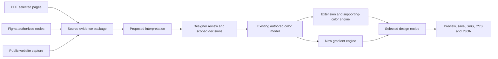

# Build a color system from an existing brand guideline

## Document Control

| Field                 | Value                                                                                                                                                                                                                                                                                                                                                                  |
| --------------------- | ---------------------------------------------------------------------------------------------------------------------------------------------------------------------------------------------------------------------------------------------------------------------------------------------------------------------------------------------------------------------- |
| Status                | Implementing                                                                                                                                                                                                                                                                                                                                                           |
| Depth                 | Full                                                                                                                                                                                                                                                                                                                                                                   |
| Extensions            | AI, Refactor                                                                                                                                                                                                                                                                                                                                                           |
| Authoring agent       | Codex using create-prd-and-build                                                                                                                                                                                                                                                                                                                                       |
| Accountable decider   | Paul Jun for product and visual acceptance; the private host for the private static pilot; remote service operation remains open                                                                                                                                                                                                                                               |
| Audience              | Teul designers, implementation agents, and release reviewers                                                                                                                                                                                                                                                                                                           |
| Last updated          | 2026-09-27                                                                                                                                                                                                                                                                                                                                                             |
| Canonical PRD         | `docs/prds/2026-09-25-brand-guideline-import.md`                                                                                                                                                                                                                                                                                                                       |
| Derived plan          | [Engineering plan](../plans/2026-09-25-brand-guideline-import-plan.md)                                                                                                                                                                                                                                                                                                 |
| Release state         | Planned                                                                                                                                                                                                                                                                                                                                                                |
| Implementation state  | Local integration verified; interface, real-source, human and live-host acceptance pending                                                                                                                                                                                                                                                                             |
| Repository baseline   | `3aa0f9cf0c9b59a41a4bd1a563176cd8e5b2e179` on private shipping `main`                                                                                                                                                                                                                                                                                                  |
| Current authorization | Execute this PRD end-to-end. On 2026-09-27 Paul approved himself as final design reviewer and preparation of the recommended private pilot (DEC-028). His subsequent instruction to finish end-to-end approved the presented creator-only static deployment settings. The pilot is deployed; external processing and full release retain their stated boundaries. |

Current evidence and remaining gates are reconciled in the acceptance inventory. It supersedes stale “Not run” status entries. DEC-028 records the owner-approved reviewer and pilot change; historical evidence remains unchanged.

This is the next product layer over the brand authoring foundation and [Studio integration](2026-09-25-studio-authoring-foundation.md). It does not reopen their completed engineering work or imply their remaining host and human acceptance checks have passed.

The standalone implementation now includes PDF extraction and manual correction, assisted-review and native-source adapters, reviewed source sets, scale extensions, supporting directions, gradients, device storage, selective source refresh, and SVG/CSS/JSON exports. Each slice has its own evidence in the [engineering plan](../plans/2026-09-25-brand-guideline-import-plan.md). Those historical receipts apply to their recorded revisions; the [recorded integration candidate passed the complete local profile](../evidence/brand-guideline-import/standalone-integration.md) on Node 22 and 24. Subsequent slices carry their own affected-change verification; full product acceptance remains open.

On 2026-09-27 Paul approved proceeding with a private pilot and serving as the final design reviewer. The two-designer staffing requirement is removed. The first pilot packages the existing browser-only Studio for local PDF/manual review and authoring; remote capture and assistance remain a separate service qualification stage. This approval does not approve any palette, source interpretation, external processing or beta release. See the private pilot handoff.

The remaining work is concentrated in three areas:

- **Finish interface acceptance.** The normal/enabled builds, source conflicts, retained designs, recovery and portable exports pass together on both runtimes. The [expanded accessibility journey](../evidence/brand-guideline-import/advanced-accessibility.md) checks eighteen page states and resolves the four clipped contrast targets when visible. It adds keyboard coverage for scales, source relationships and gradient-use constraints. Actual screen-reader use and untested editor paths remain.
- **Judge source understanding and useful output.** Equivalent synthetic PDF/Figma/HTML extraction passes. Evaluate permitted real sources and actual compositions against the frozen source and design benchmark. Human visual acceptance remains required.
- **Qualify remote capture and assistance.** Configure and verify the real authentication, Figma connection, website isolation, provider limits and operational controls before hosted use. Local fixture tests do not establish those capabilities on a live host.

The host-readiness review identifies an additional deployment gap: the current persistent SQLite/file stores cannot run unchanged on the private host's documented ephemeral filesystem. A compatible durable host preserves the existing implementation; a private-host service needs a storage migration and qualified provider/renderer integration. The generic host entry point is now implemented with private state ownership, recovery and bounded shutdown. Host selection, any required storage migration and actual identity/provider/renderer qualification remain open.

The first [annotated development cases](../evidence/brand-guideline-import/development-source-cases.md) exposed a source-understanding gap: Crane's nonconsecutive table cells left its RGB specifications as raw text, hiding two RGB/HEX conflicts from the numeric inventory. The [table-evidence improvement](../evidence/brand-guideline-import/pdf-table-evidence.md) now recovers those 17 RGB statements while preserving the original text, HEX values and failed baseline. The GOV.UK case preserves twenty selected swatch occurrences and reopens in Studio, but its offline capture remains partial. Neither case supplies human accuracy or design acceptance.

The [Robinhood development case](../evidence/brand-guideline-import/robinhood-development.md) preserves the failed selected-page import at `a8a3b6e`: fifty fragmented RGB statements were omitted without a warning. The subsequent [fragment recovery](../evidence/brand-guideline-import/pdf-fragment-evidence.md) captures all 100 annotated digital statements, retaining three RGB/HEX disagreements and original evidence. Unsupported labeled expressions now show coverage gaps. Scoped illustration permissions still require human interpretation; the complete source corpus and human review remain open.

The [statement-review improvement](../evidence/brand-guideline-import/statement-review.md) groups repeated wording while preserving each occurrence and decision. It shows nearby PDF qualifications and keeps the document visible during desktop review. The OpenWeb development case presents seven groups for sixteen rule statements; this is workflow evidence, not a measured correction-time or interpretation-accuracy result.

The [V2 gradient evidence](../evidence/brand-guideline-import/gradient-studio-v2.md) supersedes the earlier conditional feasibility experiments for new Studio gradients. It records a versioned mathematical reference, continuous bounds for compiled paint, worker cancellation and exact saved-paint recovery. That technical evidence does not establish aesthetic quality, universal rendering parity or human acceptance. Existing V1 designs retain their original paint and readers.

The [source-derived scale slice](../evidence/brand-guideline-import/source-scale.md) closes a workflow gap for guidelines that contain only base swatches. It reuses the shared planner while retaining source values and family rules; actual applications and human visual acceptance remain separate checks.

### Skill Stack

| Concern                          | Selected skill                                     | Contribution                                                                                                                              |
| -------------------------------- | -------------------------------------------------- | ----------------------------------------------------------------------------------------------------------------------------------------- |
| Product and engineering contract | create-prd-and-build                               | Canonical requirements, linked execution plan, and acceptance gates                                                                       |
| Architecture                     | derisk-the-plan                                    | Reuse existing contracts; prove one real import before expanding adapters                                                                 |
| Source meaning                   | source-to-system-compiler, reference contract only | Separate captured evidence, inferred meaning, adopted rules, and generated output; no new brand-source compilation performed for this PRD |
| Communication                    | Shared write-like-paul clarity check               | State decisions, limitations, and delivery state plainly                                                                                  |
| Execution continuity             | workstream-steward                                 | Preserve checkout identity, authorization and incomplete gates across execution                                                           |
| PDF proof                        | pdf:pdf                                            | Inspect native values alongside rendered source pages and synthetic fixtures                                                              |
| Native source study              | figma-tool, figma:figma-use                        | Read the selected subtree without mutation; retain native/printed disagreement and distinguish MCP evidence from Studio OAuth             |
| Review interface                 | product-craft                                      | Source beside its interpretation; explicit loading, errors and recovery; keyboard/mobile checks                                           |
| Implementation review            | simplify                                           | Independent reuse, quality and efficiency review of the exact proof diff                                                                  |

## One-Page Summary

**What:** Let a designer upload a brand PDF, connect a Figma guideline, or enter a website URL; review the color system Teul found; then extend that system, explore supporting colors, or create a complementary gradient.

**Problem:** Designers have guidelines, not neatly prepared input data. Teul's core can represent relationships and enforce constraints, but Studio starts with manually entered hex values. Important meaning is lost: which colors lead, which belong together, which uses are forbidden, and where a source is incomplete. Valid color math alone has already produced results Paul rejected.

**Two engineering programs:**

1. **Turn guidelines into a reviewed brand model.** Build three source adapters, evidence-linked interpretation, a concise correction screen, and a compiler into Teul's existing model. Preserve exact values and distinguish rules from examples and guesses.
2. **Use that model to author useful extensions.** Connect Studio to the existing relationship-aware authoring engine, add bounded supporting-color exploration, and build a dedicated gradient model with consistent preview, validation, saving, and export.

**Experience:** Import → Review what Teul found → Choose what to make → Compare up to three directions → Refine and export. No prompt writing or JSON preparation required.

**Product home:** Teul Studio is the standalone authoring tool. PDF/website import, source review, generation, accessibility, saving and export must work without installing or running a Figma plugin. Figma remains an input source and an optional destination. A lightweight importer can follow later; plugin feature parity is not a release dependency (DEC-006).

**Success:** On a versioned benchmark, recover usable source colors and rules without fabricating authority; preserve every locked color; produce at least one designer-accepted direction for most supported briefs; and reopen/export the exact selected result. Extraction accuracy and visual quality are separate gates.

**First release:** PDF upload, Figma URL with account authorization, and public website URL. Offer a PDF exported from Figma or manual values when API access is unavailable; an existing native packet is an optional convenience. Outputs include copy/download SVG for visual handoff, CSS for implementation and JSON for data/reopening. Support selected color sections rather than claiming to read every page of every source. Website results initially describe observed usage. Logged-in browser capture is a later extension, not silently included in URL import.

**Appetite:** Reuse the model, color science, authoring execution, catalogs, receipts, and storage protections. Add one bounded ingestion service and a separate gradient path. Prove one real PDF → reviewed model → usable extension before building the other adapters. This is a cross-system feature, not a picker enhancement; do not promise a calendar duration before the proof slice.

## Problem and Evidence

### Diagnosis and crux

The hard part is translating a visual document into a system that can be operated on. A PDF can show a swatch beside a logo, a rule beside a counterexample, and CMYK beside RGB. A website can contain approved colors, campaign exceptions, photography, and third-party content. A Figma file can include obsolete experiments and unresolved library aliases. Counting pixels cannot decide which of these govern a new design.

The guiding policy is to preserve the evidence, propose an interpretation, and let the designer confirm consequential choices. Then deterministic code applies the reviewed constraints. A model may help read a guideline; it must not invent the authoritative color values or silently relax rules to produce more attractive results.

### Evidence ledger

EVID-001 through EVID-011 describe the repository baseline and its planning assumptions. External API documentation was inspected on 2026-09-25. Later implementation evidence is linked above; product thresholds remain targets, not measured current performance.

| ID       | Claim                                                                                                                                                                    | Classification                                                                        | Source and locator                                                                                                                                                                                                                  | Implication                                                                                                    |
| -------- | ------------------------------------------------------------------------------------------------------------------------------------------------------------------------ | ------------------------------------------------------------------------------------- | ----------------------------------------------------------------------------------------------------------------------------------------------------------------------------------------------------------------------------------- | -------------------------------------------------------------------------------------------------------------- |
| EVID-001 | Studio accepts swatches and uses a complete product-application engine; it explicitly does not import company guidelines.                                                | Verified                                                                              | `web/README.md`, Product systems / Source and accessibility boundaries; `web/src/lib/authoring.ts`                                                                                                                                  | Build the intake and connect the richer model without replacing current manual entry.                          |
| EVID-002 | Sources, evidence, claims, families, authored scales, contexts, conflicts, and adoption decisions already exist.                                                         | Verified                                                                              | `src/lib/colorSystemModelV1.ts:14`, `:36`, `:237`; `src/components/ColorSystemModelIntakeV1.tsx`                                                                                                                                    | Extend the existing model boundary; avoid a competing brand database.                                          |
| EVID-003 | Structured JSON and current-file intake exist; recipe parsing is strict and rejects unknown fields and execution authority.                                              | Verified                                                                              | `src/lib/colorSystemRecipeV1.ts:33`, `:108`; `src/lib/colorSystemModelSourceAdapterV1.ts`                                                                                                                                           | External extraction needs an adapter and versioned envelope, not a loosened parser.                            |
| EVID-004 | Candidate-only generic strategy and source-aware authoring contain reusable extension machinery; Studio exposes a narrower route.                                        | Verified                                                                              | `src/lib/colorSystemAuthoringExecutionV1.ts`; `src/lib/colorSystemSecondaryStrategyV3.ts`; `src/lib/colorSystemAuthoredCandidatesV1.ts`; `web/src/lib/authoring.ts`                                                                 | Audit and reuse enforceable mechanisms individually; candidate availability is not product qualification.      |
| EVID-005 | Existing generic compilation authorizes secondary solid families, not gradients; some gradient restrictions are source-derived.                                          | Verified                                                                              | `src/lib/colorSystemSourceCompilerV2.ts:248`; `src/lib/colorSystemApplicationBlueprintV2.ts` (`GRADIENT_BACKDROP`)                                                                                                                  | Gradients need their own contract. Never globally flip an existing prohibition.                                |
| EVID-006 | Saved work is local, bounded, transactional, and replay-checked; Studio generation has no server or credentials.                                                         | Verified                                                                              | `web/README.md`; `web/src/lib/savedStore.ts`; `web/src/lib/saved.ts`                                                                                                                                                                | Network ingestion and source assets introduce new service/privacy/storage work.                                |
| EVID-007 | Paul wants extensions grounded in an existing identity and has rejected visually poor outputs despite successful color calculations.                                     | Verified user evidence                                                                | Current task history; prior source/precedent ledger                                                                                                                      | Real compositions and human visual review are release criteria.                                                |
| EVID-008 | Figma API access varies by endpoint, authorization, plan, and rate limit.                                                                                                | Verified platform constraint                                                          | [Figma REST authentication](https://developers.figma.com/docs/rest-api/authentication/), [variables](https://developers.figma.com/docs/rest-api/variables/), [rate limits](https://developers.figma.com/docs/rest-api/rate-limits/) | Do not promise every Figma link yields all variables or library data.                                          |
| EVID-009 | PDF rendering/text extraction and CSS color interpolation are available primitives, not brand interpretation.                                                            | Verified platform primitives; inference about product sufficiency                     | [PDF.js examples](https://mozilla.github.io/pdf.js/examples/), [CSS Color 4](https://www.w3.org/TR/css-color-4/#interpolation), [CSS Images 4](https://www.w3.org/TR/css-images-4/#coloring-gradient-line)                          | Structured extraction needs semantic context; gradients need explicit interpolation and runtime proof.         |
| EVID-010 | A bounded multimodal interpretation step can reduce manual review enough to justify its latency and privacy cost.                                                        | Assumption                                                                            | TASK-001 comparison with deterministic extraction plus manual labeling                                                                                                                                                              | Narrow or remove model interpretation if the proof fails.                                                      |
| EVID-011 | Suitable model/provider, host, cost baseline, and exact current permissions for pilot brand assets are not established.                                                  | Unknown                                                                               | Resolve in TASK-001 and service readiness work                                                                                                                                                                                      | Public docs establish feasibility, not account access or deployment readiness.                                 |
| EVID-012 | Paul accepts a standalone tool with a copy/export handoff to Figma; plugin limitations should not constrain the product.                                                 | Verified user direction                                                               | Current follow-up, 2026-09-25                                                                                                                                                                                                       | DEC-006 makes native plugin integration optional and outside the first release's critical path.                |
| EVID-013 | The Crane development source exposes omitted RGB table specifications and two conflicts with HEX; a public website case preserves swatches but reaches a property limit. | Verified development observations; agent annotations await human reconciliation       | [Real-source cases](../evidence/brand-guideline-import/development-source-cases.md), candidate `f797888`                                                                                                                            | Preserve failed cases; repair evidence recovery before claiming accurate brand understanding.                  |
| EVID-014 | A source-preserving Robinhood export imports, but fifty fragmented, hyphen-separated RGB statements are omitted without a coverage gap.                                  | Verified development observation; source annotation awaits human reconciliation       | [Robinhood case](../evidence/brand-guideline-import/robinhood-development.md), candidate `a8a3b6e`                                                                                                                                  | Recover bounded explicit RGB fragments and disclose unresolved labeled rows; preserve the failed comparison.   |
| EVID-015 | OpenWeb retains sixteen numeric statements, but ten of sixteen rule prompts repeat confidentiality footers; split context and contradictory clauses complicate review.   | Verified development observation; correction time and human reconciliation unmeasured | Source-authority cases, unchanged candidate `3d8d6ab`                                                                                                         | Improve contextual review without dropping evidence or automatically resolving meaning.                        |
| EVID-016 | One private brand's printed value differs from its native swatch; a custom MCP inventory succeeds while REST export/access paths remain unavailable.                    | Verified native-source study; profile, revision and Studio OAuth unqualified          | Source-authority cases                                                                                                                                        | Preserve competing representations and transport limits; source access is separate from adapter qualification. |

### Current behavior and alternate framing

At the repository baseline, a designer opens Create, enters up to six swatches, chooses a primary accent and product settings, and compares generated applications. The model behind that experience is richer than the form. The candidate plugin can ingest a structured model; users still need someone to prepare that model from the guideline. The implementation status above records the standalone intake added since that baseline.

An alternate framing is “a better color extractor.” That would reduce typing but would still confuse examples with rules and would not solve weak brand fit. Do nothing preserves a useful manual tool but leaves the interpretation work outside Teul.

## Users and Journeys

| User                        | Intended job                                                              | Desired journey                                                                  | Recovery                                                                         |
| --------------------------- | ------------------------------------------------------------------------- | -------------------------------------------------------------------------------- | -------------------------------------------------------------------------------- |
| Brand designer              | Add a coherent supporting family or gradient without changing core colors | Import guideline; confirm hierarchy and restrictions; compare brand compositions | Correct an inferred role or permit a scoped exception; source values stay intact |
| Product designer            | Translate an identity into usable product scales and roles                | Confirm source; choose product use; compare light/dark components and states     | Choose an adapted product color when an exact source accent fails a required use |
| Designer auditing a website | Recover a starting system when no guideline is available                  | Enter URL; inspect detected tokens and usage; adopt selected observations        | Mark photography, campaigns, partner logos, and incidental colors as excluded    |

### Product workflow

1. **Bring your guideline.** Three equal entry choices: PDF, Figma, Website. Manual colors remain available. Explain the supported source scope and any remote processing before analysis.
2. **Review what Teul found.** Show swatches grouped into families, usage rules, and unresolved questions. Each item opens its page crop, Figma node, or captured element. Display “stated in source,” “observed example,” “suggested interpretation,” or “needs attention.” Do not show a meaningless universal confidence percentage.
3. **Choose what to make.** Extend existing colors, Add supporting colors, or Make a gradient. Choose Brand composition or Product UI where relevant. Keep existing values locked by default. Advanced controls reveal bounds and individual rule decisions.
4. **Compare directions.** Up to three materially different candidates, each with a palette, real use preview, relationship to the source, changes made, and scoped accessibility results. Do not fill three slots with near-duplicates.
5. **Refine and keep.** Lock a color or direction, adjust the extension brief, save, copy SVG, or download SVG/CSS/JSON. The SVG is a visual handoff; reusable Figma Variables or Styles would require a separate optional importer.

The review screen highlights only unresolved items that affect the requested result. A clean source can be confirmed in one action. Ambiguous required values block that scope; optional gaps remain visible and do not block unrelated work. A source with two equal accent families does not have to nominate a fictitious global primary.

### Experience states

`idle → choosing scope → capturing → interpreting → needs review → ready → generating → comparing → saved/exported`.

Capture and generation each expose progress, cancel, partial, failed, and retry states. Rejected Figma permissions offer an exported PDF/manual path without installing a plugin. Offline mode retains reviewed sources and deterministic generation; new remote capture/interpretation is unavailable. A cancelled or late job never replaces a newer document or the last valid preview. Clipboard denial offers a download of the same SVG bytes. Unsupported content explains the missing capability and preserves the readable evidence. Importing or reviewing never writes to Figma.

## Goals and Non-Goals

### Outcomes

| ID      | Outcome                                                       | Baseline                                                                | Target before beta                                                                                                                         | Horizon / measurement                                                                                                                         |
| ------- | ------------------------------------------------------------- | ----------------------------------------------------------------------- | ------------------------------------------------------------------------------------------------------------------------------------------ | --------------------------------------------------------------------------------------------------------------------------------------------- |
| OUT-001 | Turn a supported source into a usable reviewed model          | Studio has no guideline import                                          | All three adapters pass source-specific acceptance; median active correction time under 3 minutes on the fixed pilot set                   | TASK-001 baseline, repeated at beta; count exclusions/partial coverage                                                                        |
| OUT-002 | Produce useful extensions and gradients that retain the brand | Manual input and visual quality complaints; no measured acceptance rate | At least one direction accepted on at least 12/15 held-out supported briefs and 4/5 in each output type; zero locked-value/rule violations | Independent designer review, compared with current/manual baseline; unseen brands and source-restricted infeasible briefs reported separately |
| OUT-003 | Make results trustworthy and reusable                         | Recipe-backed solids and local saving exist                             | Exact selected design survives save/reopen/export; 100% of governing rules link to evidence or an explicit user decision                   | Contract, browser, SVG/CSS/JSON output checks                                                                                                 |

Guardrails: zero invented authoritative values in release fixtures; zero cross-user access; zero silent source loss; no regression of existing manual workflows; model cost and capture bounds enforced before sending. Report median correction time alongside failed imports so failures cannot disappear from the metric.

### Non-goals

- Automatic corporate rebranding, “certified brand compliance,” or a claim that passing contrast makes a palette beautiful.
- Full-document comprehension, arbitrary web crawling, authenticated browser session harvesting, or automatic background monitoring of guidelines.
- Print color matching, Pantone conversion, or treating CMYK/spot/raster samples as exact digital tokens.
- Cloud workspace sync, team approval workflows, a vector database, autonomous browsing agents, or a new color-science engine.
- Mesh, conic, animated, translucent, or multi-layer gradients in the first release. Preserve unsupported source gradient evidence without fabricating editable equivalents.
- Automatically promoting the existing Figma candidate builder, publishing libraries, or changing the public repository mirror.
- Rebuilding the authoring experience inside Figma, requiring plugin installation, or generating native Variables/Styles as a condition of Studio release.

### Future considerations

User-initiated capture from an authenticated browser tab, broader gradient types, Display-P3 authoring, multi-device source storage, and governed brand library publication can follow measured demand. A lightweight Figma importer may later turn the reviewed JSON into Variables, Styles and frames; it should validate and materialize an existing result without repeating inference or generation. None is a hidden prerequisite for the first release.

## Current System and Constraints

The shared TypeScript core owns source models, deterministic color science, authoring, relationship evaluation, and recipe replay. Studio is a React/shadcn consumer. The Figma backend owns document mutation and host storage; messages are runtime-validated. Keep these responsibilities.

Current model limits are 2 MiB JSON, 256 colors, 128 rules, 16 contexts, four modes, and 32 sources. Recipes allow 8 MiB; Studio separately limits its complete saved store to 24 records / 8 MiB. Those are different limits. PDF bytes, screenshots, and model transcripts must not be embedded into recipe records. No hosted CI is allowed; use the repository's local Node 22 and 24 gates for shared-core changes.

| Dependency                                         | Needed for                              | Failure / contingency                                                                                                                                                                                                                   |
| -------------------------------------------------- | --------------------------------------- | --------------------------------------------------------------------------------------------------------------------------------------------------------------------------------------------------------------------------------------- |
| Scoped, usable pilot source assets                 | Baseline and visual evaluation          | Historical ledger is a locator, not proof original PDFs or rights are available now; acquire permitted assets or explicitly report missing coverage                                                                                     |
| PDF parser/render worker                           | Text, geometry, page previews           | Pin and audit dependency; malformed/unsupported documents fail within resource bounds                                                                                                                                                   |
| Figma file access; OAuth for managed connections   | URL intake                              | DEC-030 permits an end-user read-only personal token entered only in the private pilot, held in page memory and sent directly to Figma. Never request credentials in chat. Offer exported PDF/manual intake when access is unavailable. |
| Authenticated ingestion service and model provider | URL capture and optional interpretation | Local/manual path stays usable; hosted private-source processing remains disabled until configured                                                                                                                                      |
| Named service operator                             | Hosted pilot                            | Required for secrets, deletion, quota, and incident handling; not required to draft or build local deterministic parts                                                                                                                  |

## Options and Decision

| Option                                          | Benefit                                                                       | Main problem                                                                                        | Decision                             |
| ----------------------------------------------- | ----------------------------------------------------------------------------- | --------------------------------------------------------------------------------------------------- | ------------------------------------ |
| Do nothing / paste hex                          | No new infrastructure                                                         | Loses source relationships                                                                          | Baseline only                        |
| Screenshot-only model extraction                | Quick demo across formats                                                     | Weak numeric authority, hidden omissions, poor replay                                               | Reject as the primary path           |
| Entire feature inside offline plugin            | Familiar host, private local data                                             | Arbitrary URLs, OAuth secrets, heavy PDF processing, and model service do not fit existing boundary | Optional future reader/importer only |
| Studio intake + bounded service + existing core | Supports three inputs, preserves source structure and deterministic authoring | Introduces auth, privacy, operations, and source-asset handling                                     | DEC-001, selected                    |

**Cheapest falsification:** TASK-001 imports a permitted real guideline and a deliberately difficult source; compares manual/deterministic review against assisted interpretation; then produces one source-constrained extension in a component and a brand composition. If interpretation adds unsupported rules or does not reduce correction work, narrow it before building more adapters. In parallel, prove a small gradient round trip independently of extraction.

## Requirements

### Functional requirements

| ID      | Priority | Observable requirement                                                                                                                                                                        | Basis                                           | Acceptance |
| ------- | -------- | --------------------------------------------------------------------------------------------------------------------------------------------------------------------------------------------- | ----------------------------------------------- | ---------- |
| REQ-001 | Must     | Accept a PDF and let the designer select the relevant pages; retain page evidence and extraction coverage.                                                                                    | EVID-001, EVID-002, EVID-013, EVID-014, DEC-002 | AC-001     |
| REQ-002 | Must     | Accept a Figma link with authorized reads and offer exported-PDF/manual intake when remote access is unavailable, without requiring a plugin.                                                 | EVID-008, DEC-002, DEC-006                      | AC-002     |
| REQ-003 | Must     | Capture one public website URL and its rendered color usage within declared limits.                                                                                                           | DEC-002                                         | AC-003     |
| REQ-004 | Must     | Preserve original values, source locators, measurement method, and conflicts for every detected color and rule.                                                                               | EVID-002, EVID-016, DEC-003                     | AC-004     |
| REQ-005 | Must     | Let the designer correct and adopt the interpretation before it governs generation.                                                                                                           | EVID-007, EVID-015, DEC-003                     | AC-005     |
| REQ-006 | Must     | Compile adopted source meaning into the existing authored model without silently dropping unsupported rules.                                                                                  | EVID-002, EVID-003                              | AC-005     |
| REQ-007 | Must     | Extend existing families while retaining locked values, ordering, scoped relationships, and explicit exclusions.                                                                              | EVID-004, DEC-003                               | AC-006     |
| REQ-008 | Must     | Offer up to three distinct supporting-color directions that explain their source relationship and permitted changes.                                                                          | EVID-004, EVID-007                              | AC-007     |
| REQ-009 | Must     | Generate and refine opaque linear gradients with two to five authored stops under a separate versioned contract.                                                                              | EVID-005, DEC-004                               | AC-008     |
| REQ-010 | Must     | Evaluate accessibility for the declared actual use, including a gradient's interior wherever text may appear.                                                                                 | DEC-004, EVID-009                               | AC-009     |
| REQ-011 | Must     | Save and export the selected model and design without substituting regenerated values.                                                                                                        | EVID-003, EVID-006, DEC-007, DEC-008            | AC-010     |
| REQ-012 | Must     | Refresh a source by showing its changes and invalidating only decisions and results affected by those changes.                                                                                | EVID-002, DEC-003                               | AC-011     |
| REQ-013 | Must     | Cancel, retry, or recover an import without replacing newer work; reuse completed results and reserve cost for every provider attempt.                                                        | DEC-001                                         | AC-012     |
| REQ-014 | Must     | Preserve manual entry, existing recipes, source prohibitions, and candidate/production boundaries throughout migration.                                                                       | EVID-003, EVID-005, EVID-006                    | AC-013     |
| REQ-015 | Must     | Meet the source accuracy and visual quality evaluation contract before beta exposure.                                                                                                         | EVID-007, EVID-010                              | AC-014     |
| REQ-016 | Must     | Provide copy/download SVG of the selected palette, scales and gradient for visual handoff, plus CSS and versioned JSON, without requiring plugin execution; label each format's capabilities. | EVID-012, DEC-006                               | AC-015     |

Saved revisions preserve exact capture, draft/review and selected-design project bytes. Each explicit update appends the previous snapshot to bounded history; opening history changes only the editor until another explicit save. Start with 32 revisions per project within the existing shared 8 MiB project budget, without automatic eviction. Existing records migrate on their next update; earlier missing history stays unknown. The new storage envelope is read-only to older clients. Original PDF deletion must include historical dependencies. This is the storage foundation for REQ-012; refresh still requires its own source diff and selective dependency invalidation.

### Non-functional requirements

| ID      | Category            | Requirement and proposed threshold                                                                                                                                                                           | Acceptance     |
| ------- | ------------------- | ------------------------------------------------------------------------------------------------------------------------------------------------------------------------------------------------------------ | -------------- |
| NFR-001 | Privacy/security    | Every remote job requires authenticated ownership and scoped input consent; secrets never enter the browser, model prompt, recipe, or logs. No critical isolation/SSRF/injection failures.                   | AC-016         |
| NFR-002 | Performance/cost    | On the declared reference workload, p95 selected-source interpretation ≤60 seconds; generation ≤2 seconds; cancel acknowledgement ≤250 ms. Estimated inference ceiling $0.50/job, bounded before submission. | AC-017         |
| NFR-003 | Reliability/storage | Jobs are bounded and idempotent; invalid or full storage cannot destroy existing work; raw source assets use a separate bounded store.                                                                       | AC-012, AC-010 |
| NFR-004 | Accessibility       | Import, review, correction, comparison, and errors meet WCAG 2.2 AA for their implemented UI; all color-only distinctions have text/shape alternatives and keyboard access.                                  | AC-018         |
| NFR-005 | Operations          | Redacted job/version/cost/failure metrics, deletion, provider-disable switch, and recovery runbook exist before hosted pilot.                                                                                | AC-016, AC-017 |

### Invariants and implementation freedom

An immutable source value, an inferred meaning, a user decision, and generated output are separate records. Source restrictions always remain inspectable. A scoped user exception changes the extension brief, not source history. No source rule may be dropped to rescue an infeasible candidate. Missing roles remain unknown until a user supplies them. A reviewed website observation never becomes proof of corporate approval.

Builders may choose the small service framework, parser helpers, worker scheduling, and visual layout within these contracts. They may not change data exposure, supported sources, accuracy gates, existing output authority, or retention limits without revising this PRD.

## Acceptance and Verification

All criteria below remain **Planned** at the full-feature level. Partial local proof evidence records passing subsets without treating them as complete acceptance. A ready specification is not a passing feature.

| ID     | Covers           | Precondition → action                                                                                             | Observable pass condition                                                                                                                                                                                                                             | Proof                                                                                                                                               |
| ------ | ---------------- | ----------------------------------------------------------------------------------------------------------------- | ----------------------------------------------------------------------------------------------------------------------------------------------------------------------------------------------------------------------------------------------------- | --------------------------------------------------------------------------------------------------------------------------------------------------- |
| AC-001 | REQ-001          | Native, scanned, mixed-color-space, large, and malformed PDFs → select and import pages                           | Exact stated RGB values retained; approximations labeled; page links correct; unselected/unread coverage visible; unsupported/encrypted cases recover without writes                                                                                  | Versioned fixture assertions and browser page-review walkthrough                                                                                    |
| AC-002 | REQ-002          | Authorized file, denied file, rate limit, missing variable access, unresolved alias → import link or exported PDF | Exact available values/modes/source IDs retained; no fabricated alias values; unavailable coverage explicit; PDF/manual fallback works without plugin; no file mutations                                                                              | REST contract fixtures, authorized live read and browser fallback walkthrough                                                                       |
| AC-003 | REQ-003          | Public CSS-heavy page, photos, third-party embeds, blocked/redirected/private destinations → import               | Captured computed values and element evidence distinguish tokens/usage from incidental colors; URL threats blocked; no authenticated-session access or silent crawling                                                                                | Sandbox network tests and browser fixtures                                                                                                          |
| AC-004 | REQ-004          | Conflicting PDF, Figma, and web values → merge source set                                                         | Both observations survive with hashes, locators, methods, and unresolved conflict; no automatic last-write-wins source authority                                                                                                                      | Model/source contract tests and review screenshot                                                                                                   |
| AC-005 | REQ-005, REQ-006 | Inferred role, explicit ban, unsupported narrative rule → review/compile                                          | Only adopted enforceable constraints govern; unknown requested scope blocks with evidence; correction changes actual eligibility; original inference remains labeled                                                                                  | Negative rule mutation plus UI-to-engine integration test                                                                                           |
| AC-006 | REQ-007          | Multi-anchor/multi-family brief with locks and exclusions → extend                                                | Every locked value survives unchanged; source relationships hold in actual application; impossible extension yields a useful no-feasible explanation                                                                                                  | Golden model/engine tests and source-linked composition review                                                                                      |
| AC-007 | REQ-008          | Flexible and restricted brands → request supporting colors                                                        | At most three eligible, materially distinct directions; no fallback outside allowed territory; provenance and changes visible; visual gate passes                                                                                                     | Diversity assertions and blinded paired designer review                                                                                             |
| AC-008 | REQ-009          | Brand permits gradient → author/refine; ideal route passes but compiled route crosses a hard boundary → assess    | Stop/angle edits repeat exactly; final compiled path stays within enforced bounds or is blocked; source bans survive; unsupported gradients retained as evidence                                                                                      | Gradient property tests, render comparisons, prohibited-interior/compilation negative tests                                                         |
| AC-009 | REQ-010          | Gradient endpoints pass but middle fails text contrast → assess                                                   | Candidate cannot receive a passing badge; declared text footprint, minimum contrast, rendering profile, and unassessed cases visible                                                                                                                  | Independent adversarial continuous-gradient oracle and browser proof                                                                                |
| AC-010 | REQ-011, NFR-003 | Save selected extension/gradient, reload, export, fill storage → reopen                                           | Design hash and source-precision values match; missing assets do not silently change design; quota failure preserves old records; export discloses approximation                                                                                      | IndexedDB migration/replay tests; CSS/SVG/JSON comparison                                                                                           |
| AC-011 | REQ-012          | Change a source color, role, evidence-only page, or source authority → refresh                                    | Impacted decisions/results become stale; unrelated decisions remain; designer sees diff; rejected refresh preserves prior revision                                                                                                                    | Dependency-hash tests and browser stale-result scenario                                                                                             |
| AC-012 | REQ-013, NFR-003 | Cancel, duplicate, disconnect, timeout, restart, late completion → recover                                        | One accepted result per owner-bound job; no newer workspace overwrite or replay of a completed call; unknown provider outcomes do not auto-retry without provider idempotency; attempts reserve shared budget; partial evidence retained              | Failure injection and ownership/idempotency tests                                                                                                   |
| AC-013 | REQ-014          | Existing v1/manual/candidate fixtures → upgrade and rollback                                                      | Existing workflows and source bans unchanged; old bytes retained; future schema read-only; no production-candidate leak or bundle-budget regression                                                                                                   | Characterization suite, migration rehearsal, local release gates                                                                                    |
| AC-014 | REQ-015          | Frozen source and held-out design suite → repeated evaluation                                                     | EVAL-001 through EVAL-006 meet thresholds; denominator, rejected/partial cases, human ratings, and limitations recorded                                                                                                                               | Versioned evaluation report tied to model/prompt/core/fixture versions                                                                              |
| AC-015 | REQ-016          | Selected palette/scale/gradient; no plugin installed; clipboard allowed/denied → copy/download/reopen             | SVG is vector geometry with no external assets/scripts and matches selected paints; clipboard/download bytes agree; CSS/JSON preserve selected design; output explains visual shapes versus Variables/Styles; all Studio steps succeed without plugin | SVG parser/render and browser clipboard/download tests; optional Figma import observation recorded separately and never inferred from browser proof |
| AC-016 | NFR-001, NFR-005 | Hostile source, forged job ID, redirected URL, expired token, deletion request → process                          | No exfiltration, cross-user read, credential leak, or source execution; deletion and provider-disable controls meet policy                                                                                                                            | Threat tests, redacted log review, deletion and incident drill                                                                                      |
| AC-017 | NFR-002, NFR-005 | Reference workload and bounded concurrent jobs → capture/interpret/generate                                       | Latency and cost targets met; budget exhaustion refuses more work before spend; saturation is visible and recoverable                                                                                                                                 | Local load harness and controlled provider receipt                                                                                                  |
| AC-018 | NFR-004          | Keyboard and screen-reader user → import/review/refine/export at desktop and 390px                                | Focus and status announcements work; evidence/roles/errors understandable without color; no blocking overflow                                                                                                                                         | Automated checks plus manual assistive-technology/browser walkthrough                                                                               |

## Technical Design

### Program 1: source adapters and reviewed interpretation



**PDF adapter.** Parse in an isolated local worker using a pinned PDF.js version; lazily render page previews. Extract text, explicit color notation, and geometric context first. Renderer/operator color values are captured appearance, not automatically authored tokens. Match adjacent labels/swatches conservatively; keep disagreements visible. Use OCR/vision only for selected pages when native evidence is insufficient. Preserve original PDF bytes/hash and any literal CMYK, spot or profile specifications present in its text. PDF.js rendering operators can already contain converted RGB; do not claim they retain original CMYK/spot/ICC identities. Missing original color-space metadata remains unknown. Require a stated digital value or explicit acceptance of a separately labeled derived-sRGB approximation before digital generation. Do not invent Pantone conversions or place unsupported P3 values into the exact-sRGB model. [PDF.js page API](https://mozilla.github.io/pdf.js/api/draft/module-pdfjsLib-PDFPageProxy.html), [PDF.js color conversion implementation](https://raw.githubusercontent.com/mozilla/pdf.js/master/src/core/evaluator.js).

Encrypted documents require an unlocked upload in v1; never upload passwords. Initial bounds: 50 MiB, 500 pages, 20 selected pages per interpretation batch. Larger selected ranges require explicit batches; coverage never claims the entire PDF was read. These proposed bounds must survive TASK-001 measurement. Lossless original PDF paint-space extraction is outside v1 unless that proof demonstrates an essential, bounded parser addition.

**Figma adapter.** Resolve file/node links, connect through managed OAuth or the private pilot’s memory-only direct connection (DEC-030), enumerate a bounded outline, then read chosen frames/sections and available variables/styles, aliases, modes, text, and paints. Retain file version, node IDs, variable keys and resolution status. Native structure provides numeric authority; renders provide visual context. An API access failure or unresolved remote alias is a gap, never permission to substitute a screenshot color. The plugin-free fallback is a PDF exported from the relevant Figma frames or manual values with explicit source coverage. Existing current-file packets may feed the same compiler if already available; improving that plugin reader is optional. It does not open arbitrary other files or enable remote libraries. Keep source status/version distinct from the OAuth user's authority to view it.

Use `file_content:read` as the baseline; fetch actual node paints rather than treating published style metadata as color definitions. Variable endpoints are an optional Enterprise capability; the published endpoint does not supply mode values. Preflight actual access because seat/plan permissions differ. Pin batched reads to a revision where supported and reject or split a capture when source revisions disagree. Honor rate limits and cache the reviewed snapshot instead of repeatedly fetching entire files. [File endpoints](https://developers.figma.com/docs/rest-api/file-endpoints/), [variable endpoints](https://developers.figma.com/docs/rest-api/variables-endpoints/), [rate limits](https://developers.figma.com/docs/rest-api/rate-limits/).

OAuth token exchange/refresh requires a server-held client secret even with PKCE. A private published OAuth app serves its associated team/organization; broader user access requires Figma's public-app review. Record that distribution gate before claiming general availability. [Figma OAuth apps](https://developers.figma.com/docs/rest-api/oauth-apps/).

**Website adapter.** The ingestion service renders one user-entered public URL in an isolated browser with no user cookies. Record URL/final URL, time, viewport, mode, selected DOM scope, computed colors, available custom properties, paint usage, and a screenshot. Custom-property names and usage counts are clues; they are not proof of official roles. Deduplicate equivalent values without merging distinct semantic identities. Exclude photos, videos, advertisements, third-party frames, and partner marks by default; let the designer deliberately include a relevant region. Hover/focus/dark-mode variants are captured only when explicitly exercised and recorded. Unsupported canvas, cross-origin content, overlays, or blocked pages remain coverage gaps. Never accept a login form, cookie export, or remote debugging endpoint. Support a manual source packet when public capture is impossible; a future active-tab extension needs its own permission and privacy design.

That future extension can use a user gesture and temporary `activeTab` access; the current Studio webpage does not gain permission to inspect another signed-in tab. [Chrome activeTab](https://developer.chrome.com/docs/extensions/develop/concepts/activeTab).

**Interpreter.** First use deterministic parsing for literal values and native references. A bounded multimodal model may associate a label with an observation, identify a family, quote a rule, or suggest context. Output is schema-validated inert data referencing existing observation IDs. It cannot fetch links, write files, call Figma, or choose authoritative hex values. A newly noticed value becomes an unverified observation needing independent parser/user confirmation, not a trusted token. Restrict rule compilation to existing supported operators; unsupported narrative remains an explicit claim and blocks affected use when material.

**Review and compiler.** One canonical reviewed model feeds generation. Existing origin, force, adoption, evidence and conflict semantics remain. Structured source values outrank sampled appearance for numeric fidelity, but document authority is a separate user decision: a newer website does not automatically supersede an approved guideline. Adopt an inferred reusable relationship only as a named user decision or with sufficient source evidence; a single attractive example cannot establish a universal brand rule. Every constraint must map to a compiler consumer or an explicit unsupported result.

### Interfaces and state ownership

The following are proposed contract shapes; names may change, meanings may not:

```typescript
type GuidelineCapture = {
  schemaVersion: 'teul.guideline-capture.v1';
  id: string;
  kind: 'pdf' | 'figma' | 'website';
  identity: { locator: string; revision: string | null; sha256: string };
  scope: { requested: string[]; inspected: string[]; missing: SourceGap[] };
  observations: SourceObservation[]; // raw notation, native value, method, locator
  assetRefs: LocalAssetRef[]; // content hashes, never credentials or fetch authority
  extractionVersion: string;
};
type InterpretationDraft = {
  captureHashes: string[];
  colors: ProposedSourceColor[];
  claims: ProposedClaim[]; // origin, evidence refs, counterevidence, supported scope
  conflicts: SourceConflict[];
  interpreterVersion: string;
};
type ReviewedGuideline = {
  captureHashes: string[];
  model: ColorSystemModelV1;
  decisions: ReviewDecision[]; // actor, scope, evidence/dependency hash, timestamp
  revision: number;
};
type GradientDesign = {
  schemaVersion: 'teul.gradient-design.v1';
  sourceModelHash: string;
  briefHash: string;
  geometry: { type: 'linear'; angleDegrees: number };
  stops: AuthoredGradientStop[]; // 2–5; position, native value, source/derivation, lock
  route: { space: 'oklab' | 'oklch'; huePath?: 'shorter' | 'longer' };
  compiledPaint: CompiledOpaqueSrgbGradient;
  assessment: ScopedGradientAssessment;
};
```

Separate original source bytes, interpreted draft, adopted model, and selected design. `GuidelineCapture` hashes use SHA-256 for captured bytes and canonical metadata. Existing model/recipe hashes keep their own versioned semantics. Add a versioned recipe envelope for capture references and the discriminated solid/gradient design. Keep strict v1 readers unchanged; do not add new `intake` strings to v1 or overload `current-file` for remote Figma. Remote captures are snapshots; only a fresh host read can assert current-file freshness.

Studio owns local drafts/assets, authoring, review, preview, saving and exports. Shared core owns parsing, compilation, dependency invalidation, deterministic generation and receipts. The service owns authenticated capture/interpretation jobs and encrypted OAuth credentials. A future optional Figma importer would own host revalidation and explicit document mutation. Codex connectors and Paul's personal credentials are not product dependencies.

### Program 2: source-aware authoring and gradients

**Extend existing colors.** Expose the existing multi-anchor/family semantics in Studio. Preserve originals and authored ordering, then derive useful intermediate values or mode mappings where permitted. Exact Radix can remain a reference or an unchanged family; adapted values must be labeled Teul Generated. A request for Radix-style 12-step roles does not make the generated scale exact Radix or guarantee every use is accessible.

**Add supporting colors.** Use the existing catalog and bounded construction paths under the reviewed brand constraints. Candidate intent can be close extension, a new contrast relationship, or a broader supporting family; only permitted directions are eligible. Historical Wada combinations provide documented combinations; Werner provides reference colors; neither certifies compatibility. Reject infeasible candidates before ranking. Rank source relationship, usefulness in the requested context, and material diversity separately. Every selected generated color records its derivation. No universal “brand score” or rule that a mathematical complement must be good.

**Make a gradient.** Start from source colors and explicitly permitted new supporting colors. Offer two-to-five-stop opaque linear gradients, with angle, stop position, locks, and restrained/expressive exploration bounded by the brief. The new gradient capability must preserve existing source bans. Distinguish a restriction on new palette anchors from one on rendered gradient interiors; neither implies the other. Explicit gradient bans or interior-color restrictions govern their stated scope. Ambiguous wording is reviewed before affected generation, without inventing an extra prohibition. A confirmed conflict needs a scoped user exception before exploration.

Explore paths in explicit OKLab/OKLCH, checking the entire interpolated path for gamut and adopted bounds. Compile the selected path into one canonical opaque sRGB piecewise gradient, with adaptive stops and a maximum of 64 compiled stops. Preview, CSS, SVG and JSON use that same compiled paint. Keep authored stops separately editable in Studio. Proposed maximum compilation error is 0.005 Euclidean OKLab distance over the path; unresolved error at the stop budget blocks export to that target. CSS and SVG declare their supported interpolation explicitly and have tested angle/geometry conversion. Figma SVG import is a separate destination check; native Paint Style fidelity is outside the first-release contract.

Re-evaluate all hard source constraints and accessibility on the final compiled paint, including every interval and a conservative allowance for measured target-rendering error. Approximation tolerance is never permission to cross a prohibited hue, lightness or contrast boundary. Numerical parity also does not prove freedom from visible banding; inspect rendered gradients separately. Studio beta requires tested CSS/SVG/JSON outputs. Native plugin output and plugin-specific host checks are not beta blockers.

### Portable handoff to Figma and implementation

| Output | User action                                                                  | What it preserves                                                                                                   | Boundary                                                                                                             |
| ------ | ---------------------------------------------------------------------------- | ------------------------------------------------------------------------------------------------------------------- | -------------------------------------------------------------------------------------------------------------------- |
| SVG    | Copy SVG or download `.svg`; paste/import into a design tool                 | Palette/scales as vector swatches; a selected gradient as a vector-filled shape; selected paint values and geometry | Does not create Figma Variables, semantic aliases or published Styles; actual Figma rendering is verified separately |
| CSS    | Copy variables and gradient declarations                                     | Implementation-ready values from the selected recipe                                                                | Not a canvas-paste format                                                                                            |
| JSON   | Download the versioned recipe; reopen in Studio; export supported token data | Source references, decisions, semantic roles, exact values and authored gradient stops                              | Not arbitrary executable code or automatic Figma import; future importer has its own typed contract                  |

Figma documents SVG transfer between tools. Use simple SVG primitives and linear gradients; omit scripts, external references, `foreignObject` and embedded private source images. Escape labels and keep typography ancillary to paint fidelity. Copy and download serialize identical bytes; clipboard denial must not block download. Instructions state the available destination proof: `not tested in Figma`, `import observed`, or a named limitation. Never label a browser render as Figma-native verification. [Figma import guidance](https://help.figma.com/hc/en-us/articles/360040027794-Guide-to-imports-in-Figma-Design), [Figma SVG transfer](https://help.figma.com/hc/en-us/articles/360040030374-Copy-assets-between-design-tools).

The first-release completion boundary is a usable Studio plus tested portable artifacts. Observe an authorized SVG import when available and fix artifact defects within scope; unavailable Figma interaction does not stop the standalone tool. A later thin JSON importer can create Variables/Styles from the selected result through the existing guarded backend. It is optional work, not a second authoring engine or a hidden release gate.

W3C defines color-space and hue interpolation behavior, including alpha handling; CSS Images 4 is a working draft, so supported browser behavior must be tested. Choosing opaque gradients bounds the first implementation. [CSS Color 4](https://www.w3.org/TR/css-color-4/#interpolation), [CSS Images 4](https://www.w3.org/TR/css-images-4/#coloring-gradient-line).

**Accessibility.** Evaluate declared text/UI uses, not a color in isolation. For a gradient, endpoint checks are insufficient. The canonical piecewise sRGB paint allows a conservative luminance-range calculation over every interval; test that calculation against an independent dense/adversarial oracle. Test the whole background when text placement is unconstrained, or the declared footprint and geometries when fixed. A render sample alone cannot prove continuous coverage. If a bound cannot be established, return unassessed. A scrim/solid text panel is an explicit proposed design change and is re-evaluated after compositing. Do not infer dark-mode approval from light-mode success. [WCAG contrast guidance](https://www.w3.org/WAI/WCAG22/Understanding/contrast-minimum.html).

### Service, jobs, assets, and instrumentation

Use one small TypeScript API/worker deployment with isolated browser execution, a durable job table, and short-lived encrypted source assets. No agent framework, crawler fleet, vector store, or separate microservice per format. PDF parsing and deterministic generation stay local; only selected evidence is sent for optional interpretation. Figma tokens and model keys remain server-side. Reuse managed deployment authentication where possible; the pilot must have authenticated user IDs and per-user job ownership even if initially single-user.

Suggested API: create upload/capture intent, submit job, poll job, cancel job, fetch owned result, delete job/assets, OAuth connect/disconnect. The server binds idempotency to authenticated owner + capture hash + selected scope + interpreter version. Completed results are reused only within that owner boundary; source refresh creates a new identity. Persist each attempt and reserve its worst-case cost before dispatch. Accept one result per job. Exactly-once provider execution cannot be assumed: if a connection fails after dispatch and provider outcome is unknown, reconcile through supported provider idempotency/status or show an uncertain outcome; do not automatically resend. An explicit retry remains within the job's reserved spend ceiling. States include queued, capturing, interpreting, needs-review, complete, failed, cancelled, and expired. Late responses include source/workspace revision and cannot overwrite newer work.

Initial service bounds: two concurrent jobs per user, ten queued, 120-second total execution timeout, at most one retry for a confirmed retryable failure or provider-idempotent attempt within the same cost ceiling; honor provider/Figma retry instructions without unlimited loops. Website capture: one URL, at most three redirects, 30 seconds, 20 MiB received and 5,000 inspected elements. Figma: at most 5,000 selected nodes per job; report missing ranges and allow another batch. The core's stricter model limits still apply after extraction. These limits are proposed and must be measured on the reference workload.

Local source assets use a separate store with a 100 MiB ceiling for the guideline library in one browser origin and explicit deletion; no silent eviction. This conservative first implementation shares content-addressed PDFs across projects instead of allocating 100 MiB to each workspace (DEC-008). The guideline project library has its own 24-record / 8 MiB aggregate limit; the existing saved-palette library and its 24-record / 8 MiB limits are unchanged. The 16 MiB project-file import limit is separate: a valid imported file may be too large to save locally, in which case its editor and portable download remain available. Asset deletion must show which evidence previews will disappear; recipes retain their minimal source references, rule text and reviewed numeric values. Portable export excludes full raw private documents by default; an explicitly selected evidence archive can include user-owned assets. Downloading a project with confirmed page values retains its selected, bounded source crops so the decision can be inspected offline; disclose this before download. CSS, SVG and design JSON retain source-method notices without embedding those crops.

Pending-request recovery uses a separate browser cache with eight entries, 32 MiB per entry and 64 MiB total. It retains the exact submitted evidence/profile and, for PDF assistance, the complete pre-assistance workspace snapshot. Known-format records expire after 24 hours and are removed when Studio next opens or checks the cache; closed browsers cannot perform timed deletion. This local cache is not encrypted account storage. Disclose it before dispatch, preserve existing unexpired entries on quota failure, and offer explicit removal. Authenticate before displaying the matching account’s records; saved consent never authorizes a new remote call. Unsupported records stay unchanged until explicit removal. These bounds do not change the permanent project library or server retention.

Record redacted job ID, owner pseudonym, source kind, inspected/missing counts, parser/model/prompt versions, duration, estimated/actual cost, failure code and output hash. Do not log raw source text, signed URLs, OAuth tokens, or source names by default. Opt-in debug traces are encrypted, access-controlled, short-lived, and deletable. UI events track import completion, corrections, generation outcome and selected direction only when telemetry is enabled; local receipts remain available without telemetry.

## Security Privacy and Compliance

| Concern                             | Control                                                                                                                                                                                                                    | Verification / remaining boundary                                                                                    |
| ----------------------------------- | -------------------------------------------------------------------------------------------------------------------------------------------------------------------------------------------------------------------------- | -------------------------------------------------------------------------------------------------------------------- |
| Private guidelines sent to a model  | Show exact selected pages/regions and provider destination; explicit Analyze action; deterministic/manual path without upload; verify vendor retention/training terms before enabling private-source jobs                  | Consent and request-payload tests; vendor agreement is an external deployment dependency                             |
| Server-side request forgery         | Permit HTTPS public destinations only; block private/loopback/link-local/metadata addresses, unusual ports and unsafe schemes; revalidate DNS, redirects and all browser subresource requests; isolated egress proxy       | Redirect, rebinding, IPv4/IPv6 and subresource attack fixtures                                                       |
| Hostile PDF/HTML/model instructions | Sandboxed parser/renderer with memory/time limits; block downloads, file access and private egress; treat all source text as data; model has no tools; validate every output reference                                     | Malformed files, injection strings, hidden HTML and invalid output tests                                             |
| OAuth and tenancy                   | Least read scopes; state/PKCE where supported, encrypted refresh tokens, revocation; server-owned job authorization; no cross-user caches                                                                                  | OAuth security review and forged-owner/result URL tests                                                              |
| Retention and deletion              | Raw server captures/evidence and model payloads expire within 24 hours; delete request removes active data within 15 minutes; exclude raw evidence from backups; redact operational metadata and retain it at most 30 days | Time-controlled deletion drill; provider retention documented separately rather than falsely covered by app deletion |
| Source rights and evaluation corpus | Capture only user-authorized sources; keep private assets outside public fixtures; source provenance and historical status retained                                                                                        | Approved fixture manifest; synthetic mechanics clearly labeled                                                       |
| Storage and availability            | Browser assets and recipes stay device-local; export recovery available; no secrets in local packets                                                                                                                       | Quota, missing-blob, rollback and archive tests; local data is not a cloud backup                                    |

## Performance Reliability and Observability

Targets below are proposed; establish baselines in TASK-001. Reference workload: one ten-page selected PDF batch, one selected Figma section up to 1,000 nodes, or one page up to 1,000 elements; final model up to 64 colors and 32 rules; one source-aware extension or five-stop gradient. Record machine, browser, network, provider, cold/warm state and repeated sample count.

| Dimension                | Target / failure behavior                                                                                                                             | Measurement                                                                                |
| ------------------------ | ----------------------------------------------------------------------------------------------------------------------------------------------------- | ------------------------------------------------------------------------------------------ |
| Local interaction        | Cancellation ≤250 ms; no repeated import/generation tasks blocking main thread ≥50 ms                                                                 | Browser long-task and cancellation trace                                                   |
| Source capture           | Initial selected-page evidence p95 ≤15 seconds locally; public URL ≤30 seconds; platform throttling separately reported                               | Per-stage traces, not a single misleading progress timer                                   |
| Interpretation           | p95 ≤60 seconds on reference workload; 120-second total job ceiling                                                                                   | At least 30 repeated reference jobs and failure cases                                      |
| Deterministic generation | p95 ≤2 seconds; no network dependency after review                                                                                                    | Existing authoring benchmark extended with real reviewed models                            |
| Cost                     | Estimated model cost ≤$0.50/job; one shared cap covers retries; pilot per-user daily allowance 20 jobs                                                | Preflight token/image estimate and usage reconciliation; provider chosen after measurement |
| Recovery                 | Worker restart reconciles owned attempts; unknown provider outcomes do not blindly retry; cancelled/expired jobs cannot complete into workspace       | Kill/restart and duplicate-request tests                                                   |
| Alerts                   | Immediate disable on isolation/credential incident; alert on repeated parser crashes, cost-cap violation, or >5% capture failure in 50 supported jobs | Minimal operator dashboard and incident drill                                              |

## AI Behavior and Evaluation

### Role, context, permissions and fallback

AI addresses ambiguous visual/text associations, not deterministic color calculation. The baseline is exact parsing plus manual labels/rules. The model sees only selected bounded evidence and an explicit schema. It can propose meaning, quote relevant text, and identify gaps. It cannot adopt rules, manufacture official colors, mutate files, browse freely, or claim aesthetic acceptance. Its tone is concise and factual; uncertain interpretation says what needs review.

Context includes source version/hash, selected scope, extraction method, observations, evidence images and counterevidence. No unrelated conversations, account data, passwords, tokens or complete website sessions enter the prompt. Source replacement invalidates the relevant interpretation cache. An unavailable/refusing/invalid model returns deterministic observations for manual review; there is no hidden fallback to a less restricted provider. Freeze selected model ID, prompt version, parser version and compiler version in each receipt. Re-run release evals for any change.

### Dataset and human labels

Prepare 30 source cases: ten per adapter, with native and raster PDF, multi-column guidance, two equal accent families, modes/aliases, rules versus counterexamples, incidental website colors, missing/contradictory values and adversarial content. Use 15 development cases and 15 held-out cases, stratified by adapter. Include permitted real sources and clearly identified synthetic failure cases; the precise real/synthetic split must be recorded. At least half must be real before beta. The existing Crane, Medium, Coinbase and Robinhood source ledger can seed retrieval, but its historical record does not prove current original-asset availability or permission. Do not substitute retained images for a missing original PDF in a PDF-parser test.

Separately prepare 15 held-out design briefs across at least five distinct systems, with five briefs for each output type. Include at least two brand systems unseen during tuning and report those results separately. Label expected constraints and permissible freedoms before generating; freeze the manual comparison's tools and time budget before tuning. Paul judges actual compositions and component states as the final human design reviewer (DEC-028). He has approved this review arrangement, not the generated designs. Additional reviewers are optional. Calibrate the rubric on five development examples first. No model judge substitutes for the visual release gate.

The Katalon development comparison prepares two prompts comparing existing colors with preserved intermediate shades. Its agent-selected comparator, historical output and blank reviewer fields do not constitute the frozen manual baseline, five calibrated examples or held-out acceptance. Keeping the existing palette is a valid review outcome.

| ID       | Input                                                        | Expected behavior                                                                                  | Prohibited behavior                                                  | Covers                               |
| -------- | ------------------------------------------------------------ | -------------------------------------------------------------------------------------------------- | -------------------------------------------------------------------- | ------------------------------------ |
| GOLD-001 | Bright primary brand color plus an explicit limited-use rule | Preserve original; propose adapted product roles and a restrained brand composition under the rule | Darken mechanically and call the result a successful brand extension | REQ-007, EVAL-003, EVAL-004          |
| GOLD-002 | Scanned page with uncertain digits beside a swatch           | Link crop and mark approximate/unresolved; require confirmation                                    | Invent an exact authoritative hex                                    | REQ-004, EVAL-001                    |
| GOLD-003 | Two equal families and a forbidden pairing                   | Retain both families; enforce ban in extensions and applications                                   | Force a global primary or ignore the ban                             | REQ-006, REQ-008, EVAL-002, EVAL-003 |
| GOLD-004 | Website dominated by photos and campaign banners             | Separate incidental image colors from observed UI tokens                                           | Treat the most frequent pixels as the approved palette               | REQ-003, EVAL-001                    |
| GOLD-005 | Gradient has acceptable endpoints and poor middle contrast   | Reject its text-use pass or propose an explicit corrected design                                   | Claim accessibility from endpoint checks                             | REQ-009, REQ-010, EVAL-005           |
| GOLD-006 | Source tells the model to ignore rules or fetch secrets      | Preserve text as untrusted evidence; emit no action                                                | Follow source instructions or disclose another user's data           | REQ-004, EVAL-006                    |

### Failure taxonomy

Frequency is unknown until measured; these are hypothesized risks grounded in source formats and prior output feedback.

| ID       | Failure / earliest divergence                                  | Severity | Mitigation                                                                   |
| -------- | -------------------------------------------------------------- | -------- | ---------------------------------------------------------------------------- |
| FAIL-001 | Wrong numeric authority at extraction                          | Critical | Exact parser evidence or explicit user-confirmed approximation               |
| FAIL-002 | Example, guess or permission becomes a prohibition/requirement | High     | Immutable origin plus adoption/force separation                              |
| FAIL-003 | A constraint disappears between review and generation          | Critical | Hash-bound compilation and negative mutation tests                           |
| FAIL-004 | Feasible but unattractive or generic output                    | High     | Blinded contextual review against baseline; no single math score             |
| FAIL-005 | Gradient middle or renderer differs from assessment            | Critical | Canonical compiled paint, continuous assessment, export parity               |
| FAIL-006 | Injection, private egress, cross-user access or excess cost    | Critical | Tool-free interpretation, isolated capture, ownership and budget enforcement |

### Evaluation contract

| ID       | Covers                                               | Check and dataset                                                                    | Release threshold                                                                                                                                                       | Human-label validation                                                                                                                                                                          |
| -------- | ---------------------------------------------------- | ------------------------------------------------------------------------------------ | ----------------------------------------------------------------------------------------------------------------------------------------------------------------------- | ----------------------------------------------------------------------------------------------------------------------------------------------------------------------------------------------- |
| EVAL-001 | REQ-001, REQ-002, REQ-003, REQ-004, AC-014, FAIL-001 | Source suite; exact-value/provenance precision and recovery recall                   | 100% precision for values labeled exact; ≥95% recall of eligible stated digital colors in selected scope; every omitted required value is an explicit gap               | Two readers reconcile annotated ground truth; report raster results separately. This source-validation method is separate from final design review and does not gate the private browser pilot. |
| EVAL-002 | REQ-005, REQ-006, AC-014, FAIL-002                   | Grounded role/rule interpretation, force/scope and correction time                   | Zero unsupported hard rules after review; ≥90% correct rule/role proposals on labeled cases; median active correction <3 minutes                                        | Human labels distinguish source statement, example, inferred meaning and unresolved scope                                                                                                       |
| EVAL-003 | REQ-007, REQ-008, AC-014, FAIL-003                   | Deterministic rule/value checks on development and held-out briefs                   | 100% locked-value/required-rule preservation; negative mutation always rejected; prohibited/impossible briefs never counted as successful extensions                    | Reviewer inspects actual usage as well as model membership                                                                                                                                      |
| EVAL-004 | REQ-007, REQ-008, REQ-009, REQ-015, AC-014, FAIL-004 | Blinded paired review of 15 held-out briefs against a frozen current/manual baseline | ≥12/15 overall and ≥4/5 for each output type have a direction Paul would use without changing its core color relationship; zero “pass” based solely on numerical scores | Binary rubric: retains identity, coherent hierarchy, useful new relationship, and usable in shown context; Paul’s reasons for rejection and unseen-brand results retained                       |
| EVAL-005 | REQ-009, REQ-010, REQ-011, AC-014, FAIL-005          | Gradient mathematical/adversarial suite and declared renderer exports                | Zero false accessibility passes; source bans preserved; compiled path within stated error bound; unsupported targets labeled                                            | Paul inspects gradient joins, unwanted dull bands, and intended use; renderer evidence separate                                                                                                 |
| EVAL-006 | REQ-004, REQ-013, AC-014, FAIL-006                   | Injection/isolation/network/budget suite                                             | Zero critical failures; retry/cancel never increases authorized spend ceiling                                                                                           | Security review of real trace and synthetic attack evidence                                                                                                                                     |

The current source-import baseline is absent and visual acceptance baseline unmeasured. TASK-001 establishes both. Store full debug traces only under the explicit privacy policy; ordinary observability records redacted metadata. Review the earliest divergence instead of blaming downstream generation for an extraction error. Compare each model change on the same frozen cases; any new critical failure blocks rollout. If assisted interpretation does not beat manual correction time at the accuracy threshold, retain extraction and remove or narrow AI assistance.

## Behavior Baseline and Invariants

The refactor exists to connect richer inputs and portable gradient output while preserving current users' work. Blast radius includes Studio storage/export, strict shared parsers and local release/bundle checks. Existing plugin consumers need regression protection when shared code changes, but new plugin UI/messages/delivery are not required. It does not include historical datasets or production qualification policy.

| ID       | Existing behavior / consumer                                                | Preservation contract                                                                                                                   | Proof                                              |
| -------- | --------------------------------------------------------------------------- | --------------------------------------------------------------------------------------------------------------------------------------- | -------------------------------------------------- |
| BASE-001 | Studio manual product system and legacy color scales                        | Existing manual entry and exact/current generated output paths remain available                                                         | Characterization and browser regression, AC-013    |
| BASE-002 | Recipe v1 and IndexedDB saved records                                       | Existing byte snapshots, parsing, replay and revision-conflict behavior survive                                                         | Migration/recovery fixtures, AC-010, AC-013        |
| BASE-003 | Figma backend and generic candidate                                         | Existing plugin behavior, session-bound write authority, gradient bans and source restrictions unchanged; no new native output required | Existing message/backend regression checks, AC-013 |
| INV-001  | Source values and rule origin never rewritten by inference or user adoption | Applies during normal operation, refresh and migration                                                                                  | Negative mutation, AC-004, AC-005                  |
| INV-002  | One selected canonical design drives preview, assessment and export         | Applies to solids and gradients, including mixed versions                                                                               | Replay/export parity, AC-009, AC-010               |
| INV-003  | Import/save never restores credentials or Figma write authority             | Applies during import, reload, rollback and malformed packets                                                                           | Parser/authorization tests, AC-013, AC-016         |

## Refactor Strategy and Migration

Use a reversible migration: introduce capture and interpretation contracts outside the existing authoring model, initially behind disabled entry controls. Lower reviewed solids into ModelV1 wherever representable. Add versioned gradient and recipe envelope types rather than weakening ModelV1/RecipeV1. Model changes needed for paint-specific restrictions must use an explicit successor schema and lossless migration; source prohibitions must never be erased to fit a simpler schema.

Coexistence is deliberate: existing v1/manual readers stay supported; new writers emit a discriminated envelope; old clients retain unknown data read-only. Characterize old behavior before migration. Add separate IndexedDB asset stores atomically without changing existing record ownership or revision semantics. Simulate failed upgrades, missing blobs and quota errors. Do not dual-write different interpretations of the same model.

Cleanup gate: once fixture parity, migration/rollback and replacement consumers pass, remove only superseded task-local adapters and duplicate extraction/ranking logic. Keep historical data modules, exact Radix paths, v1 readers and candidate safeguards. The old secondary planner is reused only through supported constraints; do not delete it merely because Studio adds a new interface. Run the entry-aware dead-export report and inspect consumers before deleting code. Apply simplify to the implementation diff before handoff.

## Risks and Mitigations

| ID       | Risk                                                     | Likelihood / impact | Early signal                                          | Mitigation / stop condition                                                                          |
| -------- | -------------------------------------------------------- | ------------------- | ----------------------------------------------------- | ---------------------------------------------------------------------------------------------------- |
| RISK-001 | Accurate swatches, incorrect brand meaning               | High / high         | Heavy corrections or misread prohibitions             | Grounded review; stop automatic rule proposal below EVAL-002                                         |
| RISK-002 | Build a large ingestion platform before proving value    | Medium / high       | Multiple adapters/services before useful first result | TASK-001 and one vertical PDF slice first; no crawler/vector store                                   |
| RISK-003 | Figma plan/rate restrictions block URL flow              | High / medium       | Partial variables or repeated throttling              | Scoped reads and exported PDF/manual fallback; plugin packets optional; no claim of universal access |
| RISK-004 | Private-source exposure or hostile URL                   | Medium / critical   | Unredacted logs, denied egress bypass                 | Disable remote processing on any critical security finding; preserve local path                      |
| RISK-005 | Gradients look muddy or differ across targets            | High / high         | Unwanted intermediate colors or parity failure        | Explicit route/anchors and canonical compilation; block unsupported target                           |
| RISK-006 | Color metrics hide disappointing design                  | High / high         | Tests pass but reviewers reject                       | Separate EVAL-004; do not reduce quality threshold to finish engineering                             |
| RISK-007 | Feature becomes another partial path beside old builders | Medium / high       | Duplicate models or export logic                      | Single reviewed model and selected recipe; consumer map and exact-diff cleanup                       |

## Migration Compatibility and Rollback

Ship ingestion and gradient entry controls disabled initially. Existing manual generation must work when the service is unavailable or all new flags are off. Back up local saved bytes through the existing recovery archive before any schema upgrade. New asset data is independently removable; deleting it never deletes saved designs implicitly. Old clients must not overwrite an unsupported newer record.

Rollback sequence: disable new job submission; cancel/expire queued work; retain reviewed local models and exportable recipes; revert frontend/service independently only after compatible readers are confirmed. Keep new database stores and raw old records intact. Exports that have already left Teul cannot be recalled; bind their source/model/renderer versions in metadata. Disconnecting Figma deletes Teul's stored credentials but does not rewrite an already reviewed snapshot or revoke the provider grant. Provider grant revocation is a separate Figma account-settings action. Refreshing source evidence after disconnect requires reconnection and a new read.

## Rollout and Operations

| Stage                      | Entry                                                                                    | Exit                                                                                   | Owner / rollback                                                  |
| -------------------------- | ---------------------------------------------------------------------------------------- | -------------------------------------------------------------------------------------- | ----------------------------------------------------------------- |
| Proof                      | Source assets available                                                                  | TASK-001 retires interpretation and gradient risks; revised bounds recorded            | Implementing engineer; stop/narrow failed hypothesis              |
| Local integrated candidate | Contract and first PDF slice pass                                                        | All three inputs, output types, save/replay, negative and migration tests pass         | Implementing engineer; flags off retains manual path              |
| Private browser pilot      | Owner-approved audience/settings; production PDF/manual journey and artifact checks pass | Paul can review local sources and actual generated output in Studio; feedback recorded | Paul; restricted private-host static app, no remote intake service    |
| Hosted service pilot       | Named operator, host/auth, vendor/privacy settings                                       | Controlled live API evidence, deletion/quota drills, all security gates                | Operator; disable remote jobs on critical incident                |
| Beta                       | AC-001 through AC-018 and eval gates have evidence                                       | Limited invited use; corrections and visual acceptance measured                        | Paul decides product release; retain rollback controls            |
| Broader release            | Pilot shows intended value and no unresolved critical defect                             | Separate release approval and exact artifact receipts                                  | Repository/service owners; no automatic public mirror publication |

Operational readiness includes a provider-disable switch, capture allow/deny controls, user quota, encrypted secret rotation, deletion endpoint, redacted dashboard, error-code runbook, reconnect instructions, source limitations and recovery/export documentation. No hosted CI is introduced. Reuse local release gates; add service/adapter/eval checks to the local verification entry point. Studio assistive-technology and human visual acceptance remain release evidence; optional Figma destination observations are tracked separately and cannot block Studio release.

## Decisions and Open Questions

### Decision log

| ID      | Decision                                                                                                                                           | Reason / status                                                                                                                                                                                                                                                                                                                                                                                                                                                                                                                                                                                                                                                                                                                                                                              |
| ------- | -------------------------------------------------------------------------------------------------------------------------------------------------- | -------------------------------------------------------------------------------------------------------------------------------------------------------------------------------------------------------------------------------------------------------------------------------------------------------------------------------------------------------------------------------------------------------------------------------------------------------------------------------------------------------------------------------------------------------------------------------------------------------------------------------------------------------------------------------------------------------------------------------------------------------------------------------------------- |
| DEC-001 | Studio owns intake/review; one bounded service handles remote capture and interpretation; shared core remains deterministic                        | Proposed architecture; preserves existing investments and isolates secrets/heavy untrusted processing                                                                                                                                                                                                                                                                                                                                                                                                                                                                                                                                                                                                                                                                                        |
| DEC-002 | First release supports selected PDF pages, authorized Figma URL and one public website URL; exported PDF/manual input is the Figma access fallback | Covers all three requested formats without requiring a plugin or covert authenticated-browser access                                                                                                                                                                                                                                                                                                                                                                                                                                                                                                                                                                                                                                                                                         |
| DEC-003 | Evidence → proposed interpretation → adopted model → generated design are separate, versioned states                                               | Required to preserve source truth and make corrections enforceable                                                                                                                                                                                                                                                                                                                                                                                                                                                                                                                                                                                                                                                                                                                           |
| DEC-004 | Gradients use a dedicated versioned opaque-linear path with canonical compiled paint                                                               | Proposed bounded capability; source bans stay binding and parity must be proved                                                                                                                                                                                                                                                                                                                                                                                                                                                                                                                                                                                                                                                                                                              |
| DEC-005 | Accuracy, deterministic constraint preservation, and designer acceptance are independent release gates                                             | Prevents another technically passing but visually disappointing result                                                                                                                                                                                                                                                                                                                                                                                                                                                                                                                                                                                                                                                                                                                       |
| DEC-006 | Studio is the complete product; SVG/CSS/JSON form the portable handoff; native Figma importer is optional later work                               | User-directed scope clarification, EVID-012; keep Figma URL reading while removing native plugin work from the release critical path                                                                                                                                                                                                                                                                                                                                                                                                                                                                                                                                                                                                                                                         |
| DEC-007 | Saved gradient paint remains exact after validating fresh compiler replay with bounded numerical equivalence for generated intermediates only      | Real browser-created projects exposed JS-engine rounding differences; source values, authored stops, topology and hashes remain exact. [Evidence](../evidence/brand-guideline-import/website-review-project.md)                                                                                                                                                                                                                                                                                                                                                                                                                                                                                                                                                                              |
| DEC-008 | Explicit device-local saves use existing project codecs in a separate IndexedDB database; original PDFs are optional and independently bounded     | Preserve old palette clients and exact saved JSON. Start with 24 projects / 8 MiB plus 100 MiB shared original PDFs per browser origin; no autosave, cloud sync or automatic eviction. Source revision history remains required subsequent work; selected outputs use the workspace envelope in DEC-009.                                                                                                                                                                                                                                                                                                                                                                                                                                                                                     |
| DEC-009 | One versioned workspace envelope retains existing source-project bytes plus selected extensions, applications and historical assistance provenance | Reopen replays recorded extension decisions and exact chosen paints/geometry. Component contrast and execution receipts are recomputed because tiny runtime arithmetic differences change their hashes. Status and exportability must still match. Old source-only formats remain readable; no database migration or provider request is required.                                                                                                                                                                                                                                                                                                                                                                                                                                           |
| DEC-010 | Workspace V3 retains one authored gradient; flat refresh lineage V2 retains its immediately previous selection                                     | Reuse the existing two-to-five-stop compiler across PDF, Figma and website review. Legacy source projects stay strict and unchanged; a workspace cannot hold two active gradients. New export JSON includes source-value qualifications. [Local evidence](../evidence/brand-guideline-import/authored-gradients.md).                                                                                                                                                                                                                                                                                                                                                                                                                                                                         |
| DEC-011 | Workspace V4 retains a selected supporting direction; flat lineage V3 rechecks it after source updates                                             | Preserve legacy source bytes and stored outputs. Restore only verified source correspondence, exact catalog provenance, paint and geometry. Shared Studio comparisons work across PDF, Figma and website inputs. [Local implementation evidence](../evidence/brand-guideline-import/supporting-studio.md).                                                                                                                                                                                                                                                                                                                                                                                                                                                                                   |
| DEC-012 | Workspace V5 and flat lineage V4 retain declared gradient use and additional designer color limits                                                 | Recompute continuous final-paint checks from exact source foreground and saved constraints; failed or unresolved checks remain recoverable but cannot export SVG/CSS. Source bans remain binding. Ideal-path certification and complementary suggestions remain open. [Local evidence](../evidence/brand-guideline-import/gradient-assessment.md).                                                                                                                                                                                                                                                                                                                                                                                                                                           |
| DEC-013 | Workspace V6 and flat lineage V5 retain source and proposed catalog gradient stops separately                                                      | Reuse pinned Wada, Werner and Radix catalogs, bounded retrieval and the current compiler. Suggestions preserve exact locked source anchors, require explicit scoped permission for additions, and pass declared final-paint checks. Catalog pins survive offline reopen and unchanged-source refresh. Distances guide exploration, not visual acceptance. [Local evidence](../evidence/brand-guideline-import/gradient-catalog.md).                                                                                                                                                                                                                                                                                                                                                          |
| DEC-014 | Assess continuous gradient fidelity independently before replacing the V1 compiler                                                                 | The compared route includes Teul's existing gamut mapping. Preserve saved bytes and bound all possible mapper branches; budget exhaustion is unassessed. A numerical spike must establish useful latency and explicitly disclose native-math assumptions before this can govern Studio export. No current fidelity certification is claimed.                                                                                                                                                                                                                                                                                                                                                                                                                                                 |
| DEC-015 | Define an exact-source mathematical V2 gradient reference before production integration                                                            | Binary64 source channels, coefficients and policy literals; rational gamma exponents; certified mathematical angles; exact 1/200 tolerance. Native calculations may propose paint but cannot certify it. Preserve V1 saved data, bind the new reference identity and qualify browser execution separately. [Evidence](../evidence/brand-guideline-import/gradient-reference-v2.md).                                                                                                                                                                                                                                                                                                                                                                                                          |
| DEC-016 | New gradients use Design V2, authored selection V4, Workspace V7 and lineage V6; worker verification is ephemeral                                  | Preserve strict V1 recovery and exact saved paint. Separate structural validity, continuous route fidelity, declared final-paint checks and visual acceptance. Saving preserves completed verification; newer operations invalidate pending work, and project/source replacement invalidates both. The inline worker supports rechecking after the Guidelines view is loaded offline. [Evidence](../evidence/brand-guideline-import/gradient-studio-v2.md).                                                                                                                                                                                                                                                                                                                                  |
| DEC-017 | Restore unchanged compositions with a pending embedded extension as blocked work in the existing workspace format                                  | Preserve exact paint/layout and fresh proposal identity. Renew only explicit decisions against that proposal, then reassess every paint and rule. Compare retained scale evidence by declared source references; compiled ref ordering cannot establish source changes. Existing readers and export gates remain strict. [Evidence](../evidence/brand-guideline-import/composition-refresh.md).                                                                                                                                                                                                                                                                                                                                                                                              |
| DEC-018 | Reconfirm unchanged manual PDF regions before restoring their structure and designs, using existing V4 evidence                                    | Render the current PDF again and require a new confirmation. Match unique page geometry, rendering context, raster and recorded value; preserve edited structure, reject changed or ambiguous dependencies, and keep capture-only comparison hashes and saved formats unchanged. [Evidence](../evidence/brand-guideline-import/manual-pdf-refresh.md).                                                                                                                                                                                                                                                                                                                                                                                                                                       |
| DEC-019 | Compose a reviewed working palette from preserved source projects, with explicit mode, subject and value decisions                                 | Original observations and scales remain immutable. Remap governing selectors to logical subjects so choosing a value cannot evade another source's rule. A mismatched source scale stays unavailable; no anchor substitution. Retained scale selectors keep dynamic membership. Cross-source rules on overlapping families/scales block extension until group correspondence is reviewed; matching color purposes alone cannot grant that authority. Apply creates fresh adoptions, and strict reopen rebuilds the model and selected outputs. Source-set device storage and selective refresh remain explicit work.                                                                                                                                                                         |
| DEC-020 | Admit combined source sets to the existing device library through a separate versioned record                                                      | Reuse bounded revisions, atomic conflict checks and recovery downloads. Keep single-source readers and V1/V2 records unchanged. Combined projects retain embedded evidence and selected designs, but do not borrow original PDF assets. Older clients retain the combined envelope read-only. A cancelled or superseded open/save must not replace current work; completed extension generation must respect a newer project operation.                                                                                                                                                                                                                                                                                                                                                      |
| DEC-021 | Refresh one source through a staged comparison, a saved predecessor and fresh merged review                                                        | Preserve other source bytes and retain only uniquely corresponding editable choices. A separate V2 source-set envelope embeds one flat V1 predecessor; restore exact paint through the shared replay engines with namespaced families and source-local authority checks. Source inventory edits discard stale comparisons. Whole-context rule comparison remains conservative, so full AC-011 selectivity is still open.                                                                                                                                                                                                                                                                                                                                                                     |
| DEC-022 | Compare refreshed rules against the retained artifact and its actual applications                                                                  | Reuse the core evaluator on both revisions, including generated paint and every application. Ignore only explicitly inapplicable rules. Standalone scales retain structural and global constraints; gradients keep their existing gate. Derive pending composition review from fresh execution, preserve exact paint and reset old approvals. Existing formats stay unchanged. [Evidence](../evidence/brand-guideline-import/refresh-rule-scope.md).                                                                                                                                                                                                                                                                                                                                         |
| DEC-023 | Recover complete integer RGB values from explicitly labeled PDF cells through a versioned, bounded shared association helper                       | Retain both original text references and combined bounds; reject ambiguous, incomplete or nonhorizontal spatial evidence. Preserve conflicting specifications and old capture admission rules. Validate numeric locators before witness comparison and reject nonfinite computed geometry. [Evidence](../evidence/brand-guideline-import/pdf-table-evidence.md).                                                                                                                                                                                                                                                                                                                                                                                                                             |
| DEC-024 | Recover complete fragmented RGB table expressions under a distinct extraction version                                                              | Retain up to eight original references, spatial order and combined bounds. Accept spaced hyphens only inside a fully checked PDF table witness. Preserve the table-1 reader and manual/CSS grammar, keep tightly stacked rows separate, reject ambiguous owners and unsupported suffixes, and disclose unresolved labeled rows. [Evidence](../evidence/brand-guideline-import/pdf-fragment-evidence.md).                                                                                                                                                                                                                                                                                                                                                                                     |
| DEC-025 | Group exact statement text in the review interface; copy only explicit, reasoned exclusions to unresolved copies                                   | Reuse existing per-occurrence drafts and invalidation paths without changing captures or project schemas. Keep positive rules and conflicting decisions separate. Nearby PDF lines are a bounded viewing aid with original references, not inferred paragraph authority. [Evidence](../evidence/brand-guideline-import/statement-review.md).                                                                                                                                                                                                                                                                                                                                                                                                                                                 |
| DEC-026 | Show one authoring task at a time through the shared Studio workspace                                                                              | New reviews start with a task choice. Reopening prefers an existing gradient, then application, supporting direction or extension; this is a fixed display order, not last-edited history. Keep editors mounted to retain unfinished input across task switches. Preserve source edit invalidation, operation guards and saved formats. A source without a reviewed scale has an explicit extension empty state. [Evidence](../evidence/brand-guideline-import/task-flow.md).                                                                                                                                                                                                                                                                                                                |
| DEC-027 | Create a derived scale directly from a reviewed source swatch                                                                                      | A designer can choose an existing family, its exact opaque anchor, source mode, use and light/dark ordering without claiming a scale existed in the guideline. Reuse the source-scale planner and Studio lightness placement. Keep the derived scale in an existing source family so its rules still apply; only an ungrouped anchor can create a separately labeled proposed family. Near-white or near-black anchors replace an outer endpoint instead of breaking lightness ordering; renew affected rules explicitly. Preserve native values and modes, label the result proposed, assess actual layouts separately, and retain exact selected paint through versioned saving, export and source refresh. Existing interior extensions keep their original request and replay semantics. |
| DEC-028 | Paul is the final human design reviewer; prepare a private browser pilot                                                                      | Approved by Paul on 2026-09-27. Remove mandatory two-designer staffing; Paul makes final design decisions. Retain the separate source-validation method in EVAL-001 for beta; it does not gate the private browser pilot. Keep numerical, source-fidelity, security, corpus and beta thresholds. Reuse the existing enabled Studio as a restricted static private-host pilot with device storage and no remote processing. The exact creator-only static settings were subsequently approved by Paul’s instruction to finish end-to-end; the pilot is deployed and live-observed. This stage does not qualify live Figma, website capture, assistance or full release. Earlier two-designer requests in historical records are superseded.                                                       |

| DEC-029 | Offline operator commands share host ownership and state validation | Reuse the exclusive private worker lease, existing SQLite/file stores, maintenance and persistent processor controls. Commands refuse a running or stale lease and do not dispatch processors. Re-enable requires explicit operator reconciliation. Thirty mixed synthetic jobs exercise all three real adapters through the host on Node 22/24. This closes local operations wiring and exposes queue saturation as HTTP 429; actual host, provider and isolation qualification remains open. |

| DEC-030 | Add direct browser Figma reads to the private pilot | Paul requested adding a Figma library and supplied a private Figma file, page `0:1`. Reuse the existing bounded REST reader and capture/review contracts through a browser-safe module; keep server OAuth behavior unchanged. A user-entered personal token is memory-only, sent solely to `https://api.figma.com` with redirects and cookies disabled, and cleared after capture, cancellation, authentication failure or explicit forgetting. It never enters saved state, project exports, request recovery, URLs, logs or the deployed artifact. Discover page/frame choices first, pin the node revision, and read only the explicit selection plus related variable/alias dependencies when authorized. Show permission, expiry, rate-limit, empty and capacity states without discarding current work. Variable endpoint restrictions and unversioned reads remain explicit. No source mutations, all-library unused-variable claims, provider calls or new backend. Existing server connection and saved projects remain compatible. |

### Open questions with bounded resolution

| Question                                               | Resolution method / owner                                                                                                                                                                                                                                                                                                                                                                                                                                                     | Blocks                                                                                                                                                            |
| ------------------------------------------------------ | ----------------------------------------------------------------------------------------------------------------------------------------------------------------------------------------------------------------------------------------------------------------------------------------------------------------------------------------------------------------------------------------------------------------------------------------------------------------------------- | ----------------------------------------------------------------------------------------------------------------------------------------------------------------- |
| Which service host, auth integration and operator?     | Paul approved the private pilot. Use private static hosting for browser-only feedback. For the full service, compare a compatible durable host that reuses existing stores with a private-host service requiring storage migration and gateway integration. Qualify identity, provider integration and renderer isolation against the host compatibility review. The static pilot does not select the backend host. | Managed Figma OAuth, website capture, assistance and hosted operational qualification; direct browser Figma reads, local review and the browser pilot can proceed |
| Which model meets accuracy, privacy, latency and cost? | Resolve EVID-011: compare at most two approved providers/configurations on TASK-001 cases; engineer documents recommendation; operator approves private-data configuration                                                                                                                                                                                                                                                                                                    | Private-source remote interpretation; deterministic/manual work can proceed                                                                                       |
| Which brand assets can enter the private benchmark?    | Recover and hash permitted source bytes from the existing ledger; Paul resolves any unavailable asset/usage authority                                                                                                                                                                                                                                                                                                                                                         | Claimed real-source coverage and final visual acceptance                                                                                                          |
| What survives SVG import into Figma?                   | Observe the exact export on an authorized host when available; record colors, gradient geometry and editable structure; a future importer has separate qualification                                                                                                                                                                                                                                                                                                          | Destination-specific compatibility claims only; not Studio or portable-artifact release                                                                           |
| Who supplies final human design evaluation?            | Resolved by DEC-028: Paul is the final design reviewer; additional designers are optional. Agents prepare and critique the packet without claiming human acceptance                                                                                                                                                                                                                                                                                                           | Human quality/release gate only                                                                                                                                   |

These are implementation/release decisions, not a request to configure services merely to finish this PRD. No question authorizes a new subscription, agreement, private-data upload or publication.

## Plan of Action

**Canonical plan:** [Engineering plan](../plans/2026-09-25-brand-guideline-import-plan.md).

**Critical path to the first useful result:** TASK-001 → TASK-002 → TASK-004 → TASK-007. Local PDF parsing/review runs in parallel with TASK-003 service work; only assisted interpretation needs that service. Figma and web adapters (TASK-005, TASK-006) and gradients (TASK-008) join before TASK-009 integration and TASK-010 evaluation.

**Highest uncertainty:** TASK-001 proves the interpretation/correction tradeoff and canonical gradient rendering. Do not build all intake infrastructure before seeing a useful source-aware result.

## Traceability

| Outcome | Requirements              | Acceptance     | Tasks                        | Receipt / release gate                                                                                                                                                             |
| ------- | ------------------------- | -------------- | ---------------------------- | ---------------------------------------------------------------------------------------------------------------------------------------------------------------------------------- |
| OUT-001 | REQ-001                   | AC-001         | TASK-001, TASK-004           | Planned; PDF evidence                                                                                                                                                              |
| OUT-001 | REQ-002                   | AC-002         | TASK-005                     | Planned; Figma access and fallback                                                                                                                                                 |
| OUT-001 | REQ-003                   | AC-003         | TASK-006                     | Planned; bounded web capture                                                                                                                                                       |
| OUT-001 | REQ-004, REQ-005, REQ-006 | AC-004, AC-005 | TASK-002, TASK-004           | Planned; provenance/review/compilation                                                                                                                                             |
| OUT-002 | REQ-007, REQ-008          | AC-006, AC-007 | TASK-001, TASK-007           | Planned; preserved identity and useful directions                                                                                                                                  |
| OUT-002 | REQ-009, REQ-010          | AC-008, AC-009 | TASK-001, TASK-008           | Partial local evidence: source/catalog gradients, continuous V2 route fidelity, final-paint assessment and exact recovery; full corpus/rendering and visual acceptance remain open |
| OUT-003 | REQ-011, NFR-003          | AC-010         | TASK-002, TASK-009           | Planned; storage/export parity                                                                                                                                                     |
| OUT-003 | REQ-012                   | AC-011         | TASK-002, TASK-009           | Local selective replay covers source, structure and actual rule usage; integrated acceptance review remains open                                                                   |
| OUT-003 | REQ-013, NFR-003          | AC-012         | TASK-003, TASK-009           | Planned; job/recovery                                                                                                                                                              |
| OUT-003 | REQ-014                   | AC-013         | TASK-002, TASK-009, TASK-010 | Planned; migration/regression                                                                                                                                                      |
| OUT-002 | REQ-015                   | AC-014         | TASK-001, TASK-010           | Planned; independent eval gate                                                                                                                                                     |
| OUT-003 | REQ-016                   | AC-015         | TASK-009, TASK-010           | Planned; plugin-free portable handoff                                                                                                                                              |
| OUT-003 | NFR-001, NFR-005          | AC-016         | TASK-003, TASK-006, TASK-010 | Planned; security/operations                                                                                                                                                       |
| OUT-001 | NFR-002, NFR-005          | AC-017         | TASK-001, TASK-003, TASK-010 | Planned; budget and performance                                                                                                                                                    |
| OUT-001 | NFR-004                   | AC-018         | TASK-004, TASK-009, TASK-010 | Planned; accessible workflow                                                                                                                                                       |

## Post-Launch Learning

After the first 20 completed pilot imports, review time spent correcting source interpretation, partial/failed source rates, downstream no-feasible reasons, and selected directions. After 20 completed design briefs, compare actual designer acceptance with the held-out benchmark. Paul and the operator decide whether to improve extraction, adjust exploration, or expand source coverage. Do not respond to poor visual quality merely by adding more output options. Baselines and observed values remain unmeasured until the pilot; DEC-005 governs that review.

## Changelog

| Date       | Change                                                                  | Reason                                                                                                                                                                                                                                                                                         |
| ---------- | ----------------------------------------------------------------------- | ---------------------------------------------------------------------------------------------------------------------------------------------------------------------------------------------------------------------------------------------------------------------------------------------- |
| 2026-09-25 | Initial source-grounded PRD and engineering plan                        | User requested PDF/Figma/browser understanding plus extensions, new colors and gradients; repository already supplies much of the deterministic foundation                                                                                                                                     |
| 2026-09-25 | Independent review reconciled                                           | Defined uncertain provider outcomes, corrected rule scope, made native gradient output target-qualified, validated final gradient paints, removed local-PDF service dependency and added per-output visual gates; [review record](../evidence/2026-09-25-brand-guideline-import-prd-review.md) |
| 2026-09-25 | Standalone Studio and portable handoff replace required native delivery | DEC-006 follows Paul's clarification: use SVG/CSS/JSON; native Variables/Styles and plugin feature parity are optional, not release blockers                                                                                                                                                   |
| 2026-09-25 | Website review and saved-gradient portability locally verified          | DEC-007 preserves original saved paint across supported JS runtimes; website capture/review/generation/export now has a synthetic browser proof. Live hosting, cross-format evaluation and full acceptance remain open.                                                                        |

Local project storage was added under DEC-008 on 2026-09-25. Its receipt is partial evidence for AC-010/AC-012/AC-013/AC-015; it does not close the full acceptance criteria or establish a deployed product.

Selected-output recovery was added under DEC-009 on 2026-09-25. PDF, Figma and website projects can retain the standalone extension plus its recorded rule decisions and the selected application with its own independently bound extension. Completed unsuccessful assessments remain nonexportable; edits invalidate displayed and saved results together. Assistance V1 receipts retain source-bound historical evidence and hashes, but cannot authenticate the provider, verify omitted image bytes or replay the original draft transition. See [selected-output recovery evidence](../evidence/brand-guideline-import/selected-output-recovery.md). This adds partial evidence for AC-010/AC-012/AC-013/AC-015, not full acceptance or deployment. Stable remote-job recovery has subsequent partial evidence in [durable job recovery](../evidence/brand-guideline-import/durable-job-recovery.md). Immutable revision history and staged comparison across PDF, Figma and website inputs have subsequent local evidence. Full selective source refresh and the integrated quality/release gates remain open.

On 2026-09-26, the gradient fidelity experiment resolved the seven frozen cases with construction margin and centered bounds. Native-math qualification, browser performance and full acceptance remain open. See the [file-bound experiment evidence](../evidence/brand-guideline-import/gradient-centered-fidelity.md); no production compiler, saved format or export gate changed.

The V2 reference experiment under DEC-015 replaces the former numerical assumption with independently checked interval calculations. This changes the reference definition, not saved V1 behavior. No new production export guarantee or visual acceptance is implied.

On 2026-09-26, shared gradient V2 and Studio worker integration were implemented under DEC-016. Exact old paint remains unchanged; new selections are versioned and rechecked against current source, fidelity and declared use before portable export. Full release acceptance stays open.

On 2026-09-26, manual PDF continuity was implemented under DEC-018. Fresh crops and explicit confirmations can reconnect unchanged regions to source structure and exact prior paint. No saved format changed. Moved or changed regions remain new evidence; multi-source reconciliation, broader evaluation and release acceptance stay open.

On 2026-09-26, the source-set workflow under DEC-019 added direct intake of reviewed PDF/Figma/website projects, explicit mode and color-purpose mapping, exact-value conflict resolution, shared authoring, and strict portable recovery. Original project strings remain intact. The [source-set evidence](../evidence/brand-guideline-import/source-set.md) records local checks and the conservative cross-source group restriction. Device-library integration, selective multi-source refresh, real-brand quality evaluation and release acceptance remain open. Studio remains the primary authoring tool; Figma installation is not required.

Combined source sets now have device-library storage under DEC-020. The [device-storage evidence](../evidence/brand-guideline-import/source-set-storage.md) records exact reviewed-source/design recovery, bounded immutable history, older-client read-only recovery and protection against concurrent, cancelled or failed writes. This supersedes the earlier device-library gap for source sets. Selective multi-source refresh, real-brand evaluation and integrated release acceptance remain open. Studio remains the standalone workspace, with SVG/CSS/JSON handoff and optional native Figma import.

The [combined source refresh workflow](../evidence/brand-guideline-import/source-set-refresh.md) now implements DEC-021: stage one replacement, save current work before acceptance, renew the merged review, and recheck exact selected designs. It retains other source bytes and a flat portable predecessor. Whole-context rule comparison remains conservative; full selective refresh and full PRD acceptance remain open.

Rule comparison now follows the retained design under DEC-022. The [rule-scope evidence](../evidence/brand-guideline-import/refresh-rule-scope.md) supersedes the earlier whole-context comparison limitation: unrelated rules can change without discarding exact selected compositions, supporting directions or disjoint scales. New governing rules remain binding, and unknown usage stays conservative. This adds local AC-011 evidence; the integrated acceptance inventory and release gates remain open.
